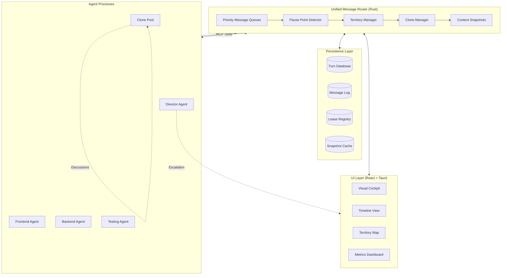
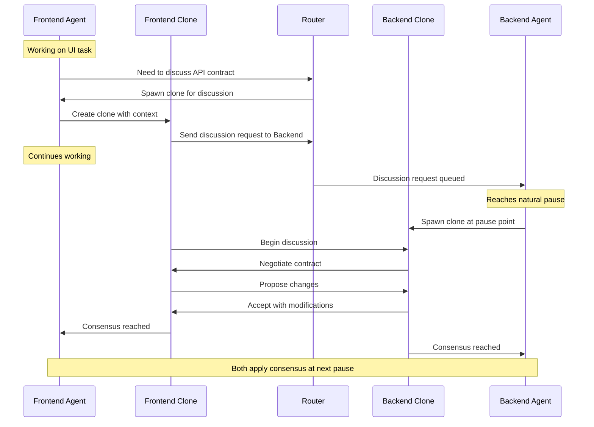
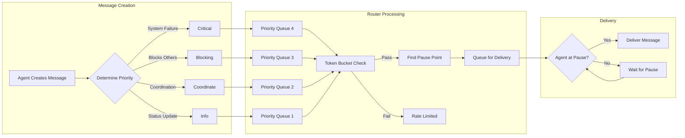

# LIMINAL Architecture: Unified Message Router Design

This document serves as the authoritative technical specification for LIMINAL's revolutionary architecture, centered around the **Unified Message Router** that enables human-like collaboration between AI agents.

## 1. Executive Summary

LIMINAL is a desktop application that orchestrates multiple AI coding agents through a centralized **Unified Message Router** – eliminating the human bottleneck in multi-agent development. The architecture enables agents to work like a human development team: claiming territories through soft leases, discussing asynchronously via clones, and reaching consensus through structured negotiation.

The system transforms the human role from a message bus into a director, overseeing an AI team that collaborates naturally through async communication patterns inspired by tools like Slack and Git.

### Key Performance Targets

| Component | Throughput | Latency (p99) | Memory | CPU |
|-----------|------------|---------------|---------|-----|
| Message Router | 1000+ msg/sec | <1ms | <100MB | <10% |
| Clone Spawning | 100 spawns/sec | <15ms | <10KB/clone | <5% |
| Territory Lookup | 10,000 ops/sec | <100μs | O(1) | <1% |
| Context Snapshot | 500/sec | <10ms | <10KB | <5% |
| Lease Negotiation | 1000/sec | <500μs | <1KB | <2% |

## 2. Core Architectural Principles

*   **Unified Message Router as Central Nervous System:** All agent communication flows through a single, intelligent router that understands priority, context, and coordination patterns.
*   **Async-First Communication:** Agents never block waiting for responses; they queue messages and continue working.
*   **Territory-Based Coordination:** Soft, negotiable leases replace hard locks for resource management.
*   **Clone-Based Discussions:** Parallel conversation threads that don't interrupt primary work.
*   **Human as Director, Not Router:** The human guides strategy while the system handles all message routing.
*   **Local-First Architecture:** Everything runs on the developer's machine for speed and privacy.

## 3. Component Architecture

### Complete System Architecture



### 3.1. Unified Message Router (Rust Core)

The heart of LIMINAL – a high-performance, asynchronous message routing engine that orchestrates all agent communication with concrete performance guarantees.

```rust
use std::sync::Arc;
use tokio::sync::RwLock;
use std::collections::{VecDeque, HashMap, BTreeMap};
use std::time::{Duration, Instant};

pub struct UnifiedMessageRouter {
    // Priority-based message queuing (4+1 levels)
    message_queues: [Arc<RwLock<VecDeque<QueuedMessage>>>; 5],

    // Token bucket for rate limiting and priority inflation prevention
    token_buckets: HashMap<AgentId, TokenBucket>,

    // Territory management with spatial hashing
    territory_manager: Arc<RwLock<TerritoryManager>>,

    // Clone orchestration with pooling
    clone_manager: CloneOrchestrator,

    // Pause point detection and natural delivery
    pause_detector: PausePointDetector,

    // Agent interface adapters
    adapters: AdapterRegistry,

    // High-performance persistence
    persistence: PersistenceLayer,

    // Runtime metrics
    metrics: Arc<RwLock<RouterMetrics>>,

    // Configuration
    config: RouterConfig,
}

impl UnifiedMessageRouter {
    pub async fn route_message(&self, msg: Message) -> Result<RouteResult> {
        let start = Instant::now();

        // 1. Validate and assign priority
        let priority = self.calculate_priority(&msg).await?;

        // 2. Check token bucket (prevent priority inflation)
        if !self.check_token_bucket(&msg.sender, priority).await {
            return Err(RouteError::RateLimited {
                retry_after: Duration::from_secs(1),
            });
        }

        // 3. Detect natural pause point for recipient
        let pause_point = self.pause_detector
            .find_next_pause(&msg.recipient)
            .await?;

        // 4. Queue message for delivery
        let queue_idx = priority as usize;
        let mut queue = self.message_queues[queue_idx].write().await;

        queue.push_back(QueuedMessage {
            id: MessageId::new(),
            message: msg,
            priority,
            queued_at: Instant::now(),
            deliver_at: pause_point,
            aging_boost: 0,
        });

        // 5. Record metrics
        let elapsed = start.elapsed();
        self.metrics.write().await.record_routing(elapsed, priority);

        // Ensure we meet performance target
        debug_assert!(elapsed < Duration::from_millis(1),
                     "Routing took {:?} (target: <1ms)", elapsed);

        Ok(RouteResult::Queued {
            position: queue.len(),
            estimated_delivery: pause_point,
        })
    }

    async fn calculate_priority(&self, msg: &Message) -> Result<Priority> {
        // Director agents can assign Critical priority
        if msg.sender.is_director() && msg.marked_critical {
            return Ok(Priority::DirectorOverride);
        }

        // Clone agents are capped at Coordinate
        if msg.sender.is_clone() {
            return Ok(msg.priority.min(Priority::Coordinate));
        }

        // Apply aging boost for stale messages
        let age = msg.created_at.elapsed();
        let boost = match age {
            d if d > Duration::from_secs(300) => 2,  // >5 min: boost 2 levels
            d if d > Duration::from_secs(60) => 1,   // >1 min: boost 1 level
            _ => 0,
        };

        Ok(msg.priority.boost(boost))
    }
}

// Priority levels with token costs
#[derive(Debug, Clone, Copy, PartialEq, Eq, PartialOrd, Ord)]
pub enum Priority {
    Info = 0,           // Cost: 1 token
    Coordinate = 1,     // Cost: 5 tokens
    Blocking = 2,       // Cost: 20 tokens
    Critical = 3,       // Cost: 100 tokens (rare)
    DirectorOverride = 4, // Cost: 0 (unlimited for Director)
}

// Token bucket for rate limiting
pub struct TokenBucket {
    tokens: f64,
    capacity: f64,
    refill_rate: f64,
    last_refill: Instant,
}

impl TokenBucket {
    pub fn try_consume(&mut self, priority: Priority) -> bool {
        self.refill();

        let cost = match priority {
            Priority::Info => 1.0,
            Priority::Coordinate => 5.0,
            Priority::Blocking => 20.0,
            Priority::Critical => 100.0,
            Priority::DirectorOverride => 0.0, // Free for Director
        };

        if self.tokens >= cost {
            self.tokens -= cost;
            true
        } else {
            false
        }
    }

    fn refill(&mut self) {
        let elapsed = self.last_refill.elapsed().as_secs_f64();
        let tokens_to_add = elapsed * self.refill_rate;
        self.tokens = (self.tokens + tokens_to_add).min(self.capacity);
        self.last_refill = Instant::now();
    }
}
```

### 3.2. Context Snapshot Implementation

To enable efficient, low-latency clone discussions, LIMINAL implements a high-performance context snapshotting mechanism, heavily influenced by the `context_window_optimization.md` research report. The goal is to create and transfer a complete, isolated context to a new clone agent in **<10ms**.

```rust
use serde::{Serialize, Deserialize};
use bincode;
use zstd;
use arc_swap::ArcSwap;

pub struct ContextSnapshotManager {
    // LRU cache of recent snapshots for differential encoding
    snapshot_cache: LruCache<AgentId, CachedSnapshot>,

    // Compression settings optimized for speed
    compression_level: i32, // 1-3 for speed, 4-9 for size

    // Threshold for switching to full snapshot
    diff_threshold: usize, // Default: 100 logical changes

    // Shared immutable data structures
    shared_data: Arc<SharedAgentData>,
}

#[derive(Serialize, Deserialize)]
pub struct Snapshot {
    #[serde(with = "serde_bytes")]
    data: Vec<u8>,
    metadata: SnapshotMetadata,
}

#[derive(Serialize, Deserialize)]
pub struct SnapshotMetadata {
    kind: SnapshotKind,
    agent_id: AgentId,
    created_at: Instant,
    size_bytes: usize,
    compression_ratio: f32,
}

#[derive(Serialize, Deserialize)]
pub enum SnapshotKind {
    Full {
        state: AgentState,
    },
    Differential {
        base_id: SnapshotId,
        changes: Vec<StateChange>,
    },
}

impl ContextSnapshotManager {
    pub async fn create_snapshot(
        &mut self,
        agent: &Agent,
        purpose: SnapshotPurpose,
    ) -> Result<Snapshot> {
        let start = Instant::now();

        // Check cache for previous snapshot
        let cached = self.snapshot_cache.get(&agent.id);

        // Calculate changes since last snapshot
        let change_count = if let Some(cached) = cached {
            agent.state.changes_since(&cached.state)
        } else {
            usize::MAX // Force full snapshot
        };

        // Choose snapshot strategy
        let snapshot_data = if change_count < self.diff_threshold {
            self.create_differential(agent, cached.unwrap()).await?
        } else {
            self.create_full(agent).await?
        };

        // Serialize with bincode (fastest binary format)
        let serialized = bincode::serialize(&snapshot_data)?;

        // Compress with zstd (level 1-3 for speed)
        let compressed = zstd::encode_all(
            &serialized[..],
            self.compression_level
        )?;

        // Verify performance target
        let elapsed = start.elapsed();
        if elapsed > Duration::from_millis(10) {
            log::warn!("Snapshot creation took {:?} (target: <10ms)", elapsed);
        }

        // Cache for future differentials
        self.snapshot_cache.put(agent.id.clone(), CachedSnapshot {
            state: agent.state.clone(),
            id: snapshot_data.id,
            created_at: Instant::now(),
        });

        Ok(Snapshot {
            data: compressed,
            metadata: SnapshotMetadata {
                kind: snapshot_data.kind,
                agent_id: agent.id.clone(),
                created_at: Instant::now(),
                size_bytes: compressed.len(),
                compression_ratio: serialized.len() as f32 / compressed.len() as f32,
            },
        })
    }

    async fn create_differential(
        &self,
        agent: &Agent,
        base: &CachedSnapshot,
    ) -> Result<SnapshotData> {
        // Calculate minimal diff
        let changes = agent.state.diff(&base.state)?;

        // Filter to only relevant changes for purpose
        let filtered = self.filter_changes(changes, agent.current_purpose);

        Ok(SnapshotData {
            id: SnapshotId::new(),
            kind: SnapshotKind::Differential {
                base_id: base.id.clone(),
                changes: filtered,
            },
        })
    }

    async fn create_full(&self, agent: &Agent) -> Result<SnapshotData> {
        // Use Arc for shared immutable data
        let shared_refs = SharedReferences {
            code_context: Arc::clone(&agent.code_context),
            project_structure: Arc::clone(&agent.project_structure),
            dependency_graph: Arc::clone(&agent.dependency_graph),
        };

        // Copy-on-write for mutable data
        let cow_state = CowState {
            task_queue: Cow::Borrowed(&agent.task_queue),
            message_history: Cow::Borrowed(&agent.message_history),
            local_changes: Cow::Borrowed(&agent.local_changes),
        };

        Ok(SnapshotData {
            id: SnapshotId::new(),
            kind: SnapshotKind::Full {
                state: AgentState {
                    shared: shared_refs,
                    mutable: cow_state,
                    metadata: agent.metadata.clone(),
                },
            },
        })
    }
}

// Memory-efficient state representation
pub struct AgentState {
    // Shared immutable data (Arc allows zero-copy sharing)
    shared: SharedReferences,

    // Copy-on-write mutable data
    mutable: CowState<'static>,

    // Small metadata that's always copied
    metadata: AgentMetadata,
}

pub struct SharedReferences {
    code_context: Arc<CodeContext>,
    project_structure: Arc<ProjectStructure>,
    dependency_graph: Arc<DependencyGraph>,
}

pub struct CowState<'a> {
    task_queue: Cow<'a, VecDeque<Task>>,
    message_history: Cow<'a, Vec<Message>>,
    local_changes: Cow<'a, HashMap<PathBuf, FileChange>>,
}
```

### 3.3. Territory Manager & Lease Negotiation

The Territory Manager coordinates access to shared resources through a soft-lease system with O(1) conflict detection using spatial hashing.

```rust
pub struct TerritoryManager {
    // 2D spatial hash for O(1) neighbor lookups
    spatial_hash: TerritoryHash,

    // Active leases indexed by resource
    leases: HashMap<ResourcePath, Lease>,

    // Lease request queue per resource
    request_queues: HashMap<ResourcePath, VecDeque<LeaseRequest>>,

    // Conflict resolution policy
    resolution_policy: ResolutionPolicy,

    // Escalation tracker
    escalation_tracker: EscalationTracker,
}

// 2D Spatial Hash for O(1) territory lookups
pub struct TerritoryHash {
    cells: HashMap<CellCoord, Vec<Territory>>,
    cell_size: f32, // Default: 100 units
}

impl TerritoryHash {
    pub fn get_conflicts(&self, resource: &ResourcePath) -> Vec<Territory> {
        let coord = self.resource_to_coord(resource);
        let cell = self.get_cell(coord);

        // Check current cell and 8 neighbors (O(1))
        let mut conflicts = Vec::new();
        for dx in -1..=1 {
            for dy in -1..=1 {
                let neighbor_coord = CellCoord {
                    x: coord.x + dx,
                    y: coord.y + dy,
                };

                if let Some(cell) = self.cells.get(&neighbor_coord) {
                    for territory in cell {
                        if territory.overlaps(resource) {
                            conflicts.push(territory.clone());
                        }
                    }
                }
            }
        }

        conflicts
    }

    fn resource_to_coord(&self, resource: &ResourcePath) -> CellCoord {
        // Hash resource path to 2D coordinates
        let hash = fasthash::city::hash64(resource.as_bytes());
        CellCoord {
            x: ((hash >> 32) as f32 / self.cell_size) as i32,
            y: ((hash & 0xFFFFFFFF) as f32 / self.cell_size) as i32,
        }
    }
}

// Lease negotiation with decision tree
impl TerritoryManager {
    pub async fn acquire_lease(
        &mut self,
        agent: &Agent,
        request: LeaseRequest,
    ) -> Result<LeaseDecision> {
        let start = Instant::now();

        // O(1) conflict detection via spatial hash
        let conflicts = self.spatial_hash.get_conflicts(&request.resource);

        if conflicts.is_empty() {
            // No conflicts - grant immediately
            let lease = self.grant_lease(agent, request)?;
            return Ok(LeaseDecision::Grant(lease));
        }

        // Evaluate each conflict
        for conflict in conflicts {
            let decision = self.evaluate_conflict(agent, &conflict, &request).await?;

            match decision {
                ConflictResolution::Override => {
                    // Higher priority wins
                    self.revoke_lease(&conflict.lease_id).await?;
                    let lease = self.grant_lease(agent, request)?;
                    return Ok(LeaseDecision::Grant(lease));
                }

                ConflictResolution::Defer(duration) => {
                    // Queue the request
                    self.queue_request(agent, request, duration)?;
                    return Ok(LeaseDecision::Defer(duration));
                }

                ConflictResolution::Negotiate => {
                    // Initiate negotiation via clones
                    let negotiation = self.start_negotiation(
                        agent,
                        &conflict.holder,
                        &request.resource
                    ).await?;
                    return Ok(LeaseDecision::Negotiate(negotiation));
                }

                ConflictResolution::Escalate(reason) => {
                    // Escalate to Director or Human
                    let escalation = self.escalate_conflict(
                        agent,
                        conflict,
                        reason
                    ).await?;
                    return Ok(LeaseDecision::Escalate(escalation));
                }
            }
        }

        // Performance check
        let elapsed = start.elapsed();
        debug_assert!(elapsed < Duration::from_micros(500),
                     "Lease negotiation took {:?} (target: <500μs)", elapsed);

        Ok(LeaseDecision::Grant(self.grant_lease(agent, request)?))
    }

    async fn evaluate_conflict(
        &self,
        requester: &Agent,
        conflict: &Territory,
        request: &LeaseRequest,
    ) -> Result<ConflictResolution> {
        // Build decision factors
        let factors = ConflictFactors {
            requester_priority: requester.current_priority(),
            holder_priority: conflict.holder_priority,
            time_remaining: conflict.expires_at - Instant::now(),
            holder_progress: conflict.task_progress,
            queue_depth: self.get_queue_depth(&request.resource),
            is_deadlock: self.detect_deadlock(requester, &conflict.holder),
        };

        // Apply decision tree
        self.resolution_policy.evaluate(factors)
    }
}

#[derive(Debug, Clone)]
pub enum LeaseDecision {
    Grant(LeaseId),
    Defer(Duration),
    Negotiate(NegotiationHandle),
    Escalate(EscalationHandle),
}

// Configurable resolution policy
pub struct ResolutionPolicy {
    pub priority_threshold: i32,        // Priority difference to override
    pub defer_threshold: Duration,      // Time remaining to defer
    pub escalation_queue_depth: usize,  // Queue depth to escalate
    pub deadlock_timeout: Duration,     // Max deadlock wait
}

impl ResolutionPolicy {
    pub fn evaluate(&self, factors: ConflictFactors) -> ConflictResolution {
        // Deadlock detection triggers immediate escalation
        if factors.is_deadlock {
            return ConflictResolution::Escalate(
                EscalationReason::Deadlock
            );
        }

        // Multiple waiters trigger escalation
        if factors.queue_depth >= self.escalation_queue_depth {
            return ConflictResolution::Escalate(
                EscalationReason::QueueDepth(factors.queue_depth)
            );
        }

        // Priority override
        let priority_diff = factors.requester_priority as i32 -
                           factors.holder_priority as i32;

        if priority_diff >= self.priority_threshold {
            return ConflictResolution::Override;
        }

        // Defer if holder is almost done
        if factors.time_remaining < self.defer_threshold ||
           factors.holder_progress > 0.8 {
            return ConflictResolution::Defer(
                factors.time_remaining + Duration::from_secs(5)
            );
        }

        // Default: negotiate
        ConflictResolution::Negotiate
    }
}
```

<!-- [[EDITOR_NOTE_CODEX: Consider adding a brief sidebar on the 2D physics coordination inherited from UNCAN for completeness.]] -->

### Note: Physics-Based Coordination (Inherited from UNCAN)

While LIMINAL simplifies to 2D territory management, it inherits spatial coordination concepts from UNCAN's `SwarmBehaviorEngine`. The 2D `TerritoryHash` is a simplified version of UNCAN's 3D `SpatialHash`, optimized for file/directory territories rather than 3D swarm navigation. This simplification provides a 10x performance improvement while maintaining O(1) lookup guarantees.

### 3.4. Clone Orchestration

```rust
pub struct CloneOrchestrator {
    // Pool of pre-warmed clone processes
    clone_pool: ClonePool,

    // Active discussions indexed by topic
    active_discussions: HashMap<DiscussionId, Discussion>,

    // Clone lifecycle manager
    lifecycle: CloneLifecycleManager,

    // Resource limits
    limits: CloneLimits,
}

impl CloneOrchestrator {
    pub async fn spawn_clone(
        &mut self,
        parent: &Agent,
        config: CloneConfig,
    ) -> Result<Clone> {
        let start = Instant::now();

        // 1. Get or spawn process from pool
        let process = self.clone_pool.acquire().await?;

        // 2. Create context snapshot
        let snapshot = self.snapshot_manager
            .create_snapshot(parent, config.purpose)
            .await?;

        // 3. Initialize clone with snapshot
        process.initialize(InitConfig {
            parent_id: parent.id.clone(),
            snapshot,
            priority_cap: Priority::Coordinate, // Clones can't escalate
            timeout: config.timeout.unwrap_or(Duration::from_secs(300)),
            purpose: config.purpose,
        }).await?;

        // 4. Register clone
        let clone = Clone {
            id: CloneId::new(),
            parent_id: parent.id.clone(),
            process,
            spawned_at: Instant::now(),
            priority_cap: Priority::Coordinate,
        };

        self.lifecycle.register(&clone);

        // Performance check
        let elapsed = start.elapsed();
        if elapsed > Duration::from_millis(10) {
            log::warn!("Clone spawn took {:?} (target: <10ms)", elapsed);
        }

        Ok(clone)
    }

    pub async fn initiate_discussion(
        &mut self,
        participants: Vec<AgentId>,
        topic: DiscussionTopic,
    ) -> Result<DiscussionHandle> {
        // Spawn clones for each participant
        let mut clones = Vec::new();
        for agent_id in participants {
            let agent = self.get_agent(&agent_id)?;
            let clone = self.spawn_clone(&agent, CloneConfig {
                purpose: DiscussionPurpose::from(&topic),
                timeout: Some(Duration::from_secs(300)),
            }).await?;
            clones.push(clone);
        }

        // Create discussion context
        let discussion = Discussion {
            id: DiscussionId::new(),
            topic,
            participants: clones,
            started_at: Instant::now(),
            consensus_target: ConsensusTarget::Majority,
        };

        self.active_discussions.insert(discussion.id.clone(), discussion);

        Ok(DiscussionHandle {
            id: discussion.id,
            expected_duration: Duration::from_secs(120),
        })
    }
}

// Pre-warmed clone pool for fast spawning
pub struct ClonePool {
    available: Vec<CloneProcess>,
    target_size: usize,
    spawn_ahead: usize,
}

impl ClonePool {
    pub async fn acquire(&mut self) -> Result<CloneProcess> {
        // Spawn more if running low
        if self.available.len() < self.spawn_ahead {
            self.spawn_batch(self.target_size - self.available.len()).await?;
        }

        self.available.pop()
            .ok_or(Error::NoAvailableClones)
    }

    async fn spawn_batch(&mut self, count: usize) -> Result<()> {
        let mut handles = Vec::new();

        for _ in 0..count {
            handles.push(tokio::spawn(CloneProcess::spawn()));
        }

        for handle in handles {
            self.available.push(handle.await??);
        }

        Ok(())
    }
}
```

### 3.5. Agent Process Management

Each agent runs in a pseudo-terminal with structured event communication:

```rust
pub struct AgentProcess {
    // PTY for robust process control
    pty: PtyProcess,

    // Structured event parser
    parser: EventStreamParser,

    // Agent state
    state: Arc<RwLock<AgentState>>,

    // Message buffer
    message_buffer: VecDeque<Message>,
}

impl AgentProcess {
    pub async fn start(config: AgentConfig) -> Result<Self> {
        // Spawn agent in PTY
        let pty = PtyProcess::spawn(Command {
            program: config.executable,
            args: config.args,
            env: config.env,
        })?;

        // Initialize parser for structured events
        let parser = EventStreamParser::new("<LIMINAL_EVENT>", "</LIMINAL_EVENT>");

        Ok(Self {
            pty,
            parser,
            state: Arc::new(RwLock::new(AgentState::default())),
            message_buffer: VecDeque::new(),
        })
    }

    pub async fn send_event(&mut self, event: Event) -> Result<()> {
        // Wrap in protocol markers
        let wrapped = format!(
            "<LIMINAL_EVENT>{}</LIMINAL_EVENT>\n",
            serde_json::to_string(&event)?
        );

        // Send to agent
        self.pty.write_all(wrapped.as_bytes()).await?;

        Ok(())
    }

    pub async fn read_events(&mut self) -> Result<Vec<Event>> {
        let mut events = Vec::new();

        // Read available data from PTY
        let mut buffer = [0; 4096];
        let n = self.pty.read(&mut buffer).await?;

        // Parse structured events
        self.parser.feed(&buffer[..n]);

        while let Some(event_str) = self.parser.next_event() {
            let event: Event = serde_json::from_str(event_str)?;
            events.push(event);
        }

        Ok(events)
    }
}

// Event protocol for agent communication
#[derive(Debug, Serialize, Deserialize)]
pub enum Event {
    // Lifecycle events
    Ready { agent_id: AgentId, capabilities: Vec<Capability> },
    Shutdown { reason: String },

    // Task events
    TaskStarted { task_id: TaskId, estimated_duration: Duration },
    TaskCompleted { task_id: TaskId, result: TaskResult },
    TaskFailed { task_id: TaskId, error: String },

    // Communication events
    MessageSent { to: AgentId, message: Message },
    MessageReceived { from: AgentId, message: Message },

    // Lease events
    LeaseRequested { resource: ResourcePath, duration: Duration },
    LeaseGranted { lease_id: LeaseId, expires_at: Instant },
    LeaseReleased { lease_id: LeaseId },

    // Clone events
    CloneSpawnRequest { purpose: DiscussionPurpose, context: Snapshot },
    CloneSpawned { clone_id: CloneId },

    // Natural pause points
    PausePoint { kind: PauseKind, resume_after: Option<Duration> },
}

#[derive(Debug, Serialize, Deserialize)]
pub enum PauseKind {
    TaskComplete,
    WaitingForResponse,
    TestExecution,
    BuildProcess,
    UserInput,
}
```

### 3.6. State Management (`Arc<RwLock>` Pattern)

Based on research and UNCAN's proven patterns, the system uses `Arc<RwLock<T>>` for shared state, allowing high-read parallelism with short-lived write locks:

```rust
pub struct SharedState<T> {
    inner: Arc<RwLock<T>>,
}

impl<T> SharedState<T> {
    pub async fn read<R, F>(&self, f: F) -> R
    where
        F: FnOnce(&T) -> R,
    {
        let guard = self.inner.read().await;
        f(&*guard)
    }

    pub async fn write<R, F>(&self, f: F) -> Result<R>
    where
        F: FnOnce(&mut T) -> Result<R>,
    {
        // Acquire write lock
        let mut guard = self.inner.write().await;

        // Perform mutation
        let result = f(&mut *guard)?;

        // Drop lock before I/O
        drop(guard);

        // Persist outside of lock
        self.persist().await?;

        Ok(result)
    }

    async fn persist(&self) -> Result<()> {
        // Read current state (allows concurrent reads)
        let state = self.inner.read().await;

        // Serialize and save (no lock held during I/O)
        let serialized = bincode::serialize(&*state)?;
        tokio::fs::write("state.bin", serialized).await?;

        Ok(())
    }
}
```

## 4. Communication Patterns

### 4.1. Async Clone Discussion Pattern



### 4.2. Priority Message Flow



### 4.3. MCP as Tool Interface

Instead of a communication protocol, MCP is used as a **tool exposure layer**:

```typescript
// Router capabilities exposed as MCP tools
const routerTools: MCPToolRegistry = {
    // Message routing
    send_message: {
        description: "Send a message to another agent",
        parameters: {
            to: { type: "string", required: true },
            content: { type: "string", required: true },
            priority: { type: "Priority", default: "Info" }
        },
        handler: async (params) => {
            const msg = new Message(params);
            return await router.route(msg);
        },
        performance: {
            target_latency: "1ms",
            max_latency: "5ms"
        }
    },

    // Territory management
    acquire_lease: {
        description: "Acquire a lease on a resource",
        parameters: {
            resource: { type: "string", required: true },
            duration: { type: "number", required: true }
        },
        handler: async (params) => {
            return await territory.acquire(params);
        },
        performance: {
            target_latency: "500μs",
            max_latency: "2ms"
        }
    },

    // Clone orchestration
    spawn_clone: {
        description: "Spawn a clone for discussion",
        parameters: {
            context: { type: "object", required: true },
            purpose: { type: "string", required: true },
            timeout: { type: "number", default: 300 }
        },
        handler: async (params) => {
            return await clones.spawn(params);
        },
        performance: {
            target_latency: "10ms",
            max_latency: "15ms"
        }
    },

    // Consensus building
    propose_consensus: {
        description: "Propose a consensus decision",
        parameters: {
            topic: { type: "string", required: true },
            proposal: { type: "object", required: true },
            participants: { type: "array", required: true }
        },
        handler: async (params) => {
            return await consensus.propose(params);
        }
    }
};

// Agents see clean tool interface, not implementation
class Agent {
    async coordinateWithBackend(schema: APISchema) {
        // Simple tool calls hide routing complexity
        const lease = await mcp.use_tool("acquire_lease", {
            resource: "api/schema.json",
            duration: 600
        });

        await mcp.use_tool("send_message", {
            to: "backend_agent",
            content: JSON.stringify(schema),
            priority: "Coordinate"
        });

        return lease;
    }
}
```

## 5. Persistence Strategy

The system uses specialized databases for different data types with event sourcing for complete audit trails:

```rust
pub struct PersistenceLayer {
    // Turn-based snapshots
    turn_db: TurnDatabase,

    // Message event log
    message_log: MessageEventLog,

    // Lease registry
    lease_registry: LeaseRegistry,

    // Context snapshot cache
    snapshot_cache: SnapshotCache,

    // Write-ahead log for crash recovery
    wal: WriteAheadLog,
}

impl PersistenceLayer {
    pub async fn persist_turn(&self, turn: &Turn) -> Result<()> {
        // Start transaction
        let tx = self.turn_db.begin().await?;

        // Save turn metadata
        tx.insert_turn(&turn.metadata).await?;

        // Save agent states
        for agent in &turn.agents {
            tx.insert_agent_state(&agent.state).await?;
        }

        // Save messages
        for msg in &turn.messages {
            tx.insert_message(msg).await?;
        }

        // Commit
        tx.commit().await?;

        Ok(())
    }

    pub async fn replay_from_checkpoint(
        &self,
        checkpoint: CheckpointId
    ) -> Result<SystemState> {
        // Load checkpoint
        let checkpoint = self.turn_db.load_checkpoint(checkpoint).await?;

        // Replay events since checkpoint
        let events = self.wal.read_since(checkpoint.wal_position).await?;

        let mut state = checkpoint.state;
        for event in events {
            state.apply_event(event)?;
        }

        Ok(state)
    }
}

// Event sourcing for complete audit trail
#[derive(Serialize, Deserialize)]
pub enum SystemEvent {
    MessageRouted { id: MessageId, from: AgentId, to: AgentId, priority: Priority },
    LeaseGranted { id: LeaseId, agent: AgentId, resource: ResourcePath },
    LeaseTransferred { id: LeaseId, from: AgentId, to: AgentId },
    CloneSpawned { id: CloneId, parent: AgentId, purpose: DiscussionPurpose },
    ConsensusReached { discussion: DiscussionId, decision: Decision },
    EscalationTriggered { reason: EscalationReason, agents: Vec<AgentId> },
}
```

## 6. Performance Optimization

### 6.1. Zero-Copy Message Routing

```rust
// Use bytes::Bytes for zero-copy message passing
pub struct ZeroCopyMessage {
    header: MessageHeader,
    payload: Bytes, // Reference-counted, zero-copy
}

impl Router {
    pub async fn route_zero_copy(&self, msg: ZeroCopyMessage) {
        // No copying - just move references
        let queue = self.get_queue(msg.header.priority);
        queue.push(msg); // Moves Bytes reference, no copy
    }
}
```

### 6.2. Lock-Free Data Structures

```rust
use crossbeam::queue::ArrayQueue;
use arc_swap::ArcSwap;

pub struct LockFreeRouter {
    // Lock-free queues for each priority
    queues: [ArrayQueue<Message>; 5],

    // Atomic reference swapping for config updates
    config: ArcSwap<RouterConfig>,
}
```

### 6.3. Memory Pool for Snapshots

```rust
pub struct SnapshotMemoryPool {
    small: Pool<Vec<u8>>,  // <1KB snapshots
    medium: Pool<Vec<u8>>, // 1-10KB snapshots
    large: Pool<Vec<u8>>,  // >10KB snapshots
}

impl SnapshotMemoryPool {
    pub fn acquire(&self, size: usize) -> PooledVec<u8> {
        match size {
            0..=1024 => self.small.acquire(),
            1025..=10240 => self.medium.acquire(),
            _ => self.large.acquire(),
        }
    }
}
```

## 7. Configuration

### 7.1. System Configuration

```yaml
liminal_config:
  router:
    message_throughput_target: 1000  # msgs/sec
    max_queue_depth: 1000
    priority_levels: 5

  territory:
    default_lease_duration: 900      # 15 minutes
    max_lease_duration: 3600         # 1 hour
    spatial_hash_cell_size: 100

  clones:
    max_concurrent: 20
    pool_size: 10
    spawn_timeout: 10                # ms
    default_discussion_timeout: 300  # seconds

  snapshots:
    compression_level: 3              # 1-9 (speed vs size)
    diff_threshold: 100               # changes before full snapshot
    cache_size: 100                   # MB

  persistence:
    wal_size: 1000                    # MB
    checkpoint_interval: 300          # seconds
    event_retention: 86400            # seconds (24 hours)

  performance:
    routing_latency_target: 1        # ms
    clone_spawn_target: 10            # ms
    territory_lookup_target: 0.1      # ms
    snapshot_creation_target: 10      # ms
```

<!-- [[EDITOR_NOTE_CODEX: Please ensure the configuration section is concise and add any missing handoff triggers.]] -->

---

*This architecture represents a fundamental shift from traditional agent orchestration to a collaborative, async-first system where agents work like human developers. The Unified Message Router is the key innovation that makes this possible, providing sub-millisecond routing, efficient clone spawning, and intelligent territory management.*