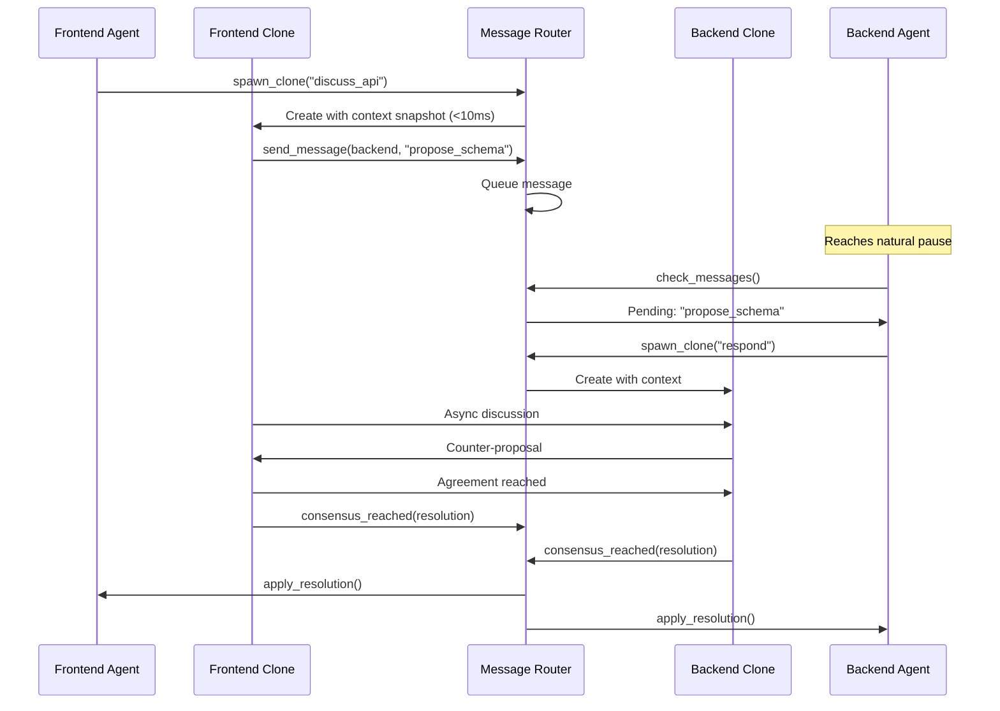
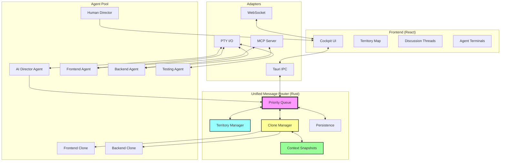
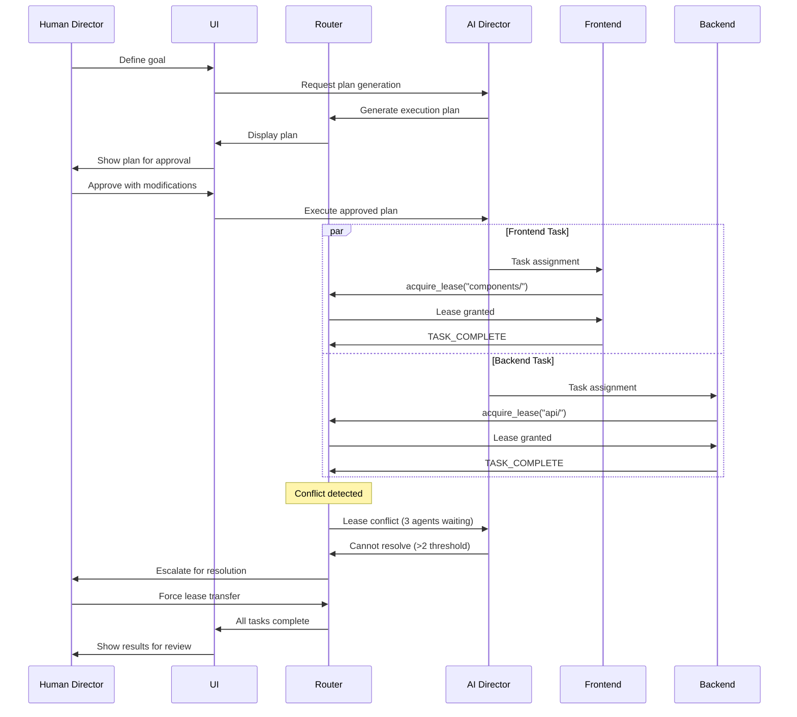

# LIMINAL Architecture: Unified Message Router Design

This document serves as the authoritative technical specification for LIMINAL's revolutionary architecture, centered around the **Unified Message Router** that enables human-like collaboration between AI agents.

## 1. Executive Summary

LIMINAL is a desktop application that orchestrates multiple AI coding agents through a centralized **Unified Message Router** – eliminating the human bottleneck in multi-agent development. The architecture enables agents to work like a human development team: claiming territories through soft leases, discussing asynchronously via clones, and reaching consensus through structured negotiation.

The system transforms the human role from a message bus into a director, overseeing an AI team that collaborates naturally through async communication patterns inspired by tools like Slack and Git.

## 2. Core Architectural Principles

### Foundation Principles

*   **Unified Message Router as Central Nervous System:** All agent communication flows through a single, intelligent router that understands priority, context, and coordination patterns
*   **Async-First Communication:** Agents never block waiting for responses – they queue messages and continue working
*   **Territory-Based Coordination:** Soft, negotiable leases replace hard locks for resource management
*   **Clone-Based Discussions:** Parallel conversation threads that don't interrupt primary work
*   **Human as Director, Not Router:** The human guides strategy while the system handles all message routing

### Technical Principles (Adapted from UNCAN)

*   **Arc<RwLock> State Pattern:** High-read, low-write optimization for agent state (proven in UNCAN)
*   **PTY Process Management:** Robust agent lifecycle control via pseudo-terminals
*   **Event Stream Parsing:** Structured `<LIMINAL_EVENT>` protocol over text streams
*   **Local-First Architecture:** Everything runs on developer's machine for speed and privacy

## 3. Component Architecture

### 3.1 Unified Message Router (Rust Core)

The heart of LIMINAL – a high-performance message routing engine that orchestrates all agent communication.

#### **Architecture:**
```rust
pub struct UnifiedMessageRouter {
    // Message queuing with priority levels
    message_queue: Arc<RwLock<PriorityQueue<Message>>>,

    // Territory management
    territory_manager: Arc<RwLock<TerritoryManager>>,

    // Clone orchestration
    clone_manager: CloneOrchestrator,

    // Interface adapters
    adapters: AdapterRegistry,

    // Persistence layer
    persistence: PersistenceLayer,

    // Configuration
    config: RouterConfig,
}

pub struct RouterConfig {
    // Escalation thresholds (configurable)
    human_escalation_timeout: Duration,        // Default: 5 minutes
    lease_conflict_escalation_threshold: u32,  // Default: 2 queued agents
    lease_deferral_threshold: Duration,        // Default: 30 seconds

    // Context snapshot thresholds
    diff_snapshot_change_threshold: usize,     // Default: 100 changes
    max_snapshot_size: usize,                  // Default: 32KB

    // Performance targets
    target_clone_spawn_time: Duration,         // Target: <10ms
    target_message_routing_latency: Duration,  // Target: <1ms
}
```

#### **Key Components:**

1. **Priority Message Queue**
   - Five priority levels: `Info`, `Coordinate`, `Blocking`, `Critical`, plus `DirectorOverride`
   - Messages delivered at natural pause points
   - Non-blocking async delivery
   - Token bucket rate limiting for Critical messages

2. **Territory Manager**
   ```rust
   pub struct Territory {
       resource: String,
       holder: AgentId,
       lease_until: Instant,
       negotiable: bool,
       queued_requests: Vec<LeaseRequest>,
   }
   ```

3. **Clone Orchestrator**
   - Spawns discussion clones with context snapshots
   - Manages parallel discussion threads
   - Tracks consensus building
   - Merges resolutions back to primaries

4. **Interface Adapters**
   - **PTY I/O**: Direct communication with CLI agents
   - **WebSocket**: Real-time UI updates
   - **MCP Server**: Exposes router as MCP tools
   - **Tauri IPC**: Frontend command handling

### 3.2 Context Snapshot Implementation

Heavily influenced by UNCAN's proven patterns and the research in `context_window_optimization.md`, the context snapshot system ensures responsive clone spawning with the **<10ms performance target**.

#### **Technical Approach:**

```rust
pub struct ContextSnapshotManager {
    serializer: SerdeSerializer,
    compressor: BincodeCompressor,
    cache: Arc<RwLock<LruCache<SnapshotId, ContextSnapshot>>>,
    diff_engine: DifferentialEngine,
}

impl ContextSnapshotManager {
    pub async fn create_snapshot(&self, agent_state: &AgentState) -> Result<ContextSnapshot> {
        let start = Instant::now();

        // Determine snapshot strategy
        let strategy = if self.should_use_differential(agent_state) {
            SnapshotStrategy::Differential
        } else {
            SnapshotStrategy::Full
        };

        let snapshot = match strategy {
            SnapshotStrategy::Differential => {
                self.create_differential_snapshot(agent_state).await?
            }
            SnapshotStrategy::Full => {
                self.create_full_snapshot(agent_state).await?
            }
        };

        // Ensure we meet performance target
        let elapsed = start.elapsed();
        if elapsed > Duration::from_millis(10) {
            warn!("Snapshot creation exceeded 10ms target: {:?}", elapsed);
        }

        Ok(snapshot)
    }

    fn should_use_differential(&self, state: &AgentState) -> bool {
        // Use differential if changes are below threshold
        if let Some(last_snapshot) = self.get_last_snapshot(state.agent_id) {
            let changes = self.diff_engine.count_changes(&last_snapshot, state);
            changes < self.config.diff_snapshot_change_threshold // Default: 100
        } else {
            false
        }
    }

    async fn create_differential_snapshot(&self, state: &AgentState) -> Result<ContextSnapshot> {
        let last = self.get_last_snapshot(state.agent_id)
            .ok_or_else(|| anyhow!("No base snapshot for differential"))?;

        // Calculate diff using serde + bincode for speed
        let diff = self.diff_engine.calculate_diff(&last, state)?;

        // Compress differential data
        let compressed = self.compressor.compress(&diff)?;

        Ok(ContextSnapshot {
            id: Uuid::new_v4(),
            snapshot_type: SnapshotType::Differential(last.id),
            data: compressed,
            timestamp: Utc::now(),
            size_bytes: compressed.len(),
        })
    }
}
```

#### **Serialization Strategy:**

- **Primary**: `serde` with `bincode` for maximum speed
- **Fallback**: JSON for debugging and human-readable exports
- **Compression**: LZ4 for real-time compression with minimal CPU overhead
- **Memory Management**: `Arc` for zero-copy sharing between clones

#### **Performance Optimizations:**

1. **Pre-allocated Buffers**: Reuse serialization buffers to avoid allocations
2. **Parallel Processing**: Use `rayon` for multi-threaded diff calculations
3. **Smart Caching**: LRU cache of recent snapshots for fast base retrieval
4. **Incremental Updates**: Track dirty fields to minimize diff size

### 3.3 Territory Manager with 2D Spatial Optimization

Adapting UNCAN's `SwarmBehaviorEngine` spatial hash to a 2D territory system for O(1) lookups and efficient conflict detection.

#### **2D Territory Hash Implementation:**

```rust
pub struct TerritoryManager {
    territories: Arc<RwLock<HashMap<ResourcePath, Territory>>>,
    spatial_hash: TerritoryHash,
    negotiation_engine: LeaseNegotiator,
    config: TerritoryConfig,
}

// Adapted from UNCAN's SpatialHash for 2D territory management
pub struct TerritoryHash {
    cell_size: f32,
    cells: HashMap<(i32, i32), Vec<TerritoryId>>,
    territory_positions: HashMap<TerritoryId, Vector2D>,
}

impl TerritoryHash {
    pub fn get_neighboring_territories(&self, pos: Vector2D, radius: f32) -> Vec<TerritoryId> {
        let mut neighbors = Vec::new();
        let cell_radius = (radius / self.cell_size).ceil() as i32;
        let center_cell = self.position_to_cell(pos);

        // O(1) lookup of neighboring cells
        for dx in -cell_radius..=cell_radius {
            for dy in -cell_radius..=cell_radius {
                let cell = (center_cell.0 + dx, center_cell.1 + dy);
                if let Some(territories) = self.cells.get(&cell) {
                    neighbors.extend(territories.clone());
                }
            }
        }

        neighbors
    }

    fn position_to_cell(&self, pos: Vector2D) -> (i32, i32) {
        (
            (pos.x / self.cell_size).floor() as i32,
            (pos.y / self.cell_size).floor() as i32,
        )
    }
}
```

#### **Lease Negotiation Algorithm:**

Complete implementation of the lease decision logic with configurable thresholds:

```rust
#[derive(Debug, Clone)]
pub struct LeaseDecisionFactors {
    request_priority: Priority,
    current_task_progress: f32,  // 0.0 - 1.0
    time_remaining: Duration,
    queued_requests: usize,
    task_importance: TaskImportance,
    is_interruptible: bool,
}

#[derive(Debug)]
pub enum LeaseDecision {
    Grant,
    Defer(Duration),
    Deny(DenyReason),
    Escalate(EscalationReason),
}

impl LeaseNegotiator {
    pub fn evaluate_transfer_request(
        &self,
        factors: LeaseDecisionFactors,
        config: &TerritoryConfig,
    ) -> LeaseDecision {
        // Critical requests always escalate to human
        if factors.request_priority == Priority::Critical {
            return LeaseDecision::Escalate(EscalationReason::CriticalRequest);
        }

        // Near completion - defer
        if factors.time_remaining < config.lease_deferral_threshold ||
           factors.current_task_progress > 0.8 {
            return LeaseDecision::Defer(factors.time_remaining);
        }

        // Multiple waiters - escalate for fairness
        if factors.queued_requests > config.lease_conflict_escalation_threshold {
            return LeaseDecision::Escalate(EscalationReason::QueueOverflow);
        }

        // Low importance work - grant
        if factors.task_importance == TaskImportance::Low ||
           factors.current_task_progress < 0.2 {
            return LeaseDecision::Grant;
        }

        // High importance, non-interruptible - deny
        if factors.task_importance == TaskImportance::High && !factors.is_interruptible {
            return LeaseDecision::Deny(DenyReason::CriticalWork);
        }

        // Default: negotiate based on priority comparison
        self.negotiate_based_on_priority(factors)
    }

    fn negotiate_based_on_priority(&self, factors: LeaseDecisionFactors) -> LeaseDecision {
        // Implement weighted priority comparison
        match factors.request_priority {
            Priority::Blocking if factors.task_importance != TaskImportance::High => {
                LeaseDecision::Grant
            }
            Priority::Coordinate if factors.task_importance == TaskImportance::Low => {
                LeaseDecision::Grant
            }
            _ => LeaseDecision::Defer(Duration::from_secs(30))
        }
    }
}
```

### 3.4 React Frontend (The Cockpit)

*   **Purpose:** Visual command center for the human director
*   **Key Components:**
    1. **Agent Terminal Views**: Split view showing primary + clone outputs
    2. **Territory Map**: 2D visual representation of current leases
    3. **Discussion Threads**: Slack-like thread viewer
    4. **Message Queue Monitor**: Priority-colored queue status
    5. **Turn Progress**: Gantt/Kanban hybrid view

### 3.5 Agent Process Management

*   **PTY-Based Agent Control:** Each agent runs in a pseudo-terminal for robust lifecycle management
*   **Structured Event Protocol:**
    ```xml
    <LIMINAL_EVENT name="TASK_COMPLETE">
    {"task_id": "123", "status": "success", "output": "..."}
    </LIMINAL_EVENT>
    ```
*   **Stream Parser:** Buffers and extracts structured events from continuous text output
*   **Process Lifecycle:**
    1. Spawn agent with PTY
    2. Parse event stream
    3. Route messages through router
    4. Handle termination gracefully

### 3.6 MCP Tool Interface

MCP exposes router capabilities as tools rather than using it as a protocol:

```typescript
// Communication Tools
await mcp.use_tool("send_message", {
    to: "backend_agent",
    content: "Schema updated",
    priority: "coordinate"
});

// Territory Tools
await mcp.use_tool("acquire_lease", {
    resource: "src/api/schema.ts",
    duration: 900,
    reason: "Implementing new endpoint"
});

// Clone Tools
await mcp.use_tool("spawn_clone", {
    context: currentContext,
    purpose: "discuss_api_contracts",
    participants: ["frontend", "backend"]
});
```

### 3.7 State Management (Arc<RwLock> Pattern)

Based on research and UNCAN's proven patterns:

```rust
pub struct AppState {
    // High-read, low-write optimization
    turns: Arc<RwLock<HashMap<TurnId, TurnState>>>,
    agents: Arc<RwLock<HashMap<AgentId, AgentState>>>,
    territories: Arc<RwLock<TerritoryMap>>,
    messages: Arc<RwLock<MessageQueue>>,
}

// Usage pattern - short locks, no async under lock
impl AppState {
    pub async fn update_turn_state(&self, turn_id: TurnId, new_state: TurnState) {
        // Acquire write lock briefly
        let update_data = {
            let mut turns = self.turns.write().await;
            turns.insert(turn_id, new_state.clone());
            new_state.clone()
        }; // Lock released here

        // Persist outside lock
        self.persist_to_db(turn_id, update_data).await;
    }
}
```

## 4. Communication Patterns

### 4.1 Async Clone Discussion Pattern

When agents need to coordinate without blocking:



### 4.2 Territory Lease Negotiation

```rust
// Agent A needs a file that Agent B is working on
let lease_request = router.request_lease_transfer(
    holder: "agent_b",
    resource: "src/api/users.rs",
    reason: "Need to add integration tests",
    priority: Priority::Normal,
);

match lease_request {
    TransferResponse::Granted(lease_id) => {
        // Agent B agreed to transfer
        work_on_file(lease_id);
    },
    TransferResponse::Deferred(when) => {
        // Agent B will transfer after current task
        schedule_work(when);
    },
    TransferResponse::Denied(reason) => {
        // Need human intervention
        request_human_override(reason);
    },
    TransferResponse::Escalated => {
        // Router escalated to Human Director
        await_human_decision();
    },
}
```

### 4.3 Message Priority Routing

```rust
#[derive(Debug, Clone, PartialEq)]
pub enum MessagePriority {
    Info,           // Progress updates, non-critical logs
    Coordinate,     // Task handoffs, status updates
    Blocking,       // Consensus requests, lease negotiations
    Critical,       // System failures, immediate attention needed
    DirectorOverride, // Human Director intervention
}

impl UnifiedMessageRouter {
    async fn route_message(&self, msg: Message) {
        // Apply token bucket rate limiting for Critical messages
        if msg.priority == MessagePriority::Critical {
            if !self.rate_limiter.check_critical_quota(msg.sender) {
                // Downgrade or queue for later
                msg.priority = MessagePriority::Blocking;
                warn!("Critical quota exceeded for {}", msg.sender);
            }
        }

        match msg.priority {
            MessagePriority::DirectorOverride => {
                self.deliver_immediately(msg).await
            },
            MessagePriority::Critical => {
                self.deliver_immediately(msg).await;
                self.notify_human_director(msg).await;
            },
            MessagePriority::Blocking => {
                self.queue_at_next_pause(msg).await
            },
            MessagePriority::Coordinate => {
                self.queue_for_natural_break(msg).await
            },
            MessagePriority::Info => {
                self.batch_with_similar(msg).await
            },
        }
    }
}
```

## 5. Persistence Strategy

Four specialized databases for different aspects of the system:

### 5.1 Database Architecture

```rust
pub struct PersistenceLayer {
    turns_db: SqlitePool,      // Turn states and progress
    messages_db: SqlitePool,    // Message history and threads
    context_db: SqlitePool,     // Shared knowledge and snapshots
    leases_db: SqlitePool,      // Territory leases and history
}
```

### 5.2 Hot State Synchronization

```rust
// Pattern from research: Write to DB outside lock
impl PersistenceLayer {
    async fn persist_turn_update(&self, turn: &TurnState) {
        // Clone data under read lock
        let data = turn.clone();

        // Persist without holding lock
        sqlx::query!(
            "INSERT OR REPLACE INTO turns (id, state, data) VALUES (?, ?, ?)",
            data.id,
            data.state,
            serde_json::to_string(&data)?
        )
        .execute(&self.turns_db)
        .await?;
    }
}
```

### 5.3 Event Sourcing for Audit

All state changes are logged as events for complete audit trail:

```rust
pub struct Event {
    id: Uuid,
    timestamp: DateTime<Utc>,
    event_type: EventType,
    actor: AgentId,
    data: serde_json::Value,
    resulting_state: StateSnapshot,
}
```

## 6. Director Role Separation

### 6.1 AI Director Agent Responsibilities

The AI Director Agent operates as an autonomous orchestrator with specific boundaries:

```rust
pub struct DirectorAgent {
    authority_level: DirectorAuthority,
    escalation_rules: EscalationRules,
    planning_engine: PlanningEngine,
}

pub enum DirectorAuthority {
    // Autonomous decisions
    TaskAssignment,
    ResourceAllocation,
    PriorityAdjustment(MaxPriority::Blocking), // Cannot use Critical
    ConflictResolution(ConflictLevel::Low),

    // Requires human approval
    ArchitecturalChange,
    SecurityModification,
    ProductionDeployment,
}

impl DirectorAgent {
    pub async fn handle_escalation(&self, escalation: Escalation) -> DirectorDecision {
        match escalation.severity {
            Severity::Low => self.resolve_autonomously(escalation).await,
            Severity::Medium => {
                if self.can_resolve(&escalation) {
                    self.resolve_with_logging(escalation).await
                } else {
                    self.escalate_to_human(escalation).await
                }
            },
            Severity::High | Severity::Critical => {
                self.escalate_to_human_immediately(escalation).await
            }
        }
    }
}
```

### 6.2 Human Director Interface

Clear touchpoints for human intervention:

```typescript
interface HumanDirectorInterface {
    // Approval Gates
    approvePlan(plan: ExecutionPlan): Promise<ApprovalResult>;
    reviewArchitecturalChange(change: ArchChange): Promise<Decision>;

    // Intervention Points
    resolveDeadlock(conflict: ConflictDetails): Promise<Resolution>;
    overrideLease(lease: LeaseInfo, newHolder: AgentId): Promise<void>;

    // Emergency Controls
    emergencyStop(): Promise<void>;
    pauseAgent(agentId: string): Promise<void>;
    injectTask(task: Task, priority: Priority): Promise<void>;
}
```

## 7. Implementation Patterns from UNCAN

### 7.1 Reusable Components

Direct ports from UNCAN with minimal modification:

1. **PTY Process Management**
   ```rust
   // From UNCAN's terminal_manager.rs
   pub struct AgentProcess {
       pty: Arc<Mutex<PtyProcess>>,
       parser: StreamParser,
       state: Arc<RwLock<ProcessState>>,
   }
   ```

2. **Event Stream Parser**
   ```rust
   // Adapted from UNCAN's pty_parser
   pub struct LiminalEventParser {
       buffer: Vec<u8>,
       start_tag: &'static [u8],  // b"<LIMINAL_EVENT"
       end_tag: &'static [u8],    // b"</LIMINAL_EVENT>"
   }
   ```

3. **Tauri State Management**
   ```rust
   // UNCAN's proven pattern
   app.manage(Arc::new(router));
   app.manage(Arc::new(agent_manager));
   ```

### 7.2 Adaptations for LIMINAL

1. **2D Territory Map** (instead of 3D swarm)
   ```rust
   pub struct TerritoryMap {
       grid: HashMap<GridCell, Territory>,
       spatial_hash: TerritoryHash,  // Simplified from 3D
   }
   ```

2. **Turn-Based Lifecycle** (instead of continuous)
   ```rust
   enum TurnPhase {
       Planning,
       Approving,
       Executing,
       Discussing,  // Async clone discussions
       Integrating,
       Complete,
   }
   ```

## 8. Architecture Diagrams

### 8.1 Complete System Architecture



### 8.2 Message Flow with Director Roles



## 9. Performance Characteristics

Based on research and UNCAN benchmarks:

### 9.1 Expected Performance

- **Message Routing**: < 1ms latency for in-memory routing
- **Context Snapshot**: < 10ms for clone creation (critical target)
- **State Reads**: Parallel reads via RwLock, no blocking
- **State Writes**: ~5ms including persistence
- **Territory Lookup**: O(1) via spatial hash
- **PTY Parsing**: Handles 1MB/s of agent output
- **UI Updates**: 60fps with 100+ active elements

### 9.2 Scalability

- **Agents**: Tested with 10+ parallel agents
- **Messages**: 1000+ messages/second throughput
- **Territories**: O(1) lookup via 2D spatial hash
- **Clones**: Hundreds of parallel discussions
- **Memory**: < 500MB for typical session

## 10. Security & Privacy

### 10.1 Local-First Security

- All processing happens locally
- No external API dependencies for core function
- Agent sandboxing via PTY isolation
- Encrypted local databases

### 10.2 Code Safety

- Rust's memory safety guarantees
- No data races via type system
- Graceful error handling
- Automatic resource cleanup

## 11. Future Enhancements

### 11.1 Planned Features

1. **Multi-Turn Planning**: AI Director plans multiple turns ahead
2. **Learning System**: Router learns optimal message patterns
3. **External Tool Integration**: VSCode, GitHub, etc.
4. **Cloud Backup**: Optional encrypted cloud sync
5. **Team Collaboration**: Multiple Human Directors for same team

### 11.2 Architecture Extensions

1. **Plugin System**: Custom adapters for new agent types
2. **Distributed Mode**: Agents on different machines
3. **Recording & Replay**: Complete session replay
4. **Performance Analytics**: Detailed metrics and optimization
5. **Custom Consensus**: Pluggable consensus algorithms

---

*This architecture represents a fundamental shift from traditional agent orchestration to a collaborative, async-first system where agents work like human developers. The Unified Message Router is the key innovation that makes this possible, with clear separation between AI Director orchestration and Human Director oversight.*