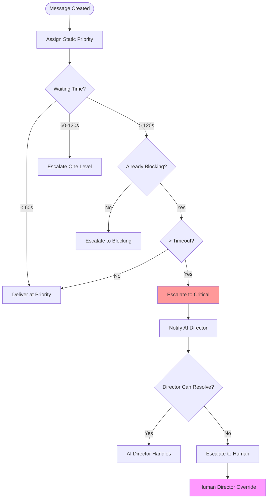

# LIMINAL Message Priority and Routing System Specification

## Introduction

In LIMINAL's multi-agent coding system (hosting AI Director, Frontend, Backend, Testing, and Reviewer agents with clones for sub-tasks), an efficient message priority and routing mechanism is crucial. Agents constantly exchange messages for command-control (task assignments), coordination (resource leases), discussions (knowledge sharing), and telemetry (status updates). The system targets soft real-time responsiveness (ideally under 100ms message routing latency) while maintaining fairness and preventing priority inflation.

This specification draws from multiple domains:
- Modern Message Queue Systems (RabbitMQ, Kafka, Redis, ZeroMQ, NATS)
- Operating System Schedulers (Linux kernel scheduling, real-time algorithms)
- Network QoS Mechanisms (DiffServ, traffic shaping, weighted fair queuing)
- Human Priority Protocols (emergency communications, hospital triage, air traffic control)

## LIMINAL Message Priority Design

### Priority Levels

LIMINAL implements a **4+1 priority system** with clear semantics and usage guidelines:

1. **Info (Priority 0)**: Telemetry, logs, non-urgent discussion
   - Never interrupts ongoing work
   - Batched for efficiency
   - Examples: Progress updates, metrics, debug logs

2. **Coordinate (Priority 1)**: Standard operational messages
   - Task assignments, status updates, routine operations
   - Delivered at natural pause points
   - Examples: Task handoffs, completion notifications

3. **Blocking (Priority 2)**: Sender cannot proceed without response
   - Jumps ahead of Coordinate/Info messages
   - Triggers cooperative preemption
   - Examples: Consensus requests, lease negotiations

4. **Critical (Priority 3)**: Urgent alerts requiring immediate attention
   - Preempts current processing
   - Rate-limited via token bucket
   - Examples: System failures, security alerts

5. **DirectorOverride (Priority 4)**: Human Director intervention
   - Absolute priority, bypasses all queues
   - Only issued by Human Director interface
   - Examples: Emergency stop, manual override

### Router Mechanics

```rust
pub struct MessageRouter {
    // Separate priority queues
    queues: [VecDeque<Message>; 5],

    // Token bucket for Critical rate limiting
    critical_quotas: HashMap<AgentId, TokenBucket>,

    // Starvation prevention
    aging_tracker: AgingTracker,

    // Flow control
    prefetch_limits: HashMap<AgentId, usize>,
}

impl MessageRouter {
    pub async fn dispatch(&mut self) -> Option<Message> {
        // Check for Director Override first
        if !self.queues[4].is_empty() {
            return self.queues[4].pop_front();
        }

        // Apply aging to prevent starvation
        self.aging_tracker.promote_aged_messages(&mut self.queues);

        // Service highest non-empty queue
        for priority in (0..4).rev() {
            if !self.queues[priority].is_empty() {
                // Check token bucket for Critical messages
                if priority == 3 {
                    let msg = self.queues[priority].front().unwrap();
                    if !self.check_critical_quota(&msg.sender) {
                        // Downgrade or defer
                        continue;
                    }
                }
                return self.queues[priority].pop_front();
            }
        }

        None
    }
}
```

### Static vs Dynamic Priority

LIMINAL uses a hybrid approach:

#### Static Priority Assignment

Messages are tagged with initial priority based on type and context:

```typescript
function assignStaticPriority(message: Message): Priority {
    const priorityMap = {
        // Info level
        'progress_update': Priority.Info,
        'metric_report': Priority.Info,
        'debug_log': Priority.Info,

        // Coordinate level
        'task_assignment': Priority.Coordinate,
        'status_change': Priority.Coordinate,
        'resource_ready': Priority.Coordinate,

        // Blocking level
        'consensus_request': Priority.Blocking,
        'lease_negotiation': Priority.Blocking,
        'dependency_wait': Priority.Blocking,

        // Critical level
        'system_failure': Priority.Critical,
        'security_alert': Priority.Critical,
        'deadlock_detected': Priority.Critical,
    };

    return priorityMap[message.type] || Priority.Info;
}
```

#### Dynamic Escalation

Priorities can be adjusted based on runtime conditions:

```rust
pub struct DynamicEscalation {
    escalation_rules: Vec<EscalationRule>,
    escalation_timeout: Duration,  // Configurable, default: 5 minutes
}

impl DynamicEscalation {
    pub fn check_escalation(&self, message: &QueuedMessage) -> Option<Priority> {
        let wait_time = Instant::now() - message.queued_at;

        // Time-based escalation
        match message.priority {
            Priority::Info if wait_time > Duration::from_secs(60) => {
                Some(Priority::Coordinate)
            },
            Priority::Coordinate if wait_time > Duration::from_secs(120) => {
                Some(Priority::Blocking)
            },
            Priority::Blocking if wait_time > self.escalation_timeout => {
                Some(Priority::Critical)
            },
            _ => None
        }
    }

    pub fn inherit_priority(&self, request: &Message, dependency: &Message) -> Priority {
        // Propagate higher priority through dependency chains
        std::cmp::max(request.priority, dependency.priority)
    }
}
```

### Preventing Priority Inflation

LIMINAL implements multiple safeguards against priority inflation:

#### 1. Clear Policy Documentation

Each priority level has explicit usage criteria and examples (see Priority Levels section).

#### 2. Agent Restrictions

```rust
pub struct AgentPriorityLimits {
    // Regular agents cannot use Critical without justification
    max_priority: HashMap<AgentType, Priority>,

    // Clones have additional restrictions
    clone_max_priority: Priority,  // Limited to Coordinate
}

impl AgentPriorityLimits {
    pub fn new() -> Self {
        let mut limits = HashMap::new();
        limits.insert(AgentType::Director, Priority::Blocking);
        limits.insert(AgentType::Worker, Priority::Blocking);
        limits.insert(AgentType::Clone, Priority::Coordinate);

        Self {
            max_priority: limits,
            clone_max_priority: Priority::Coordinate,
        }
    }

    pub fn enforce(&self, agent: &Agent, requested: Priority) -> Priority {
        let max = if agent.is_clone {
            self.clone_max_priority
        } else {
            *self.max_priority.get(&agent.agent_type).unwrap_or(&Priority::Info)
        };

        std::cmp::min(requested, max)
    }
}
```

#### 3. Token Bucket Rate Limiting

```rust
pub struct TokenBucket {
    tokens: f64,
    max_tokens: f64,
    refill_rate: f64,  // tokens per second
    last_refill: Instant,
}

impl TokenBucket {
    pub fn try_consume(&mut self, cost: f64) -> bool {
        self.refill();

        if self.tokens >= cost {
            self.tokens -= cost;
            true
        } else {
            false
        }
    }

    fn refill(&mut self) {
        let now = Instant::now();
        let elapsed = (now - self.last_refill).as_secs_f64();
        self.tokens = (self.tokens + elapsed * self.refill_rate).min(self.max_tokens);
        self.last_refill = now;
    }
}
```

#### 4. Monitoring and Alerting

```typescript
class PriorityMonitor {
    async trackUsage(agent: AgentId, priority: Priority): Promise<void> {
        this.metrics.record(agent, priority);

        // Alert on suspicious patterns
        const criticalRate = this.metrics.getCriticalRate(agent);
        if (criticalRate > this.config.critical_threshold) {
            await this.alert({
                type: 'priority_inflation',
                agent: agent,
                rate: criticalRate,
                action: 'review_required'
            });
        }
    }

    async generateReport(): Promise<PriorityReport> {
        return {
            by_agent: this.metrics.getByAgent(),
            by_priority: this.metrics.getByPriority(),
            violations: this.metrics.getViolations(),
            recommendations: this.generateRecommendations()
        };
    }
}
```

### Interrupt vs Queue Behavior

Agents implement cooperative preemption based on message priority:

```typescript
class AgentMessageHandler {
    private interruptThreshold = Priority.Blocking;
    private currentTask: Task | null = null;

    async processMessages(): Promise<void> {
        while (true) {
            const message = await this.getNextMessage();

            if (message.priority >= Priority.Critical) {
                // Immediate interrupt
                await this.handleInterrupt(message);
            } else if (message.priority >= this.interruptThreshold) {
                // Cooperative preemption at next checkpoint
                await this.schedulePreemption(message);
            } else {
                // Queue for natural processing
                this.messageQueue.push(message);
            }

            // Process at checkpoint
            if (this.isAtCheckpoint()) {
                await this.processQueuedMessages();
            }
        }
    }

    private async handleInterrupt(message: Message): Promise<void> {
        // Save current state
        const checkpoint = await this.saveCheckpoint();

        // Handle critical message
        await this.processCritical(message);

        // Resume from checkpoint
        await this.restoreCheckpoint(checkpoint);
    }
}
```

### Priority Inversion Policy

LIMINAL implements priority inheritance to prevent inversion:

```rust
pub struct PriorityInheritance {
    dependency_graph: HashMap<TaskId, Vec<TaskId>>,
    inherited_priorities: HashMap<TaskId, Priority>,
}

impl PriorityInheritance {
    pub fn propagate_priority(&mut self, high_priority_task: TaskId, priority: Priority) {
        let mut to_visit = vec![high_priority_task];
        let mut visited = HashSet::new();

        while let Some(task) = to_visit.pop() {
            if visited.contains(&task) {
                continue;
            }
            visited.insert(task);

            // Inherit priority if higher
            let current = self.inherited_priorities.get(&task).copied()
                .unwrap_or(Priority::Info);

            if priority > current {
                self.inherited_priorities.insert(task, priority);

                // Propagate to dependencies
                if let Some(deps) = self.dependency_graph.get(&task) {
                    to_visit.extend(deps);
                }
            }
        }
    }
}
```

### Priority Privileges by Agent Type

Different agent types have different priority privileges:

#### AI Director Agent
- Can use priorities up to Blocking
- Can issue task assignments at Coordinate priority
- Can request consensus at Blocking priority
- Cannot use Critical (reserved for system issues)
- Cannot use DirectorOverride

#### Worker Agents (Frontend, Backend, Testing, Reviewer)
- Normal operations at Info/Coordinate
- Can escalate to Blocking when truly blocked
- Critical only for system failures
- Must justify any Critical usage

#### Clone Agents
- Limited to Info and Coordinate priorities
- Must escalate through parent for higher priorities
- Cannot directly trigger Blocking or Critical

#### Human Director
- Exclusive access to DirectorOverride priority
- Can force any priority level
- Can adjust priority thresholds dynamically
- Can review and penalize priority inflation

### Escalation Paths



## Implementation Guidelines

### Message Structure

```typescript
interface Message {
    id: string;
    sender: AgentId;
    recipient: AgentId | 'broadcast';
    priority: Priority;
    type: MessageType;
    content: any;
    metadata: {
        timestamp: number;
        queuedAt?: number;
        originalPriority?: Priority;
        escalationReason?: string;
        tokenCost?: number;
        blocking?: boolean;
        waitingAgents?: AgentId[];
    };
}
```

### Performance Targets

- **Routing Latency**: < 1ms for in-memory routing
- **Priority Escalation Check**: < 100μs per message
- **Token Bucket Check**: < 50μs per check
- **Queue Insertion**: O(log n) with priority queue
- **Starvation Prevention**: Check every 100ms

### Configuration Parameters

```yaml
# Default configuration (all configurable)
priority_config:
  escalation_timeout: 300  # seconds (5 minutes)
  info_escalation_threshold: 60  # seconds
  coordinate_escalation_threshold: 120  # seconds

  critical_token_bucket:
    max_tokens: 10
    refill_rate: 0.1  # tokens per second
    cost_per_critical: 1.0

  starvation_prevention:
    check_interval: 100  # milliseconds
    max_wait_time: 600  # seconds (10 minutes)

  agent_limits:
    director_max_priority: blocking
    worker_max_priority: blocking
    clone_max_priority: coordinate
```

## Summary

LIMINAL's message priority system provides:

1. **Five distinct priority levels** with clear semantics
2. **Hybrid static/dynamic priority** assignment
3. **Multiple safeguards** against priority inflation
4. **Cooperative preemption** for responsive agents
5. **Priority inheritance** to prevent inversion
6. **Agent-specific privileges** based on role
7. **Clear escalation paths** to AI and Human Directors
8. **Configurable thresholds** for deployment flexibility

This design ensures efficient message routing while maintaining fairness, preventing abuse, and providing clear paths for escalation when needed. The system achieves soft real-time responsiveness (<100ms) while supporting the complex coordination needs of multi-agent development.