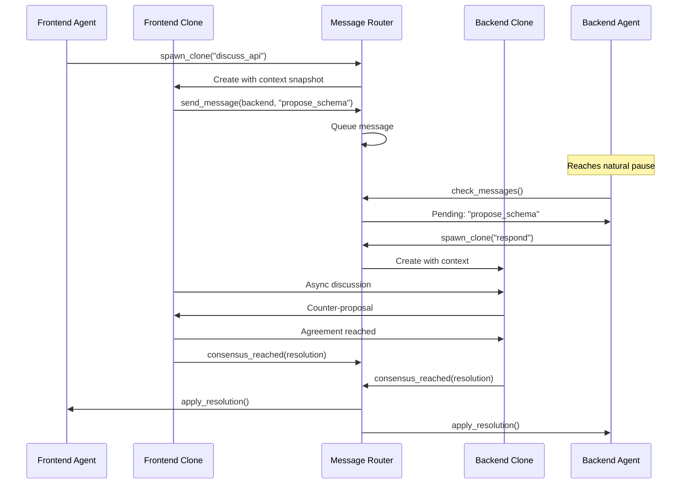
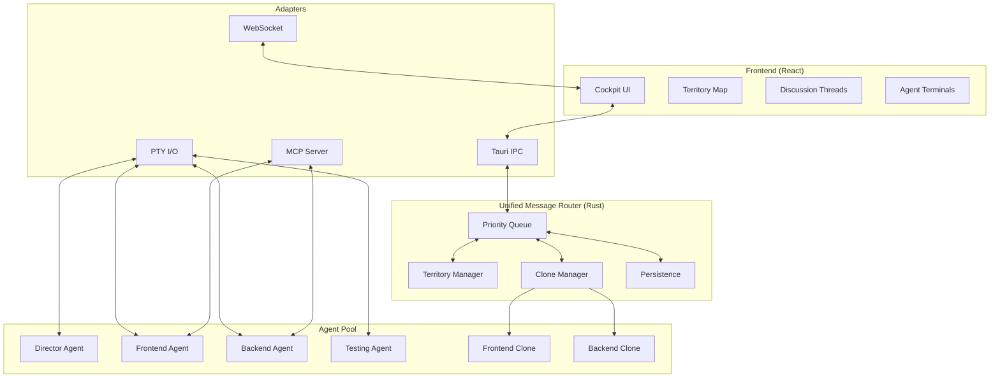
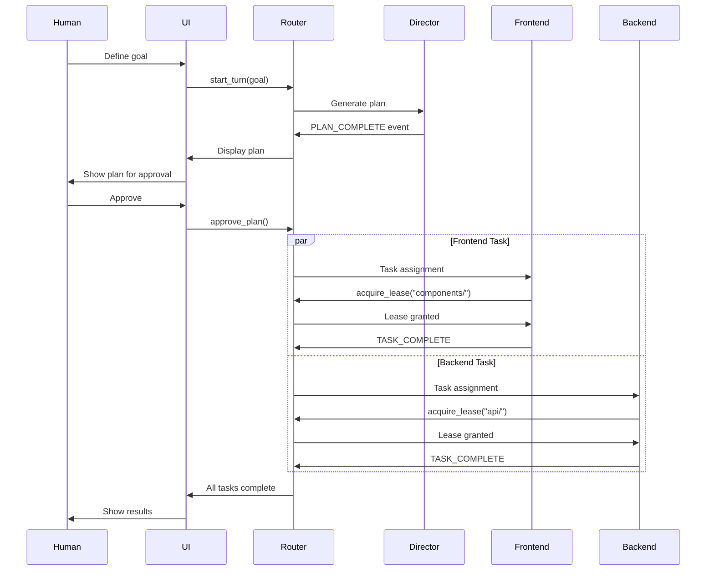

# LIMINAL Architecture: Unified Message Router Design

This document serves as the authoritative technical specification for LIMINAL's revolutionary architecture, centered around the **Unified Message Router** that enables human-like collaboration between AI agents.

## 1. Executive Summary

LIMINAL is a desktop application that orchestrates multiple AI coding agents through a centralized **Unified Message Router** – eliminating the human bottleneck in multi-agent development. The architecture enables agents to work like a human development team: claiming territories through soft leases, discussing asynchronously via clones, and reaching consensus through structured negotiation.

The system transforms the human role from a message bus into a director, overseeing an AI team that collaborates naturally through async communication patterns inspired by tools like Slack and Git.

## 2. Core Architectural Principles

### Foundation Principles

*   **Unified Message Router as Central Nervous System:** All agent communication flows through a single, intelligent router that understands priority, context, and coordination patterns
*   **Async-First Communication:** Agents never block waiting for responses – they queue messages and continue working
*   **Territory-Based Coordination:** Soft, negotiable leases replace hard locks for resource management
*   **Clone-Based Discussions:** Parallel conversation threads that don't interrupt primary work
*   **Human as Director, Not Router:** The human guides strategy while the system handles all message routing

### Technical Principles (Adapted from UNCAN)

*   **Arc<RwLock> State Pattern:** High-read, low-write optimization for agent state (proven in UNCAN)
*   **PTY Process Management:** Robust agent lifecycle control via pseudo-terminals
*   **Event Stream Parsing:** Structured `<LIMINAL_EVENT>` protocol over text streams
*   **Local-First Architecture:** Everything runs on developer's machine for speed and privacy

## 3. Component Architecture

### 3.1 Unified Message Router (Rust Core)

The heart of LIMINAL – a high-performance message routing engine that orchestrates all agent communication.

#### **Architecture:**
```rust
pub struct UnifiedMessageRouter {
    // Message queuing with priority levels
    message_queue: Arc<RwLock<PriorityQueue<Message>>>,

    // Territory management
    territory_manager: Arc<RwLock<TerritoryManager>>,

    // Clone orchestration
    clone_manager: CloneOrchestrator,

    // Interface adapters
    adapters: AdapterRegistry,

    // Persistence layer
    persistence: PersistenceLayer,
}
```

#### **Key Components:**

1. **Priority Message Queue**
   - Four priority levels: `Critical`, `Blocking`, `Coordinate`, `Info`
   - Messages delivered at natural pause points
   - Non-blocking async delivery

2. **Territory Manager**
   ```rust
   pub struct Territory {
       resource: String,
       holder: AgentId,
       lease_until: Instant,
       negotiable: bool,
   }
   ```

3. **Clone Orchestrator**
   - Spawns discussion clones with context snapshots
   - Manages parallel discussion threads
   - Tracks consensus building
   - Merges resolutions back to primaries

4. **Interface Adapters**
   - **PTY I/O**: Direct communication with CLI agents
   - **WebSocket**: Real-time UI updates
   - **MCP Server**: Exposes router as MCP tools
   - **Tauri IPC**: Frontend command handling

### 3.2 React Frontend (The Cockpit)

*   **Purpose:** Visual command center for the human director
*   **Key Components:**
    1. **Agent Terminal Views**: Split view showing primary + clone outputs
    2. **Territory Map**: Visual representation of current leases
    3. **Discussion Threads**: Slack-like thread viewer
    4. **Message Queue Monitor**: Priority-colored queue status
    5. **Turn Progress**: Gantt/Kanban hybrid view

### 3.3 Agent Process Management

*   **PTY-Based Agent Control:** Each agent runs in a pseudo-terminal for robust lifecycle management
*   **Structured Event Protocol:**
    ```xml
    <LIMINAL_EVENT name="TASK_COMPLETE">
    {"task_id": "123", "status": "success", "output": "..."}
    </LIMINAL_EVENT>
    ```
*   **Stream Parser:** Buffers and extracts structured events from continuous text output
*   **Process Lifecycle:**
    1. Spawn agent with PTY
    2. Parse event stream
    3. Route messages through router
    4. Handle termination gracefully

### 3.4 MCP Tool Interface

MCP exposes router capabilities as tools rather than using it as a protocol:

```typescript
// Communication Tools
await mcp.use_tool("send_message", {
    to: "backend_agent",
    content: "Schema updated",
    priority: "coordinate"
});

// Territory Tools
await mcp.use_tool("acquire_lease", {
    resource: "src/api/schema.ts",
    duration: 900,
    reason: "Implementing new endpoint"
});

// Clone Tools
await mcp.use_tool("spawn_clone", {
    context: currentContext,
    purpose: "discuss_api_contracts",
    participants: ["frontend", "backend"]
});
```

### 3.5 State Management (Arc<RwLock> Pattern)

Based on research and UNCAN's proven patterns:

```rust
pub struct AppState {
    // High-read, low-write optimization
    turns: Arc<RwLock<HashMap<TurnId, TurnState>>>,
    agents: Arc<RwLock<HashMap<AgentId, AgentState>>>,
    territories: Arc<RwLock<TerritoryMap>>,
    messages: Arc<RwLock<MessageQueue>>,
}

// Usage pattern - short locks, no async under lock
impl AppState {
    pub async fn update_turn_state(&self, turn_id: TurnId, new_state: TurnState) {
        // Acquire write lock briefly
        let update_data = {
            let mut turns = self.turns.write().await;
            turns.insert(turn_id, new_state.clone());
            new_state.clone()
        }; // Lock released here

        // Persist outside lock
        self.persist_to_db(turn_id, update_data).await;
    }
}
```

## 4. Communication Patterns

### 4.1 Async Clone Discussion Pattern

When agents need to coordinate without blocking:



### 4.2 Territory Lease Negotiation

```rust
// Agent A needs a file that Agent B is working on
let lease_request = router.request_lease_transfer(
    holder: "agent_b",
    resource: "src/api/users.rs",
    reason: "Need to add integration tests",
    priority: Priority::Normal,
);

match lease_request {
    TransferResponse::Granted(lease_id) => {
        // Agent B agreed to transfer
        work_on_file(lease_id);
    },
    TransferResponse::Deferred(when) => {
        // Agent B will transfer after current task
        schedule_work(when);
    },
    TransferResponse::Denied(reason) => {
        // Need human intervention
        request_human_override(reason);
    },
}
```

### 4.3 Message Priority Routing

```rust
enum MessagePriority {
    Critical,   // System failures, immediate attention needed
    Blocking,   // Consensus requests, lease negotiations
    Coordinate, // Task handoffs, status updates
    Info,       // Progress updates, non-critical logs
}

impl UnifiedMessageRouter {
    async fn route_message(&self, msg: Message) {
        match msg.priority {
            Critical => self.deliver_immediately(msg).await,
            Blocking => self.queue_at_next_pause(msg).await,
            Coordinate => self.queue_for_natural_break(msg).await,
            Info => self.batch_with_similar(msg).await,
        }
    }
}
```

## 5. Persistence Strategy

Four specialized databases for different aspects of the system:

### 5.1 Database Architecture

```rust
pub struct PersistenceLayer {
    turns_db: SqlitePool,      // Turn states and progress
    messages_db: SqlitePool,    // Message history and threads
    context_db: SqlitePool,     // Shared knowledge and snapshots
    leases_db: SqlitePool,      // Territory leases and history
}
```

### 5.2 Hot State Synchronization

```rust
// Pattern from research: Write to DB outside lock
impl PersistenceLayer {
    async fn persist_turn_update(&self, turn: &TurnState) {
        // Clone data under read lock
        let data = turn.clone();

        // Persist without holding lock
        sqlx::query!(
            "INSERT OR REPLACE INTO turns (id, state, data) VALUES (?, ?, ?)",
            data.id,
            data.state,
            serde_json::to_string(&data)?
        )
        .execute(&self.turns_db)
        .await?;
    }
}
```

### 5.3 Event Sourcing for Audit

All state changes are logged as events for complete audit trail:

```rust
pub struct Event {
    id: Uuid,
    timestamp: DateTime<Utc>,
    event_type: EventType,
    actor: AgentId,
    data: serde_json::Value,
    resulting_state: StateSnapshot,
}
```

## 6. Implementation Patterns from UNCAN

### 6.1 Reusable Components

Direct ports from UNCAN with minimal modification:

1. **PTY Process Management**
   ```rust
   // From UNCAN's terminal_manager.rs
   pub struct AgentProcess {
       pty: Arc<Mutex<PtyProcess>>,
       parser: StreamParser,
       state: Arc<RwLock<ProcessState>>,
   }
   ```

2. **Event Stream Parser**
   ```rust
   // Adapted from UNCAN's pty_parser
   pub struct ForgeEventParser {
       buffer: Vec<u8>,
       start_tag: &'static [u8],  // b"<LIMINAL_EVENT"
       end_tag: &'static [u8],    // b"</LIMINAL_EVENT>"
   }
   ```

3. **Tauri State Management**
   ```rust
   // UNCAN's proven pattern
   app.manage(Arc::new(router));
   app.manage(Arc::new(agent_manager));
   ```

### 6.2 Adaptations for LIMINAL

1. **2D Territory Map** (instead of 3D swarm)
   ```rust
   pub struct TerritoryMap {
       grid: HashMap<GridCell, Territory>,
       spatial_hash: SpatialHash2D,  // Simplified from 3D
   }
   ```

2. **Turn-Based Lifecycle** (instead of continuous)
   ```rust
   enum TurnPhase {
       Planning,
       Approving,
       Executing,
       Discussing,  // New: Async clone discussions
       Integrating,
       Complete,
   }
   ```

## 7. Architecture Diagrams

### 7.1 Complete System Architecture



### 7.2 Message Flow Example



## 8. Performance Characteristics

Based on research and UNCAN benchmarks:

### 8.1 Expected Performance

- **Message Routing**: < 1ms latency for in-memory routing
- **State Reads**: Parallel reads via RwLock, no blocking
- **State Writes**: ~5ms including persistence
- **Clone Spawn**: < 10ms for context snapshot
- **PTY Parsing**: Handles 1MB/s of agent output
- **UI Updates**: 60fps with 100+ active elements

### 8.2 Scalability

- **Agents**: Tested with 10+ parallel agents
- **Messages**: 1000+ messages/second throughput
- **Territories**: O(1) lookup via spatial hash
- **Clones**: Hundreds of parallel discussions
- **Memory**: < 500MB for typical session

## 9. Security & Privacy

### 9.1 Local-First Security

- All processing happens locally
- No external API dependencies for core function
- Agent sandboxing via PTY isolation
- Encrypted local databases

### 9.2 Code Safety

- Rust's memory safety guarantees
- No data races via type system
- Graceful error handling
- Automatic resource cleanup

## 10. Future Enhancements

### 10.1 Planned Features

1. **Multi-Turn Planning**: Agents plan multiple turns ahead
2. **Learning System**: Router learns optimal message patterns
3. **External Tool Integration**: VSCode, GitHub, etc.
4. **Cloud Backup**: Optional encrypted cloud sync
5. **Team Collaboration**: Multiple humans directing same team

### 10.2 Architecture Extensions

1. **Plugin System**: Custom adapters for new agent types
2. **Distributed Mode**: Agents on different machines
3. **Recording & Replay**: Complete session replay
4. **Performance Analytics**: Detailed metrics and optimization
5. **Custom Consensus**: Pluggable consensus algorithms

---

*This architecture represents a fundamental shift from traditional agent orchestration to a collaborative, async-first system where agents work like human developers. The Unified Message Router is the key innovation that makes this possible.*

## 3.6 Context Snapshot Implementation

Liminal clones operate on compact, serializable context snapshots designed for sub-10ms spawn overhead on typical hardware.

- Serialization: `serde` structs encoded via `bincode` for compact binary payloads
- Snapshot types: full snapshots for cold-start, differential snapshots for iterative discussions
- Memory pattern: `Arc<RwLock<...>>` for shared state; clone snapshotting never holds locks across await
- Budget: < 10ms snapshot generation, < 50ms end-to-end clone availability

```rust
#[derive(serde::Serialize, serde::Deserialize, Clone)]
pub struct ContextSnapshot {
    pub agent_id: String,
    pub turn_id: TurnId,
    pub task_state: TaskStateBrief,
    pub pointers: Vec<ContextPointer>, // keys/ids to fetch large assets on demand
    pub timestamp: i64,
}

pub enum SnapshotKind {
    Full(ContextSnapshot),
    Differential { base_id: Uuid, changes: Vec<ContextDelta> },
}

pub fn make_snapshot(state: &AppState, topic: &str) -> SnapshotKind {
    // 1) Read under short lock
    let ctx = {
        let agents = state.agents.blocking_read();
        // assemble minimal brief
        ContextSnapshot { /* ... */ agent_id: "".into(), turn_id: TurnId::new(), task_state: TaskStateBrief::default(), pointers: vec![], timestamp: chrono::Utc::now().timestamp_millis() }
    };

    // 2) Serialize outside locks
    SnapshotKind::Full(ctx)
}

pub fn make_diff(prev: &ContextSnapshot, current: &ContextSnapshot) -> SnapshotKind {
    let changes = diff_context(prev, current);
    if changes.len() < 100 { // DEFAULT_DIFF_CHANGE_LIMIT
        SnapshotKind::Differential { base_id: Uuid::new_v4(), changes }
    } else {
        SnapshotKind::Full(current.clone())
    }
}
```

- Retrieval policy: include must-have snippets inline; reference large docs via pointers and fetch lazily
- Distillation: summarize long logs; persist decisions and constraints in long-term memory with tags

## 3.7 TerritoryManager Lease Negotiation Algorithm

The TerritoryManager evaluates transfer requests using configurable defaults and clear outcomes.

```rust
enum LeaseDecision {
    Grant,
    Defer(Duration),
    Deny(Reason),
    Escalate(Reason),
}

struct LeasePolicy {
    defer_threshold_secs: u64,        // DEFAULT_DEFER_THRESHOLD = 30
    max_queued_before_escalate: u32,  // DEFAULT_QUEUE_ESCALATE = 2
}

impl LeasePolicy {
    fn evaluate(
        &self,
        priority: Priority,
        time_remaining: Duration,
        queued: u32,
        progress_pct: u8,
        importance: Importance,
        interruptible: bool,
    ) -> LeaseDecision {
        use LeaseDecision::*;
        if priority == Priority::Critical { return Escalate(Reason::CriticalPath); }
        if time_remaining.as_secs() < self.defer_threshold_secs || progress_pct > 80 { return Defer(time_remaining); }
        if queued > self.max_queued_before_escalate { return Escalate(Reason::FairnessQueue); }
        if importance == Importance::Low || progress_pct < 20 { return Grant; }
        if importance == Importance::High && !interruptible { return Deny(Reason::NonInterruptibleHighImportance); }
        Deny(Reason::TaskInProgress)
    }
}
```

- Inputs: request priority, remaining time, queue length, task progress, task importance, interruptibility
- Outputs: `Grant`, `Defer(eta)`, `Deny(reason)`, `Escalate(reason)`
- Policy defaults (configurable):
  - `DEFAULT_DEFER_THRESHOLD = 30s`
  - `DEFAULT_QUEUE_ESCALATE = 2`
  - `DEFAULT_PROGRESS_GRANT = <20%`
  - `DEFAULT_PROGRESS_DEFER = >80%`

### TerritoryHash Influence (from UNCAN v2)

- Use a 2D `TerritoryHash` (adapted from UNCAN’s 3D SpatialHash) for O(1) neighborhood lookups
- Maintain soft boundaries akin to Voronoi regions; render conflict heatmaps in UI
- Store claims with lease metadata; compute overlap/conflict candidates quickly

## 3.8 Physics-Based Coordination Engine (from UNCAN v2)

Liminal adopts a 2D physics-inspired coordination layer to support territory visualization and fast conflict detection:

- SwarmBehaviorEngine (2D): separation/alignment/cohesion behaviors drive agent positioning for visualization and proximity-based interactions
- TerritoryHash: efficient 2D spatial hash for claims, conflicts, and neighbor queries
- Expected gains: 5–10× faster physics calculations vs 3D; simpler collision checks; reduced memory footprint
- Integration: engine is authoritative for visualization and fast spatial queries; router remains authoritative for state/leases

## 3.9 Roles and Handoffs

- Human Director: sets goals, approves plans, intervenes on escalations, final QA
- Director Agent: generates plans, decomposes tasks, arbitrates low-priority conflicts, proposes lease transfers
- Handoff: plan approval, high-risk changes, stalled consensus, Director Override
- Escalation: critical deadlocks >60s, fairness violations, safety/compliance concerns
