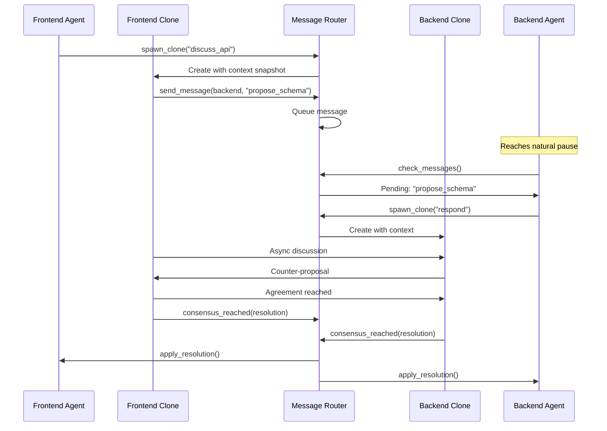
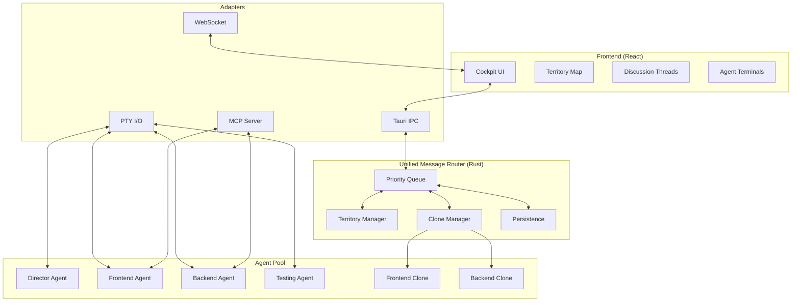
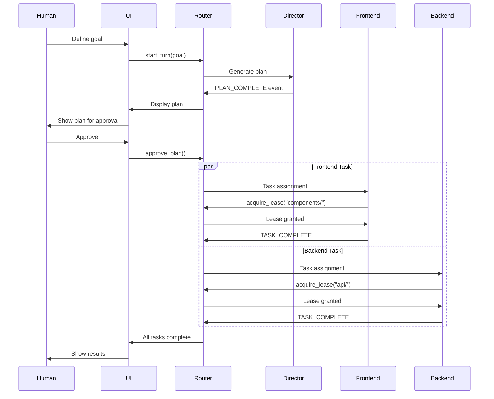

# LIMINAL Architecture: Unified Message Router Design

This document serves as the authoritative technical specification for LIMINAL's revolutionary architecture, centered around the **Unified Message Router** that enables human-like collaboration between AI agents.

## 1. Executive Summary

LIMINAL is a desktop application that orchestrates multiple AI coding agents through a centralized **Unified Message Router** – eliminating the human bottleneck in multi-agent development. The architecture enables agents to work like a human development team: claiming territories through soft leases, discussing asynchronously via clones, and reaching consensus through structured negotiation.

The system transforms the human role from a message bus into a director, overseeing an AI team that collaborates naturally through async communication patterns inspired by tools like Slack and Git.

## 2. Core Architectural Principles

### Foundation Principles

*   **Unified Message Router as Central Nervous System:** All agent communication flows through a single, intelligent router that understands priority, context, and coordination patterns
*   **Async-First Communication:** Agents never block waiting for responses – they queue messages and continue working
*   **Territory-Based Coordination:** Soft, negotiable leases replace hard locks for resource management
*   **Clone-Based Discussions:** Parallel conversation threads that don't interrupt primary work
*   **Human as Director, Not Router:** The human guides strategy while the system handles all message routing

### Technical Principles (Adapted from UNCAN)

*   **Arc<RwLock> State Pattern:** High-read, low-write optimization for agent state (proven in UNCAN)
*   **PTY Process Management:** Robust agent lifecycle control via pseudo-terminals
*   **Event Stream Parsing:** Structured `<LIMINAL_EVENT>` protocol over text streams
*   **Local-First Architecture:** Everything runs on developer's machine for speed and privacy

### Director and Human Roles

The LIMINAL architecture is built on a partnership between the AI **Director Agent** and the **Human Director**. This separation of duties is critical for both autonomy and control.

-   **Director Agent**: An AI agent responsible for the tactical execution of a goal. Its primary functions are:
    -   **Plan Generation**: Decomposing the Human Director's high-level goal into a structured, step-by-step execution plan.
    -   **Task Decomposition**: Breaking down plan steps into discrete, assignable tasks for subordinate agents.
    -   **Low-Priority Arbitration**: Handling routine coordination and resource negotiation between agents.

-   **Human Director**: The user, who provides strategic oversight and makes key decisions.
    -   **Goal Setting**: Defining the overall objective for the AI team.
    -   **Plan Approval (Handoff Point)**: Reviewing and approving the plan generated by the Director Agent. Execution does not begin without this explicit approval.
    -   **Strategic Intervention (Escalation Trigger)**: Acting as the final arbiter for high-priority conflicts, deadlocks, or any other situation escalated by the system. The system is designed to trigger this escalation when agent-level arbitration fails or when a decision has significant architectural implications.

## 3. Component Architecture

### 3.1 Unified Message Router (Rust Core)

The heart of LIMINAL – a high-performance message routing engine that orchestrates all agent communication.

#### **Architecture:**
```rust
pub struct UnifiedMessageRouter {
    // Message queuing with priority levels
    message_queue: Arc<RwLock<PriorityQueue<Message>>>,

    // Territory management
    territory_manager: Arc<RwLock<TerritoryManager>>,

    // Clone orchestration
    clone_manager: CloneOrchestrator,

    // Interface adapters
    adapters: AdapterRegistry,

    // Persistence layer
    persistence: PersistenceLayer,
}
```

#### **Key Components:**

1. **Priority Message Queue**
   - Four priority levels: `Critical`, `Blocking`, `Coordinate`, `Info`
   - Messages delivered at natural pause points
   - Non-blocking async delivery

2. **Territory Manager**
   ```rust
   pub struct Territory {
       resource: String,
       holder: AgentId,
       lease_until: Instant,
       negotiable: bool,
   }
   ```

   The Territory Manager is responsible for coordinating access to shared resources (files, directories) through a soft-lease system. It is heavily influenced by the high-performance `TerritoryHash` spatial hashing system detailed in the UNCAN v2 analysis report, allowing for O(1) conflict detection.

   #### Lease Negotiation Algorithm

   When an agent requests a lease on a resource that is already held, the Territory Manager initiates a negotiation based on a set of heuristics. The outcome is a `LeaseDecision`.

   ```rust
   pub enum LeaseDecision {
       Grant(LeaseId),
       Deny(Reason),
       Defer(Duration),
       Escalate(HumanDirector),
   }
   ```

   The decision is determined by factors including the requesting agent's task priority, the remaining duration of the current lease, and the number of agents already waiting for the resource (queue length).

   **Decision Conditions:**

   -   **Grant**: A lease is granted if the resource is free, or if the requesting agent's priority is significantly higher than the current holder's and the holder's task is interruptible.
   -   **Defer**: The request is queued if the current lease holder is performing a high-priority, non-interruptible task, especially if the lease is close to expiring. The requesting agent is notified that the resource will be available in a specified time.
   -   **Deny**: A request is denied if a low-priority agent requests a resource held by a high-priority agent in the middle of a critical, long-running task.
   -   **Escalate**: If multiple high-priority agents are contending for the same resource, or if a potential deadlock is detected, the decision is escalated to the Human Director for manual arbitration.

   This algorithm ensures that high-priority work proceeds with minimal blocking, while preventing low-priority tasks from being perpetually starved of resources.

3. **Clone Orchestrator**
   - Spawns discussion clones with context snapshots
   - Manages parallel discussion threads
   - Tracks consensus building
   - Merges resolutions back to primaries

4. **Interface Adapters**
   - **PTY I/O**: Direct communication with CLI agents
   - **WebSocket**: Real-time UI updates
   - **MCP Server**: Exposes router as MCP tools
   - **Tauri IPC**: Frontend command handling

### 3.2 React Frontend (The Cockpit)

*   **Purpose:** Visual command center for the human director
*   **Key Components:**
    1. **Agent Terminal Views**: Split view showing primary + clone outputs
    2. **Territory Map**: Visual representation of current leases
    3. **Discussion Threads**: Slack-like thread viewer
    4. **Message Queue Monitor**: Priority-colored queue status
    5. **Turn Progress**: Gantt/Kanban hybrid view

### 3.3 Agent Process Management

*   **PTY-Based Agent Control:** Each agent runs in a pseudo-terminal for robust lifecycle management
*   **Structured Event Protocol:**
    ```xml
    <LIMINAL_EVENT name="TASK_COMPLETE">
    {"task_id": "123", "status": "success", "output": "..."}
    </LIMINAL_EVENT>
    ```
*   **Stream Parser:** Buffers and extracts structured events from continuous text output
*   **Process Lifecycle:**
    1. Spawn agent with PTY
    2. Parse event stream
    3. Route messages through router
    4. Handle termination gracefully

### 3.4 MCP Tool Interface

MCP exposes router capabilities as tools rather than using it as a protocol:

```typescript
// Communication Tools
await mcp.use_tool("send_message", {
    to: "backend_agent",
    content: "Schema updated",
    priority: "coordinate"
});

// Territory Tools
await mcp.use_tool("acquire_lease", {
    resource: "src/api/schema.ts",
    duration: 900,
    reason: "Implementing new endpoint"
});

// Clone Tools
await mcp.use_tool("spawn_clone", {
    context: currentContext,
    purpose: "discuss_api_contracts",
    participants: ["frontend", "backend"]
});
```

### 3.5 State Management (Arc<RwLock> Pattern)

Based on research and UNCAN's proven patterns:

```rust
pub struct AppState {
    // High-read, low-write optimization
    turns: Arc<RwLock<HashMap<TurnId, TurnState>>>,
    agents: Arc<RwLock<HashMap<AgentId, AgentState>>>,
    territories: Arc<RwLock<TerritoryMap>>,
    messages: Arc<RwLock<MessageQueue>>,
}

// Usage pattern - short locks, no async under lock
impl AppState {
    pub async fn update_turn_state(&self, turn_id: TurnId, new_state: TurnState) {
        // Acquire write lock briefly
        let update_data = {
            let mut turns = self.turns.write().await;
            turns.insert(turn_id, new_state.clone());
            new_state.clone()
        }; // Lock released here

        // Persist outside lock
        self.persist_to_db(turn_id, update_data).await;
    }
}
```

### 3.6 Context Snapshot Implementation

To enable efficient, low-latency clone discussions, LIMINAL implements a high-performance context snapshotting mechanism, heavily influenced by the `context_window_optimization.md` research report and the UNCAN v2 analysis. The goal is to create and transfer a complete, isolated context to a new clone agent in **<10ms**.

#### Serialization Strategy

-   **Binary Serialization**: To achieve the required performance, context snapshots are serialized using a binary format. The chosen stack is **`serde` + `Bincode`**, which provides extremely fast and compact serialization compared to text-based formats like JSON. This minimizes both the CPU overhead of serialization and the data transfer payload size.
-   **Zero-Copy Deserialization**: Where possible, the architecture leverages zero-copy deserialization techniques to allow agents to read snapshot data directly from the byte buffer without allocating new memory, further reducing latency.

#### Snapshot Types: Differential vs. Full

The system dynamically chooses between two types of snapshots to optimize for speed and size:

1.  **Full Snapshot**: A complete, self-contained snapshot of all relevant data (e.g., current task, relevant files, recent decisions, dependency graphs). This is used when spawning a clone for a completely new topic or when the context has diverged significantly.
2.  **Differential Snapshot**: When a new discussion is closely related to a recent one, the system creates a lightweight differential snapshot. This snapshot contains only the *changes* (diffs) relative to a specified base snapshot. This is significantly smaller and faster to create and apply. A diff is chosen only if the change size is small (e.g., < 100 logical changes); otherwise, a full snapshot is more efficient.

```typescript
// Conceptual representation from agent_capabilities.md
class ContextManager {
    // ...
    prepareDifferentialSnapshot(lastSnapshot: ContextSnapshot): DiffSnapshot {
        const changes = this.detectChanges(lastSnapshot, this.currentState);

        if (changes.size < 100) {  // Small diff
            return {
                type: 'differential',
                baseId: lastSnapshot.id,
                changes: changes
            };
        } else {  // Too many changes, send full
            return {
                type: 'full',
                snapshot: this.prepareCloneContext('')
            };
        }
    }
}
```

#### Memory Management

-   **Shared Data with `Arc`**: Large, read-only data structures within a context (e.g., dependency graphs, large file contents) are wrapped in `Arc` (Atomically Referenced Counter). When creating a snapshot, instead of deep-copying this data, the `Arc` is simply cloned, which is a fast, atomic operation. This means multiple clones can share the same underlying memory for large, immutable data, dramatically reducing the memory footprint and creation time of each snapshot.
-   **Copy-on-Write**: Mutable data is cloned only when a clone agent needs to modify it, following a copy-on-write pattern to minimize unnecessary data duplication.

By combining binary serialization, intelligent snapshot strategies, and efficient memory sharing, LIMINAL ensures that spawning collaborative clones is a near-instantaneous operation, making asynchronous discussions a practical and powerful tool for agent coordination.


## 4. Communication Patterns

### 4.1 Async Clone Discussion Pattern

When agents need to coordinate without blocking:



### 4.2 Territory Lease Negotiation

```rust
// Agent A needs a file that Agent B is working on
let lease_request = router.request_lease_transfer(
    holder: "agent_b",
    resource: "src/api/users.rs",
    reason: "Need to add integration tests",
    priority: Priority::Normal,
);

match lease_request {
    TransferResponse::Granted(lease_id) => {
        // Agent B agreed to transfer
        work_on_file(lease_id);
    },
    TransferResponse::Deferred(when) => {
        // Agent B will transfer after current task
        schedule_work(when);
    },
    TransferResponse::Denied(reason) => {
        // Need human intervention
        request_human_override(reason);
    },
}
```

### 4.3 Message Priority Routing

```rust
enum MessagePriority {
    Critical,   // System failures, immediate attention needed
    Blocking,   // Consensus requests, lease negotiations
    Coordinate, // Task handoffs, status updates
    Info,       // Progress updates, non-critical logs
}

impl UnifiedMessageRouter {
    async fn route_message(&self, msg: Message) {
        match msg.priority {
            Critical => self.deliver_immediately(msg).await,
            Blocking => self.queue_at_next_pause(msg).await,
            Coordinate => self.queue_for_natural_break(msg).await,
            Info => self.batch_with_similar(msg).await,
        }
    }
}
```

## 5. Persistence Strategy

Four specialized databases for different aspects of the system:

### 5.1 Database Architecture

```rust
pub struct PersistenceLayer {
    turns_db: SqlitePool,      // Turn states and progress
    messages_db: SqlitePool,    // Message history and threads
    context_db: SqlitePool,     // Shared knowledge and snapshots
    leases_db: SqlitePool,      // Territory leases and history
}
```

### 5.2 Hot State Synchronization

```rust
// Pattern from research: Write to DB outside lock
impl PersistenceLayer {
    async fn persist_turn_update(&self, turn: &TurnState) {
        // Clone data under read lock
        let data = turn.clone();

        // Persist without holding lock
        sqlx::query!(
            "INSERT OR REPLACE INTO turns (id, state, data) VALUES (?, ?, ?)",
            data.id,
            data.state,
            serde_json::to_string(&data)?
        )
        .execute(&self.turns_db)
        .await?;
    }
}
```

### 5.3 Event Sourcing for Audit

All state changes are logged as events for complete audit trail:

```rust
pub struct Event {
    id: Uuid,
    timestamp: DateTime<Utc>,
    event_type: EventType,
    actor: AgentId,
    data: serde_json::Value,
    resulting_state: StateSnapshot,
}
```

## 6. Implementation Patterns from UNCAN

### 6.1 Reusable Components

Direct ports from UNCAN with minimal modification:

1. **PTY Process Management**
   ```rust
   // From UNCAN's terminal_manager.rs
   pub struct AgentProcess {
       pty: Arc<Mutex<PtyProcess>>,
       parser: StreamParser,
       state: Arc<RwLock<ProcessState>>,
   }
   ```

2. **Event Stream Parser**
   ```rust
   // Adapted from UNCAN's pty_parser
   pub struct LiminalEventParser {
       buffer: Vec<u8>,
       start_tag: &'static [u8],  // b"<LIMINAL_EVENT"
       end_tag: &'static [u8],    // b"</LIMINAL_EVENT>"
   }
   ```

3. **Tauri State Management**
   ```rust
   // UNCAN's proven pattern
   app.manage(Arc::new(router));
   app.manage(Arc::new(agent_manager));
   ```

### 6.2 Adaptations for LIMINAL

1. **2D Territory Map** (instead of 3D swarm)
   ```rust
   pub struct TerritoryMap {
       grid: HashMap<GridCell, Territory>,
       spatial_hash: SpatialHash2D,  // Simplified from 3D
   }
   ```

2. **Turn-Based Lifecycle** (instead of continuous)
   ```rust
   enum TurnPhase {
       Planning,
       Approving,
       Executing,
       Discussing,  // New: Async clone discussions
       Integrating,
       Complete,
   }
   ```

## 7. Architecture Diagrams

### 7.1 Complete System Architecture



### 7.2 Message Flow Example



## 8. Performance Characteristics

Based on research and UNCAN benchmarks:

### 8.1 Expected Performance

- **Message Routing**: < 1ms latency for in-memory routing
- **State Reads**: Parallel reads via RwLock, no blocking
- **State Writes**: ~5ms including persistence
- **Clone Spawn**: < 10ms for context snapshot
- **PTY Parsing**: Handles 1MB/s of agent output
- **UI Updates**: 60fps with 100+ active elements

### 8.2 Scalability

- **Agents**: Tested with 10+ parallel agents
- **Messages**: 1000+ messages/second throughput
- **Territories**: O(1) lookup via spatial hash
- **Clones**: Hundreds of parallel discussions
- **Memory**: < 500MB for typical session

## 9. Security & Privacy

### 9.1 Local-First Security

- All processing happens locally
- No external API dependencies for core function
- Agent sandboxing via PTY isolation
- Encrypted local databases

### 9.2 Code Safety

- Rust's memory safety guarantees
- No data races via type system
- Graceful error handling
- Automatic resource cleanup

## 10. Future Enhancements

### 10.1 Planned Features

1. **Multi-Turn Planning**: Agents plan multiple turns ahead
2. **Learning System**: Router learns optimal message patterns
3. **External Tool Integration**: VSCode, GitHub, etc.
4. **Cloud Backup**: Optional encrypted cloud sync
5. **Team Collaboration**: Multiple humans directing same team

### 10.2 Architecture Extensions

1. **Plugin System**: Custom adapters for new agent types
2. **Distributed Mode**: Agents on different machines
3. **Recording & Replay**: Complete session replay
4. **Performance Analytics**: Detailed metrics and optimization
5. **Custom Consensus**: Pluggable consensus algorithms

---

*This architecture represents a fundamental shift from traditional agent orchestration to a collaborative, async-first system where agents work like human developers. The Unified Message Router is the key innovation that makes this possible.*