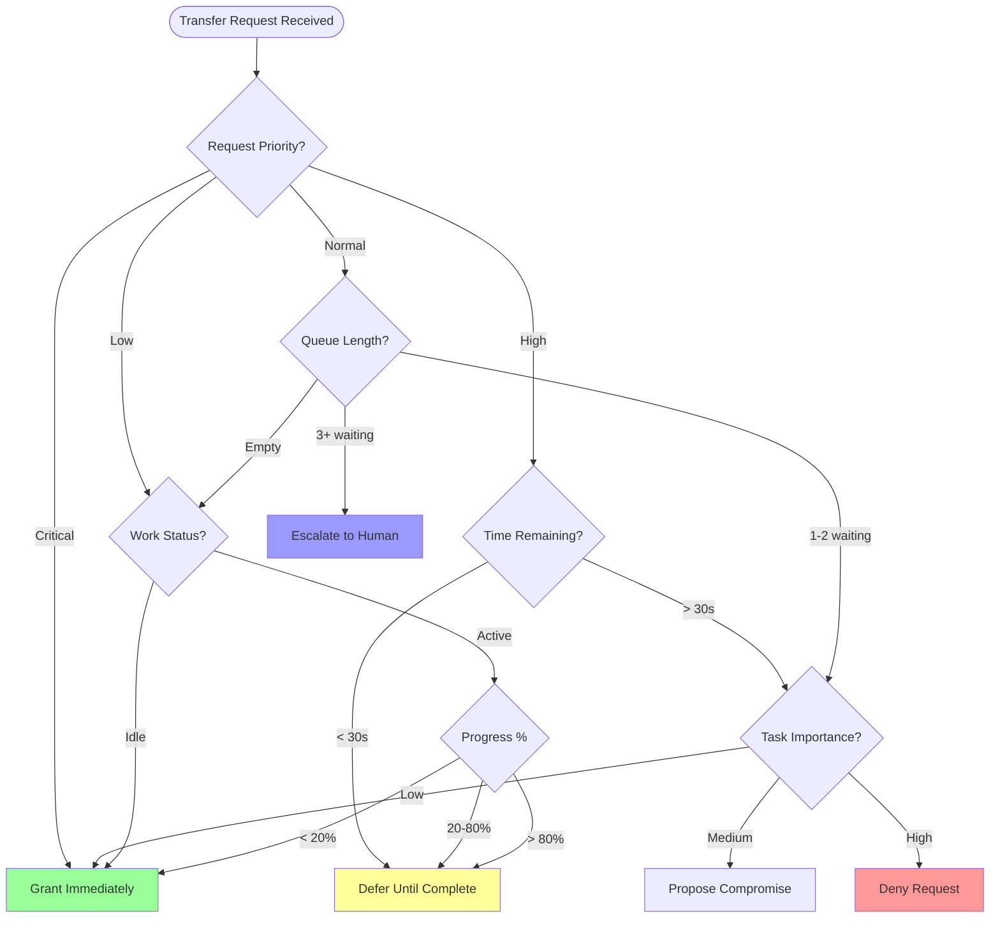
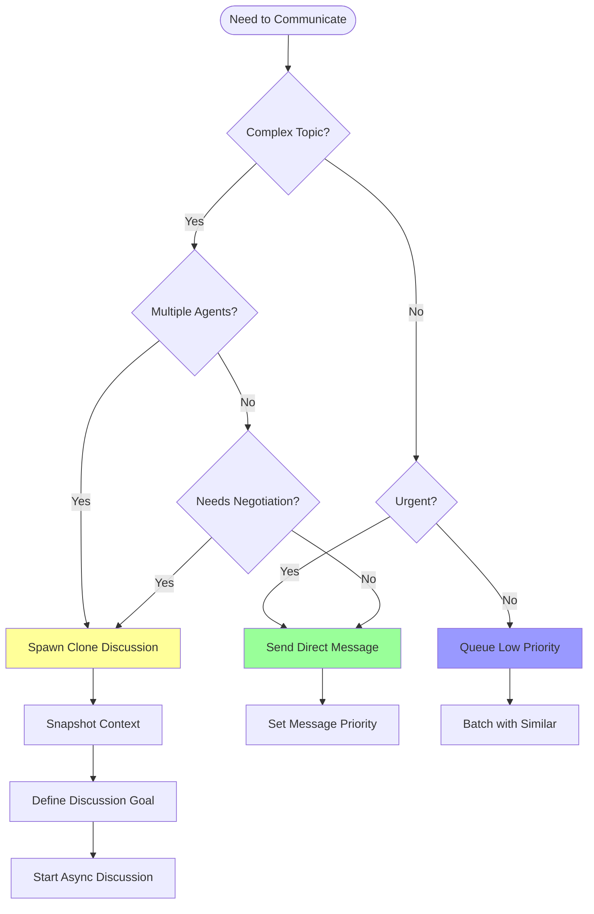
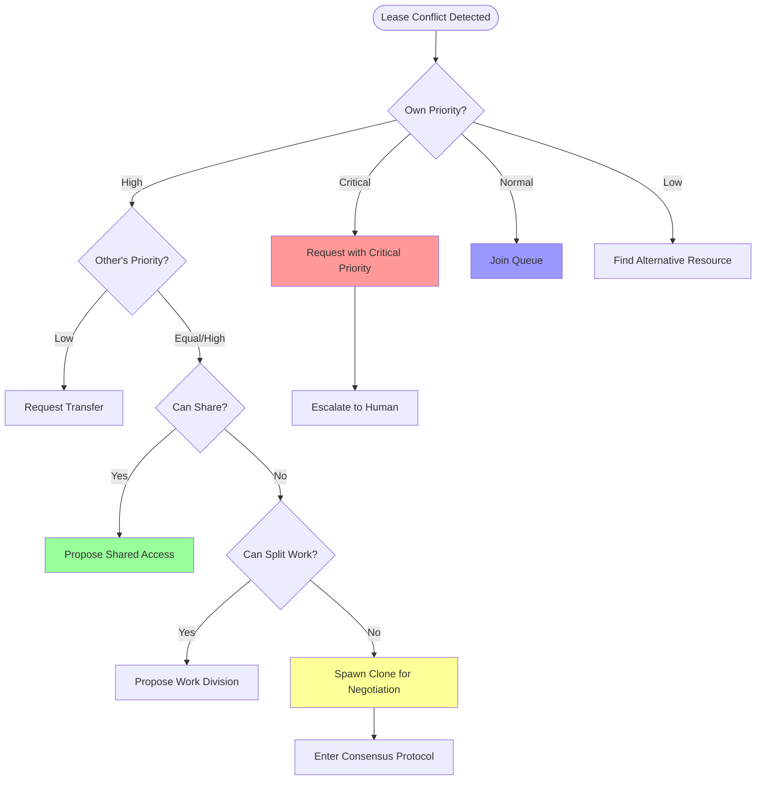
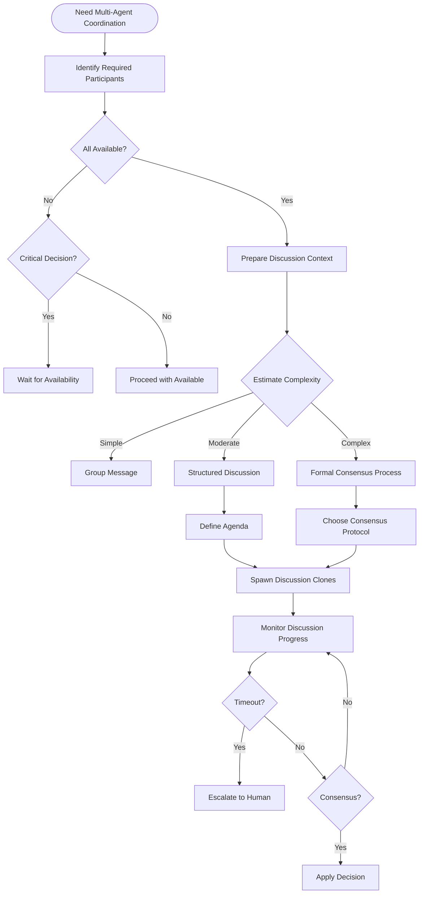
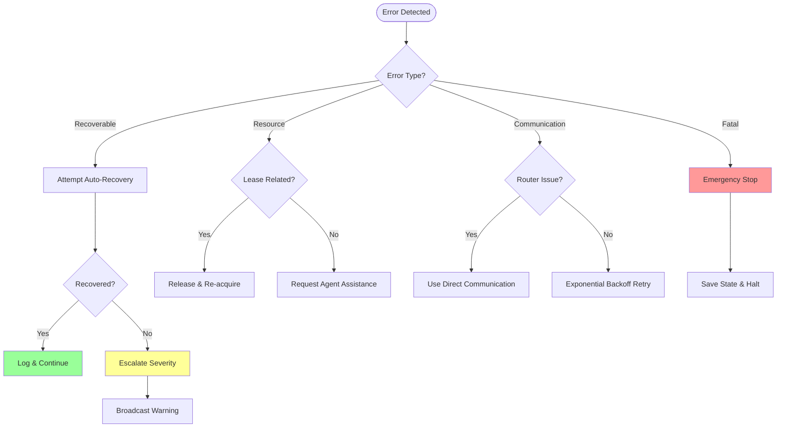

# Agent Capabilities Guide

This document defines the agent-side logic and decision-making patterns for effectively leveraging LIMINAL's Unified Message Router. It provides concrete heuristics, decision trees, and implementation guidelines for agent developers.

## 1. Lease Management Heuristics

### 1.1 When to Grant a Lease Transfer Request

Agents should evaluate transfer requests based on multiple factors:



### 1.2 Lease Request Decision Matrix

```typescript
interface LeaseDecisionFactors {
    requestPriority: Priority;
    currentTaskProgress: number;  // 0-100%
    timeRemaining: number;        // seconds
    queuedRequests: number;
    taskImportance: 'low' | 'medium' | 'high';
    isInterruptible: boolean;
}

function evaluateLeaseTransfer(factors: LeaseDecisionFactors): LeaseDecision {
    // Critical requests always escalate to human
    if (factors.requestPriority === Priority.Critical) {
        return LeaseDecision.Escalate;
    }

    // Near completion - defer
    if (factors.timeRemaining < 30 || factors.currentTaskProgress > 80) {
        return LeaseDecision.Defer(factors.timeRemaining);
    }

    // Multiple waiters - escalate for fairness
    if (factors.queuedRequests > 2) {
        return LeaseDecision.Escalate;
    }

    // Low importance work - grant
    if (factors.taskImportance === 'low' || factors.currentTaskProgress < 20) {
        return LeaseDecision.Grant;
    }

    // High importance, non-interruptible - deny
    if (factors.taskImportance === 'high' && !factors.isInterruptible) {
        return LeaseDecision.Deny(Reason.CriticalWork);
    }

    // Default: negotiate
    return LeaseDecision.Negotiate;
}
```

### 1.3 Proactive Lease Management

Agents should proactively manage their leases:

```typescript
class LeaseManager {
    // Request leases before needed
    async planLeaseAcquisition(taskPlan: TaskPlan): Promise<void> {
        const requiredResources = this.analyzeResourceNeeds(taskPlan);

        for (const resource of requiredResources) {
            const estimatedStartTime = this.estimateStartTime(resource);
            const estimatedDuration = this.estimateDuration(resource);

            // Request lease 30 seconds before needed
            setTimeout(() => {
                this.requestLease(resource, estimatedDuration);
            }, estimatedStartTime - 30000);
        }
    }

    // Release leases immediately when done
    async onTaskComplete(resource: string, leaseId: string): Promise<void> {
        await this.releaseLease(leaseId);

        // Notify waiting agents
        if (this.hasQueuedRequests(resource)) {
            await this.notifyNextInQueue(resource);
        }
    }

    // Extend leases if running long
    async monitorProgress(leaseId: string): Promise<void> {
        const interval = setInterval(async () => {
            const remaining = await this.getTimeRemaining(leaseId);
            const progress = await this.getTaskProgress();

            if (remaining < 60 && progress < 90) {
                // Need more time
                const extension = this.estimateAdditionalTime(progress);
                await this.extendLease(leaseId, extension);
            }

            if (progress === 100) {
                clearInterval(interval);
            }
        }, 10000); // Check every 10 seconds
    }
}
```

## 2. Intelligent Tool Usage

### 2.1 When to Spawn Clones vs Direct Messages



### 2.2 Clone Spawning Decision Logic

```typescript
interface CommunicationContext {
    topic: string;
    complexity: 'simple' | 'moderate' | 'complex';
    participants: AgentId[];
    expectedDuration: number;
    requiresConsensus: boolean;
    canWaitForResponse: boolean;
}

class CommunicationStrategy {
    determineStrategy(context: CommunicationContext): CommunicationMethod {
        // Complex multi-party discussions need clones
        if (context.participants.length > 2 && context.complexity === 'complex') {
            return {
                method: 'clone_discussion',
                reason: 'Multi-party complex topic requires parallel discussion'
            };
        }

        // Consensus building needs clones
        if (context.requiresConsensus) {
            return {
                method: 'clone_discussion',
                reason: 'Consensus requires structured discussion'
            };
        }

        // Long discussions that shouldn't block
        if (context.expectedDuration > 300 && context.canWaitForResponse) {
            return {
                method: 'clone_discussion',
                reason: 'Long discussion should not block primary work'
            };
        }

        // Simple, urgent messages go direct
        if (context.complexity === 'simple' && !context.canWaitForResponse) {
            return {
                method: 'direct_message',
                priority: Priority.High,
                reason: 'Simple urgent communication'
            };
        }

        // Default to queued message
        return {
            method: 'queued_message',
            priority: Priority.Normal,
            reason: 'Standard async communication'
        };
    }
}
```

### 2.3 Context Snapshot Strategy

```typescript
class ContextManager {
    // Determine what context to snapshot for clone
    prepareCloneContext(discussionTopic: string): ContextSnapshot {
        const baseContext = {
            agentId: this.id,
            currentTask: this.currentTask,
            timestamp: Date.now()
        };

        // Add topic-specific context
        switch (this.classifyTopic(discussionTopic)) {
            case 'api_design':
                return {
                    ...baseContext,
                    schemas: this.getCurrentSchemas(),
                    endpoints: this.getRelevantEndpoints(),
                    contracts: this.getExistingContracts()
                };

            case 'architecture':
                return {
                    ...baseContext,
                    components: this.getComponentMap(),
                    dependencies: this.getDependencyGraph(),
                    patterns: this.getArchitecturalPatterns()
                };

            case 'testing':
                return {
                    ...baseContext,
                    testSuites: this.getTestSuites(),
                    coverage: this.getCoverageReport(),
                    failures: this.getRecentFailures()
                };

            default:
                return {
                    ...baseContext,
                    relevantFiles: this.getRecentlyModifiedFiles(),
                    recentDecisions: this.getRecentDecisions()
                };
        }
    }

    // Differential snapshots for efficiency
    prepareDifferentialSnapshot(lastSnapshot: ContextSnapshot): DiffSnapshot {
        const changes = this.detectChanges(lastSnapshot, this.currentState);

        if (changes.size < 100) {  // Small diff
            return {
                type: 'differential',
                baseId: lastSnapshot.id,
                changes: changes
            };
        } else {  // Too many changes, send full
            return {
                type: 'full',
                snapshot: this.prepareCloneContext('')
            };
        }
    }
}
```

## 3. Message Priority Determination

### 3.1 Priority Assignment Logic

```typescript
enum MessagePriority {
    Critical,   // System failures, blocking issues
    Blocking,   // Consensus needed, lease negotiations
    Coordinate, // Task handoffs, status updates
    Info        // Progress updates, metrics
}

class PriorityCalculator {
    calculatePriority(message: Message): MessagePriority {
        // System failures are always critical
        if (message.type === 'error' || message.type === 'failure') {
            return MessagePriority.Critical;
        }

        // Blocking other agents
        if (this.isBlockingOthers(message)) {
            return MessagePriority.Blocking;
        }

        // Consensus requests
        if (message.type === 'consensus_request' ||
            message.type === 'lease_negotiation') {
            return MessagePriority.Blocking;
        }

        // Coordination messages
        if (message.type === 'task_handoff' ||
            message.type === 'status_change' ||
            message.type === 'resource_ready') {
            return MessagePriority.Coordinate;
        }

        // Everything else is informational
        return MessagePriority.Info;
    }

    private isBlockingOthers(message: Message): boolean {
        return message.metadata?.blocking === true ||
               message.metadata?.waitingAgents?.length > 0 ||
               message.type === 'holding_resource';
    }
}
```

### 3.2 Dynamic Priority Adjustment

```typescript
class AdaptivePriority {
    // Increase priority based on waiting time
    adjustPriorityOverTime(message: QueuedMessage): MessagePriority {
        const waitTime = Date.now() - message.queuedAt;
        const basePriority = message.priority;

        // Escalate after thresholds
        if (waitTime > 60000 && basePriority === MessagePriority.Info) {
            return MessagePriority.Coordinate;
        }

        if (waitTime > 120000 && basePriority === MessagePriority.Coordinate) {
            return MessagePriority.Blocking;
        }

        if (waitTime > 300000) {  // 5 minutes
            return MessagePriority.Critical;  // Something is wrong
        }

        return basePriority;
    }

    // Batch similar low-priority messages
    shouldBatchMessage(message: Message, queue: Message[]): boolean {
        if (message.priority !== MessagePriority.Info) {
            return false;  // Only batch info messages
        }

        const similar = queue.filter(m =>
            m.type === message.type &&
            m.recipient === message.recipient &&
            m.priority === MessagePriority.Info
        );

        return similar.length > 0;
    }
}
```

## 4. Decision Trees for Common Scenarios

### 4.1 Handling Lease Conflicts



### 4.2 Multi-Agent Discussion Initiation



### 4.3 Error Recovery Decision Tree



## 5. Implementation Guidelines

### 5.1 Agent Initialization

```typescript
class LiminalAgent {
    private router: MessageRouter;
    private leaseManager: LeaseManager;
    private cloneManager: CloneManager;
    private contextManager: ContextManager;

    async initialize(): Promise<void> {
        // Connect to router
        this.router = await MessageRouter.connect({
            agentId: this.id,
            capabilities: this.getCapabilities(),
            priority: this.getDefaultPriority()
        });

        // Set up lease management
        this.leaseManager = new LeaseManager(this.router);
        this.leaseManager.on('transfer_request', this.handleTransferRequest.bind(this));

        // Configure clone spawning
        this.cloneManager = new CloneManager(this.router);
        this.cloneManager.setSnapshotStrategy(this.contextManager.getStrategy());

        // Register message handlers
        this.router.on('message', this.handleMessage.bind(this));
        this.router.on('emergency', this.handleEmergency.bind(this));
    }
}
```

### 5.2 Best Practices

1. **Always Release Leases**: Never hold leases longer than necessary
2. **Prefer Async Communication**: Use clones for non-urgent discussions
3. **Batch Low-Priority Messages**: Reduce router load
4. **Snapshot Efficiently**: Use differential snapshots when possible
5. **Escalate Wisely**: Only escalate to humans when truly necessary
6. **Monitor Resource Usage**: Track lease utilization and adjust estimates
7. **Implement Fallbacks**: Have backup strategies for all critical operations

### 5.3 Performance Optimization

```typescript
class PerformanceOptimizer {
    // Cache frequently accessed context
    private contextCache: LRUCache<string, Context>;

    // Batch message sending
    private messageBatch: Message[] = [];
    private batchTimer: NodeJS.Timeout;

    async sendMessage(message: Message): Promise<void> {
        if (message.priority >= MessagePriority.Blocking) {
            // Send immediately
            await this.router.send(message);
        } else {
            // Batch low priority
            this.messageBatch.push(message);
            this.scheduleBatchSend();
        }
    }

    private scheduleBatchSend(): void {
        if (this.batchTimer) return;

        this.batchTimer = setTimeout(async () => {
            if (this.messageBatch.length > 0) {
                await this.router.sendBatch(this.messageBatch);
                this.messageBatch = [];
            }
            this.batchTimer = null;
        }, 100);  // Send every 100ms
    }
}
```

## 6. Monitoring and Metrics

### 6.1 Key Performance Indicators

```typescript
interface AgentMetrics {
    // Lease efficiency
    leaseUtilization: number;        // Time actively using vs holding
    leaseConflicts: number;          // Conflicts per hour
    averageLeaseWaitTime: number;    // Seconds

    // Communication efficiency
    messagesPerTask: number;
    cloneSpawnsPerHour: number;
    consensusSuccessRate: number;
    averageDiscussionTime: number;

    // Task performance
    tasksCompleted: number;
    taskSuccessRate: number;
    averageTaskDuration: number;
    blockedTime: number;             // Time waiting for resources
}

class MetricsCollector {
    collect(): AgentMetrics {
        return {
            leaseUtilization: this.calculateLeaseUtilization(),
            leaseConflicts: this.countLeaseConflicts(),
            averageLeaseWaitTime: this.calculateAverageWait(),
            // ... etc
        };
    }

    reportAnomalies(metrics: AgentMetrics): void {
        if (metrics.leaseUtilization < 0.5) {
            this.warn('Low lease utilization - holding resources unnecessarily');
        }

        if (metrics.consensusSuccessRate < 0.8) {
            this.warn('Low consensus success - consider simplifying discussions');
        }

        if (metrics.blockedTime > metrics.averageTaskDuration * 0.3) {
            this.warn('Excessive blocking - optimize resource requests');
        }
    }
}
```

## Conclusion

This guide provides agents with the decision-making framework needed to effectively operate within LIMINAL's collaborative environment. By following these heuristics and patterns, agents can:

- Minimize resource conflicts through intelligent lease management
- Communicate efficiently using appropriate methods
- Participate effectively in consensus building
- Recover gracefully from errors
- Optimize their performance within the system

The key principle is that agents should behave like considerate team members: respecting others' work, communicating asynchronously when possible, and escalating to humans only when necessary.