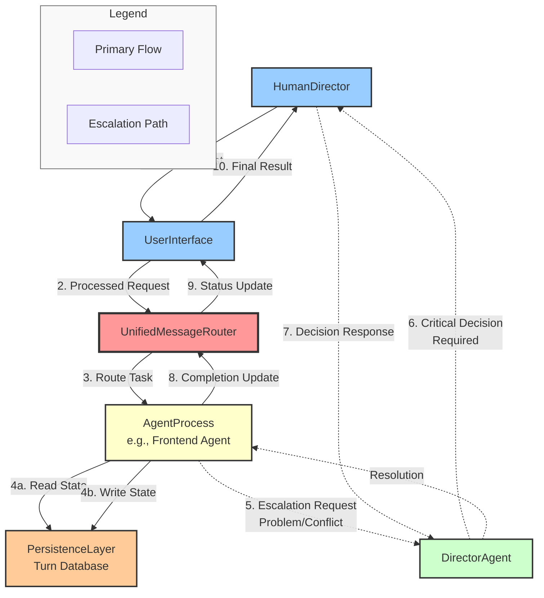

# LIMINAL System Data Flow Diagram

## High-Level Request Flow Architecture

## Data Flow Description

### Primary Request Path
1. **User Request**: HumanDirector initiates a request
2. **UI Processing**: UserInterface processes and formats the request
3. **Routing**: UnifiedMessageRouter determines appropriate agent
4. **Execution**: AgentProcess executes task with persistence layer support
   - 4a: Reads current state from Turn Database
   - 4b: Writes updated state to Turn Database
5-7. **Escalation** (when needed): Problems escalate through DirectorAgent to HumanDirector
8. **Completion**: AgentProcess sends completion status
9. **Status Update**: Router forwards status to UI
10. **Result Display**: UserInterface presents final result to HumanDirector

### Key Component Roles

- **HumanDirector**: System entry/exit point for human oversight
- **UserInterface**: Request processing and result presentation layer
- **UnifiedMessageRouter** (Central Hub): Core routing and orchestration engine
- **AgentProcess**: Task execution engines (e.g., Frontend, Backend agents)
- **PersistenceLayer**: State management and turn history
- **DirectorAgent**: Escalation handler for complex decisions

### Escalation Protocol
Dotted lines indicate the escalation path activated when:
- AgentProcess encounters unresolvable conflicts
- Ambiguous requirements need clarification
- Critical decisions require human judgment

The escalation flow ensures system resilience while maintaining human oversight for critical decisions.