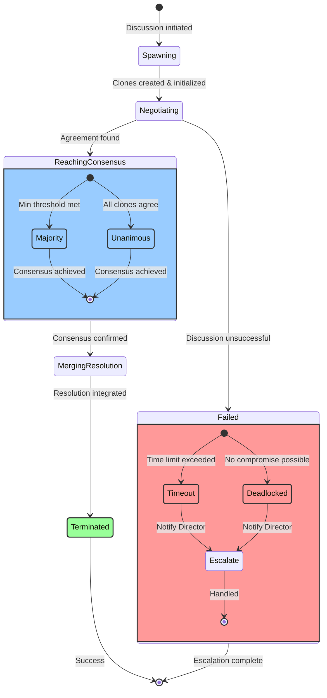

# Clone Discussion Lifecycle State Diagram

## Asynchronous Negotiation Process

## State Descriptions

### Primary States

**Spawning**
- Parent agents create clone instances
- Initialize discussion parameters (timeout, consensus threshold)
- Allocate resources for negotiation

**Negotiating**
- Active exchange of proposals and counter-proposals
- Clones evaluate options against their constraints
- Iterative refinement of solutions

**ReachingConsensus** (Composite State)
- **Majority**: Minimum threshold of clones agree (e.g., 75%)
- **Unanimous**: All clones reach full agreement
- Consensus type determined by discussion requirements

**MergingResolution**
- Parent agents integrate consensus decision
- Update system state with agreed solution
- Propagate changes to affected components

**Terminated** ✅
- Successful completion of discussion
- Resources released
- Results logged for audit

### Failure States

**Failed** (Composite State) ❌
- **Timeout**: Discussion exceeds allocated time limit
- **Deadlocked**: Clones cannot find acceptable compromise
- **Escalate**: Director Agent notified for intervention

## Transition Conditions

| From | To | Condition |
|------|-----|-----------|
| [*] | Spawning | New discussion request received |
| Spawning | Negotiating | All clones successfully initialized |
| Negotiating | ReachingConsensus | Sufficient agreement detected |
| Negotiating | Failed | Timeout OR deadlock detected |
| ReachingConsensus | MergingResolution | Consensus validated & confirmed |
| MergingResolution | Terminated | Resolution successfully integrated |
| Failed | [*] | Escalation handled by Director |
| Terminated | [*] | Discussion lifecycle complete |

## Key Design Principles

1. **Asynchronous Operation**: All state transitions are non-blocking
2. **Failure Recovery**: Built-in escalation paths for all failure modes
3. **Consensus Flexibility**: Supports both majority and unanimous decisions
4. **Resource Management**: Clear entry/exit points for cleanup
5. **Audit Trail**: Every state transition is logged for debugging

## Implementation Notes

- State transitions emit events for monitoring
- Timeout values configurable per discussion type
- Consensus thresholds adjustable based on criticality
- Failed discussions preserve context for Director review
- Parent agents maintain heartbeat during clone negotiations