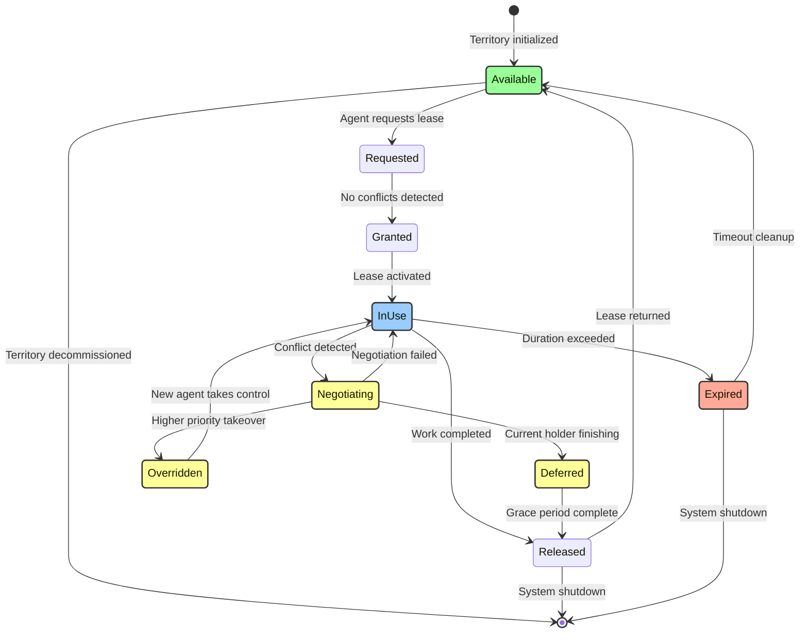

# Territory Lease State Diagram

## Agent Coordination Resource Management



## State Descriptions

### Primary States

**Available** 🟢
- Territory is free and ready for lease
- No agent currently holds ownership
- Resource monitor actively tracking

**Requested**
- Agent has submitted lease request
- System validating request parameters
- Checking for conflicts with existing leases

**Granted**
- Lease approved by system
- Ownership token generated
- Transition to active use imminent

**InUse** 🔵
- Agent actively working in territory
- Exclusive access enforced
- Heartbeat monitoring active
- Duration timer running

### Conflict Resolution States

**Negotiating** 🟡
- Multiple agents claiming same territory
- Automated conflict resolution initiated
- Priority comparison in progress
- Options: defer, override, or maintain

**Deferred** 🟡
- New request postponed
- Current holder given grace period
- Queue position maintained
- Automatic retry scheduled

**Overridden** 🟡
- High-priority agent takes precedence
- Force transfer executed
- Previous holder notified
- State preserved for handoff

### Terminal States

**Released** ✅
- Agent voluntarily relinquishes lease
- Clean shutdown performed
- Resources freed
- Territory marked available

**Expired** 🟠
- Lease duration limit reached
- Automatic cleanup triggered
- Agent forcibly evicted
- Warning logged for analysis

## Transition Rules

| From | To | Trigger | Condition |
|------|-----|---------|-----------|
| Available | Requested | lease_request() | Territory not reserved |
| Requested | Granted | validate_lease() | No conflicts found |
| Granted | InUse | activate_lease() | Token issued |
| InUse | Released | release_lease() | Agent completes work |
| InUse | Expired | timeout_check() | Duration > max_lease_time |
| InUse | Negotiating | conflict_detected() | Another agent requests |
| Negotiating | Deferred | defer_decision() | Current holder near completion |
| Negotiating | Overridden | priority_override() | New agent priority higher |
| Negotiating | InUse | maintain_lease() | Current holder priority higher |
| Deferred | Released | grace_period_end() | Deferred time elapsed |
| Overridden | InUse | transfer_complete() | New agent takes control |
| Released | Available | cleanup_complete() | Territory reset |
| Expired | Available | force_cleanup() | Eviction complete |

## Lease Management Properties

### Configuration Parameters
- `max_lease_duration`: Maximum time an agent can hold a territory
- `grace_period`: Time allowed for deferred completion
- `heartbeat_interval`: Frequency of lease health checks
- `priority_threshold`: Minimum priority difference for override

### Conflict Resolution Algorithm

This is a high-level summary of the conflict resolution logic. For the complete, multi-factor decision tree and reference implementation, see the [Agent Capabilities Guide](../reference/01_agent_capabilities.md#11-when-to-grant-a-lease-transfer-request).

```
1. Compare agent priorities.
2. If difference > threshold:
   - Higher priority agent may override.
3. Else if current holder is near completion:
   - Defer the new request.
4. Else:
   - Maintain the current lease and queue the request.
```

## Implementation Considerations

### Atomicity Requirements
- State transitions must be atomic
- Distributed lock required for conflict states
- Transaction log for audit trail

### Monitoring Metrics
- Average lease duration
- Conflict frequency per territory
- Override vs defer ratio
- Expired lease percentage

### Failure Handling
- Agent crash → Expired state after heartbeat timeout
- Network partition → Conservative lease retention
- System restart → All leases reset to Available

## Example Scenarios

### Scenario 1: Normal Operation
```
Available → Requested → Granted → InUse → Released → Available
```

### Scenario 2: Priority Override
```
InUse → Negotiating → Overridden → InUse (new agent)
```

### Scenario 3: Graceful Deferral
```
InUse → Negotiating → Deferred → Released → Available
```

### Scenario 4: Timeout Enforcement
```
InUse → Expired → Available
```