# Agent Capabilities Guide

This document defines the agent-side logic and decision-making patterns for effectively leveraging LIMINAL's [Unified Message Router](./00_glossary.md#unified-message-router). It provides concrete heuristics, decision trees, and implementation guidelines for agent developers.

## 1. Lease Management Heuristics

### 1.1 When to Grant a Lease Transfer Request

Agents must intelligently evaluate transfer requests based on multiple factors. The following decision tree provides a complete evaluation framework:

```mermaid
flowchart TD
    Start([Transfer Request Received])

    Start --> CheckPriority{Request Priority?}

    CheckPriority -->|Critical| Escalate[Escalate to Human]
    CheckPriority -->|Blocking| CheckTime{Time Remaining?}
    CheckPriority -->|Coordinate| CheckQueue{Queue Length?}
    CheckPriority -->|Info| CheckWork{Work Status?}

    CheckTime -->|< 30s| Defer[Defer Until Complete]
    CheckTime -->|30-60s| CheckImportance{Task Importance?}
    CheckTime -->|> 60s| CheckProgress{Progress %}

    CheckQueue -->|0 waiting| CheckWork
    CheckQueue -->|1-2 waiting| CheckImportance
    CheckQueue -->|3+ waiting| Escalate

    CheckImportance -->|Low| Grant[Grant Immediately]
    CheckImportance -->|Medium| Negotiate[Propose Compromise]
    CheckImportance -->|High| CheckInterrupt{Interruptible?}

    CheckInterrupt -->|Yes| SaveState[Save & Grant]
    CheckInterrupt -->|No| Deny[Deny Request]

    CheckWork -->|Idle| Grant
    CheckWork -->|Active| CheckProgress

    CheckProgress -->|< 20%| Grant
    CheckProgress -->|20-50%| CheckSavepoint{Has Savepoint?}
    CheckProgress -->|50-80%| Negotiate
    CheckProgress -->|> 80%| Defer

    CheckSavepoint -->|Yes| SaveState
    CheckSavepoint -->|No| Negotiate

    SaveState --> Grant

    style Grant fill:#9f9
    style Defer fill:#ff9
    style Deny fill:#f99
    style Escalate fill:#99f
    style Negotiate fill:#f9f
```



### 1.2 Lease Request Decision Matrix Implementation

```rust
pub struct LeaseDecisionFactors {
    pub request_priority: Priority,
    pub current_task_progress: f32,      // 0.0 to 1.0
    pub time_remaining: Duration,        // Time left on current lease
    pub queued_requests: usize,          // Number of agents waiting
    pub task_importance: TaskImportance,
    pub is_interruptible: bool,
    pub has_savepoint: bool,
}

#[derive(Debug, Clone)]
pub enum LeaseDecision {
    Grant { immediate: bool },
    Defer { retry_after: Duration },
    Deny { reason: String },
    Negotiate { proposal: NegotiationProposal },
    Escalate { reason: EscalationReason },
}

impl LeaseManager {
    pub fn evaluate_transfer_request(&self, factors: LeaseDecisionFactors) -> LeaseDecision {
        // Critical requests always escalate to human
        if factors.request_priority == Priority::Critical {
            return LeaseDecision::Escalate {
                reason: EscalationReason::CriticalRequest
            };
        }

        // Multiple waiters trigger fairness escalation
        let escalation_threshold = self.config.lease_conflict_escalation_threshold.unwrap_or(2);
        if factors.queued_requests > escalation_threshold {
            return LeaseDecision::Escalate {
                reason: EscalationReason::QueueDepth(factors.queued_requests)
            };
        }

        // Near completion - defer with specific retry time
        let deferral_threshold = self.config.lease_deferral_threshold.unwrap_or(Duration::from_secs(30));
        if factors.time_remaining < deferral_threshold || factors.current_task_progress > 0.8 {
            return LeaseDecision::Defer {
                retry_after: factors.time_remaining + Duration::from_secs(5)
            };
        }

        // Blocking priority with low-importance work - grant
        if factors.request_priority == Priority::Blocking && factors.task_importance == TaskImportance::Low {
            return LeaseDecision::Grant { immediate: true };
        }

        // Early in task or idle - grant
        if factors.current_task_progress < 0.2 {
            return LeaseDecision::Grant { immediate: true };
        }

        // High importance, non-interruptible - deny
        if factors.task_importance == TaskImportance::High && !factors.is_interruptible {
            return LeaseDecision::Deny {
                reason: "Critical non-interruptible work in progress".to_string()
            };
        }

        // Mid-progress with savepoint - can grant after saving
        if factors.current_task_progress < 0.5 && factors.has_savepoint {
            return LeaseDecision::Grant { immediate: false }; // Save state first
        }

        // Default: negotiate a compromise
        LeaseDecision::Negotiate {
            proposal: self.generate_compromise_proposal(factors)
        }
    }

    fn generate_compromise_proposal(&self, factors: LeaseDecisionFactors) -> NegotiationProposal {
        NegotiationProposal {
            options: vec![
                ProposalOption::SplitResource {
                    holder_portion: 0.6,
                    requester_portion: 0.4,
                },
                ProposalOption::TimeShare {
                    holder_duration: Duration::from_secs(180),
                    requester_duration: Duration::from_secs(120),
                },
                ProposalOption::DeferWithPriority {
                    defer_duration: factors.time_remaining / 2,
                    priority_boost: true,
                },
            ],
            rationale: format!(
                "Current task {}% complete, importance: {:?}",
                (factors.current_task_progress * 100.0) as u32,
                factors.task_importance
            ),
        }
    }
}
```

### 1.3 Proactive Lease Management Strategy

```rust
pub struct ProactiveLeaseManager {
    planned_leases: BTreeMap<Instant, PlannedLease>,
    active_leases: HashMap<LeaseId, ActiveLease>,
    monitor_interval: Duration,
}

impl ProactiveLeaseManager {
    /// Plan lease acquisitions based on task analysis
    pub async fn plan_lease_acquisition(&mut self, task_plan: &TaskPlan) -> Result<()> {
        let resource_timeline = self.analyze_resource_needs(task_plan)?;

        for (resource, timing) in resource_timeline {
            let planned = PlannedLease {
                resource: resource.clone(),
                estimated_start: timing.start,
                estimated_duration: timing.duration,
                priority: self.calculate_lease_priority(&resource, task_plan),
                fallback_resources: self.identify_alternatives(&resource),
            };

            // Schedule acquisition 30 seconds before needed
            let acquire_at = timing.start.saturating_sub(Duration::from_secs(30));
            self.planned_leases.insert(acquire_at, planned);
        }

        // Start monitoring task
        self.start_lease_monitor().await;
        Ok(())
    }

    /// Monitor and extend leases proactively
    async fn monitor_active_leases(&mut self) {
        for (lease_id, lease) in &mut self.active_leases {
            let remaining = lease.expires_at.saturating_duration_since(Instant::now());
            let progress = lease.get_task_progress().await;

            // Extend if running low on time but not done
            if remaining < Duration::from_secs(60) && progress < 0.9 {
                let extension = self.calculate_extension(progress, remaining);

                match self.extend_lease(lease_id, extension).await {
                    Ok(_) => {
                        lease.expires_at += extension;
                        log::info!("Extended lease {} by {:?}", lease_id, extension);
                    }
                    Err(e) => {
                        // Prepare for lease loss
                        self.prepare_savepoint(lease).await;
                        log::warn!("Failed to extend lease {}: {}", lease_id, e);
                    }
                }
            }

            // Release immediately when done
            if progress >= 1.0 {
                self.release_lease(lease_id).await;

                // Notify next in queue if any
                if let Some(next) = self.get_next_waiter(&lease.resource) {
                    self.notify_available(next, &lease.resource).await;
                }
            }
        }
    }

    /// Calculate optimal extension duration
    fn calculate_extension(&self, progress: f32, remaining: Duration) -> Duration {
        let estimated_total = remaining.as_secs_f32() / (1.0 - progress);
        let needed = Duration::from_secs_f32(estimated_total * (1.0 - progress));

        // Add 20% buffer, cap at max extension
        let with_buffer = needed.mul_f32(1.2);
        with_buffer.min(self.config.max_lease_extension)
    }
}
```

## 2. Intelligent Tool Usage: Clones vs. Direct Messages

### 2.1 Communication Method Decision Tree


### 2.2 Clone Spawning Decision Logic

```rust
pub struct CommunicationContext {
    pub topic: Topic,
    pub complexity: Complexity,
    pub participants: Vec<AgentId>,
    pub expected_duration: Duration,
    pub requires_consensus: bool,
    pub can_wait_for_response: bool,
    pub context_size: usize,
    pub urgency: Urgency,
}

pub struct CommunicationStrategy {
    config: StrategyConfig,
    metrics: CommunicationMetrics,
}

impl CommunicationStrategy {
    pub fn determine_method(&self, ctx: &CommunicationContext) -> CommunicationMethod {
        // Measure decision time for optimization
        let start = Instant::now();

        let method = match (ctx.complexity, ctx.participants.len(), ctx.urgency) {
            // Critical urgency always uses direct message
            (_, _, Urgency::Critical) => CommunicationMethod::Direct {
                priority: Priority::Blocking,
                reason: "Critical urgency requires immediate delivery",
            },

            // Complex multi-party needs clones
            (Complexity::Complex, n, _) if n > 2 => CommunicationMethod::CloneDiscussion {
                participant_count: n,
                estimated_duration: ctx.expected_duration,
                context_strategy: self.determine_snapshot_strategy(ctx.context_size),
                reason: "Complex multi-party discussion requires parallel processing",
            },

            // Consensus building needs clones
            (_, _, _) if ctx.requires_consensus => CommunicationMethod::CloneDiscussion {
                participant_count: ctx.participants.len(),
                estimated_duration: Duration::from_secs(300), // 5 min default
                context_strategy: SnapshotStrategy::Selective,
                reason: "Consensus building requires dedicated discussion thread",
            },

            // Simple urgent messages
            (Complexity::Simple, _, Urgency::High) => CommunicationMethod::Direct {
                priority: Priority::Coordinate,
                reason: "Simple urgent message needs immediate delivery",
            },

            // Low priority batchable messages
            (Complexity::Simple, _, Urgency::Low) if ctx.can_wait_for_response => {
                CommunicationMethod::Batched {
                    batch_window: Duration::from_secs(30),
                    priority: Priority::Info,
                    reason: "Low-priority message can be batched for efficiency",
                }
            }

            // Default: evaluate based on response requirement
            _ => {
                if !ctx.can_wait_for_response {
                    CommunicationMethod::Direct {
                        priority: Priority::Coordinate,
                        reason: "Requires synchronous response",
                    }
                } else {
                    CommunicationMethod::Queued {
                        priority: Priority::Info,
                        deliver_at_pause: true,
                        reason: "Can wait for natural pause point",
                    }
                }
            }
        };

        // Record metrics
        self.metrics.record_decision(start.elapsed(), &method);

        method
    }

    fn determine_snapshot_strategy(&self, context_size: usize) -> SnapshotStrategy {
        match context_size {
            0..=4096 => SnapshotStrategy::Full,           // < 4KB: send everything
            4097..=8192 => SnapshotStrategy::Selective,   // 4-8KB: cherry-pick
            _ => SnapshotStrategy::Differential,          // > 8KB: send changes only
        }
    }
}
```

### 2.3 Context Snapshot Strategy Implementation

```rust
pub struct ContextSnapshotManager {
    snapshot_cache: LruCache<AgentId, CachedSnapshot>,
    compression: CompressionStrategy,
    diff_threshold: usize, // Default: 100 logical changes
}

impl ContextSnapshotManager {
    /// Create optimal snapshot for clone spawning (<10ms target)
    pub async fn create_snapshot(
        &mut self,
        agent_id: AgentId,
        state: &AgentState,
        purpose: DiscussionPurpose,
    ) -> Result<Snapshot> {
        let start = Instant::now();

        // Get previous snapshot if exists
        let prev = self.snapshot_cache.get(&agent_id);

        // Calculate changes since last snapshot
        let changes = if let Some(prev) = prev {
            state.calculate_changes_since(&prev.state)?
        } else {
            usize::MAX // Force full snapshot
        };

        let snapshot = if changes < self.diff_threshold {
            // Create differential snapshot
            self.create_differential(state, prev.unwrap(), purpose).await?
        } else {
            // Create full snapshot
            self.create_full(state, purpose).await?
        };

        // Ensure we meet performance target
        let elapsed = start.elapsed();
        if elapsed > Duration::from_millis(10) {
            log::warn!("Snapshot creation took {:?} (target: 10ms)", elapsed);
        }

        // Cache for future differentials
        self.snapshot_cache.put(agent_id, CachedSnapshot {
            state: state.clone(),
            created_at: Instant::now(),
        });

        Ok(snapshot)
    }

    async fn create_differential(
        &self,
        current: &AgentState,
        previous: &CachedSnapshot,
        purpose: DiscussionPurpose,
    ) -> Result<Snapshot> {
        // Filter to relevant changes for the discussion purpose
        let relevant_changes = self.filter_changes_for_purpose(
            current.diff(&previous.state)?,
            purpose
        );

        // Compress using bincode + zstd
        let serialized = bincode::serialize(&relevant_changes)?;
        let compressed = self.compression.compress(&serialized)?;

        Ok(Snapshot {
            kind: SnapshotKind::Differential {
                base_id: previous.id,
                changes: compressed,
            },
            size: compressed.len(),
            purpose,
            created_at: Instant::now(),
        })
    }

    async fn create_full(
        &self,
        state: &AgentState,
        purpose: DiscussionPurpose,
    ) -> Result<Snapshot> {
        // Select only necessary state for the purpose
        let filtered = self.filter_state_for_purpose(state, purpose);

        // Serialize and compress
        let serialized = bincode::serialize(&filtered)?;
        let compressed = self.compression.compress(&serialized)?;

        Ok(Snapshot {
            kind: SnapshotKind::Full {
                state: compressed,
            },
            size: compressed.len(),
            purpose,
            created_at: Instant::now(),
        })
    }

    fn filter_state_for_purpose(&self, state: &AgentState, purpose: DiscussionPurpose) -> FilteredState {
        match purpose {
            DiscussionPurpose::ApiContract => FilteredState {
                include_leases: false,
                include_message_history: true,
                include_task_state: true,
                include_metrics: false,
                max_history_depth: 10,
            },
            DiscussionPurpose::LeaseNegotiation => FilteredState {
                include_leases: true,
                include_message_history: false,
                include_task_state: true,
                include_metrics: false,
                max_history_depth: 0,
            },
            DiscussionPurpose::ConsensusBuilding => FilteredState {
                include_leases: true,
                include_message_history: true,
                include_task_state: true,
                include_metrics: true,
                max_history_depth: 20,
            },
        }
    }
}
```

## 3. Message Priority Determination

For a full breakdown of message priority levels, see the [LIMINAL Message Priority and Interaction Model Specification](./02_interaction_model.md).

### 3.1 Priority Assignment Decision Matrix


### 3.2 Priority Assignment Implementation

```rust
pub struct PriorityCalculator {
    agent_caps: AgentCapabilities,
    current_state: AgentState,
    config: PriorityConfig,
}

impl PriorityCalculator {
    pub fn calculate_priority(&self, message: &OutgoingMessage) -> Priority {
        // Agents cannot assign Critical priority (Director only)
        if self.would_be_critical(message) {
            return self.escalate_to_director(message);
        }

        match message.message_type {
            MessageType::LeaseRequest { deadline, .. } => {
                if deadline < Duration::from_secs(30) {
                    Priority::Blocking
                } else {
                    Priority::Coordinate
                }
            }

            MessageType::TaskHandoff { blocks_count, .. } => {
                match blocks_count {
                    0 => Priority::Info,
                    1 => Priority::Coordinate,
                    _ => Priority::Blocking,
                }
            }

            MessageType::ConsensusRequest { participants, .. } => {
                // Multi-party consensus is always Coordinate
                if participants.len() > 2 {
                    Priority::Coordinate
                } else {
                    Priority::Info
                }
            }

            MessageType::StatusUpdate { .. } => Priority::Info,

            MessageType::ErrorReport { severity, .. } => {
                match severity {
                    ErrorSeverity::Fatal => self.escalate_to_director(message),
                    ErrorSeverity::Recoverable => Priority::Coordinate,
                    ErrorSeverity::Warning => Priority::Info,
                }
            }

            _ => self.calculate_default_priority(message),
        }
    }

    fn would_be_critical(&self, message: &OutgoingMessage) -> bool {
        matches!(message.message_type,
            MessageType::SystemFailure { .. } |
            MessageType::DeadlockDetected { .. } |
            MessageType::DataCorruption { .. }
        )
    }

    fn escalate_to_director(&self, message: &OutgoingMessage) -> Priority {
        // Create escalation request to Director
        self.request_director_intervention(message);
        Priority::Blocking // Max priority for regular agents
    }
}
```

### 3.3 Dynamic Priority Adjustment

```rust
pub struct PriorityAdjuster {
    aging_config: AgingConfig,
    starvation_threshold: Duration,
}

impl PriorityAdjuster {
    /// Apply aging to prevent starvation
    pub fn apply_aging(&self, queued_message: &mut QueuedMessage) {
        let age = queued_message.age();

        // Boost priority after thresholds
        let boost = match age {
            d if d > self.aging_config.critical_threshold => 2,
            d if d > self.aging_config.boost_threshold => 1,
            _ => 0,
        };

        if boost > 0 {
            let new_priority = queued_message.priority.boost(boost);
            log::info!(
                "Boosted message {} from {:?} to {:?} due to age {:?}",
                queued_message.id, queued_message.priority, new_priority, age
            );
            queued_message.priority = new_priority;
        }

        // Check for starvation
        if age > self.starvation_threshold {
            self.escalate_starvation(queued_message);
        }
    }

    /// Prevent priority inflation
    pub fn validate_priority(&self, agent: &Agent, requested: Priority) -> Priority {
        // Check agent's priority cap
        let max_allowed = agent.get_max_priority();

        // Clones are capped at Coordinate
        let effective_max = if agent.is_clone() {
            Priority::Coordinate.min(max_allowed)
        } else {
            max_allowed
        };

        // Check for gaming patterns
        if self.detect_priority_gaming(agent) {
            log::warn!("Priority gaming detected for agent {}", agent.id);
            return Priority::Info; // Penalize gaming
        }

        requested.min(effective_max)
    }

    fn detect_priority_gaming(&self, agent: &Agent) -> bool {
        let recent = agent.recent_priority_history(Duration::from_secs(60));

        // Check for suspicious patterns
        let high_priority_ratio = recent.iter()
            .filter(|p| **p >= Priority::Blocking)
            .count() as f32 / recent.len() as f32;

        high_priority_ratio > 0.5 // More than 50% high priority is suspicious
    }
}
```

## 4. Error Recovery Decision Framework

### 4.1 Error Recovery Decision Tree


### 4.2 Error Recovery Implementation

```rust
pub struct ErrorRecoveryManager {
    retry_policy: RetryPolicy,
    savepoint_manager: SavepointManager,
    fallback_registry: FallbackRegistry,
}

impl ErrorRecoveryManager {
    pub async fn handle_error(&mut self, error: AgentError) -> Result<RecoveryAction> {
        let start = Instant::now();

        let action = match error.classify() {
            ErrorClass::Network(net_err) => {
                self.handle_network_error(net_err).await
            }

            ErrorClass::Resource(res_err) => {
                self.handle_resource_error(res_err).await
            }

            ErrorClass::Logic(logic_err) => {
                self.handle_logic_error(logic_err).await
            }

            ErrorClass::Fatal(fatal_err) => {
                self.handle_fatal_error(fatal_err).await
            }
        };

        // Log recovery attempt
        log::info!(
            "Error recovery for {:?} took {:?}, action: {:?}",
            error, start.elapsed(), action
        );

        Ok(action)
    }

    async fn handle_network_error(&mut self, error: NetworkError) -> RecoveryAction {
        let retry_state = self.retry_policy.get_state(&error.endpoint);

        if retry_state.attempts < self.retry_policy.max_attempts {
            // Calculate backoff
            let backoff = self.retry_policy.calculate_backoff(retry_state.attempts);

            RecoveryAction::Retry {
                after: backoff,
                attempt: retry_state.attempts + 1,
            }
        } else if let Some(fallback) = self.fallback_registry.get(&error.endpoint) {
            RecoveryAction::UseFallback {
                endpoint: fallback,
                reason: "Max retries exceeded",
            }
        } else {
            RecoveryAction::Escalate {
                severity: Severity::High,
                reason: format!("Network error after {} attempts", retry_state.attempts),
            }
        }
    }

    async fn handle_resource_error(&mut self, error: ResourceError) -> RecoveryAction {
        match error.kind {
            ResourceErrorKind::LeaseUnavailable { resource, holder } => {
                // Try to negotiate
                match self.request_lease_transfer(&resource, &holder).await {
                    Ok(lease) => RecoveryAction::Continue { with_lease: lease },
                    Err(_) => {
                        // Check for alternatives
                        if let Some(alt) = self.find_alternative_resource(&resource) {
                            RecoveryAction::UseAlternative {
                                resource: alt,
                                reason: "Primary resource unavailable",
                            }
                        } else {
                            RecoveryAction::Escalate {
                                severity: Severity::Medium,
                                reason: "Resource blocked, no alternatives",
                            }
                        }
                    }
                }
            }

            ResourceErrorKind::InsufficientCapacity => {
                RecoveryAction::Wait {
                    duration: Duration::from_secs(30),
                    then_retry: true,
                }
            }
        }
    }

    async fn handle_logic_error(&mut self, error: LogicError) -> RecoveryAction {
        if error.is_recoverable {
            if let Some(savepoint) = self.savepoint_manager.get_latest() {
                // Restore from savepoint
                self.savepoint_manager.restore(savepoint).await?;
                RecoveryAction::RetryFromSavepoint {
                    savepoint_id: savepoint.id,
                    skip_steps: error.skip_on_retry,
                }
            } else {
                // Restart task
                RecoveryAction::RestartTask {
                    reason: "Logic error, no savepoint available",
                }
            }
        } else {
            RecoveryAction::Report {
                to: AgentId::Director,
                error: error.into(),
                continue_other_tasks: true,
            }
        }
    }
}
```

## 5. Director Agent Special Capabilities

The AI [Director Agent](./00_glossary.md#director-agent) has unique capabilities for orchestrating the team, including handling escalations and monitoring system health.

### 5.1 Director Agent Authority Matrix

```rust
pub struct DirectorCapabilities {
    // Exclusive Director capabilities
    pub can_issue_critical_priority: bool,      // true
    pub can_override_leases: bool,              // true
    pub can_modify_agent_priorities: bool,      // true
    pub can_spawn_unlimited_clones: bool,       // true
    pub can_access_all_agent_state: bool,       // true

    // Escalation handling
    pub escalation_authority: EscalationAuthority,

    // System monitoring
    pub monitoring_access: MonitoringAccess,
}

impl DirectorAgent {
    /// Handle escalated conflicts from subordinate agents
    pub async fn handle_escalation(&mut self, escalation: Escalation) -> Result<Resolution> {
        match escalation.kind {
            EscalationKind::LeaseConflict { agents, resource } => {
                // Analyze task priorities and progress
                let analysis = self.analyze_conflict(&agents, &resource).await?;

                match analysis.recommended_action {
                    ConflictAction::GrantToHighestPriority => {
                        self.override_lease(&resource, analysis.winner).await
                    }
                    ConflictAction::SplitResource => {
                        self.partition_resource(&resource, &agents).await
                    }
                    ConflictAction::TimeShare => {
                        self.create_timeshare_schedule(&resource, &agents).await
                    }
                    ConflictAction::EscalateToHuman => {
                        self.escalate_to_human(escalation).await
                    }
                }
            }

            EscalationKind::Deadlock { participants } => {
                // Detect cycle and break it
                let cycle = self.detect_deadlock_cycle(&participants)?;
                self.break_deadlock(cycle).await
            }

            EscalationKind::PriorityInflation { agent } => {
                // Penalize gaming behavior
                self.adjust_agent_priority_cap(agent, Priority::Info).await;
                Resolution::PriorityAdjusted
            }

            EscalationKind::ConsensusTimeout { discussion } => {
                // Make executive decision
                self.make_consensus_decision(discussion).await
            }
        }
    }

    /// Monitor system health and performance
    pub async fn monitor_system_health(&mut self) -> SystemHealth {
        let metrics = SystemHealthMetrics {
            agent_utilization: self.calculate_utilization().await,
            message_latency_p99: self.get_latency_p99().await,
            queue_depths: self.get_queue_depths().await,
            deadlock_count: self.deadlock_detector.get_count(),
            escalation_rate: self.escalation_tracker.get_rate(),
            consensus_success_rate: self.consensus_tracker.success_rate(),
        };

        // Check against thresholds
        let alerts = self.check_health_thresholds(&metrics);

        // Take corrective actions
        for alert in &alerts {
            self.handle_health_alert(alert).await;
        }

        SystemHealth {
            metrics,
            alerts,
            status: self.calculate_overall_status(&metrics),
        }
    }

    /// Plan execution strategy for human-provided goals
    pub async fn create_execution_plan(&mut self, goal: &Goal) -> ExecutionPlan {
        // Decompose into tasks
        let tasks = self.decompose_goal(goal);

        // Assign agents based on capabilities
        let assignments = self.assign_tasks_to_agents(&tasks).await;

        // Identify dependencies
        let dependencies = self.analyze_dependencies(&tasks);

        // Create timeline
        let timeline = self.create_timeline(&tasks, &dependencies);

        // Identify critical path
        let critical_path = self.find_critical_path(&timeline);

        ExecutionPlan {
            goal: goal.clone(),
            tasks,
            assignments,
            dependencies,
            timeline,
            critical_path,
            estimated_duration: timeline.total_duration(),
            risk_factors: self.identify_risks(&tasks),
        }
    }
}
```

### 5.2 System Health Monitoring KPIs

System health KPIs and their thresholds are defined in the central [**`liminal.config.yaml`**](../config/liminal.config.yaml) file.

```yaml
# See liminal.config.yaml for detailed parameter definitions
health_monitoring_kpis:
  utilization:
    target: 85-90%
    warning_threshold: < 70%

  message_latency:
    p99_target: 1ms

  queue_health:
    max_depth: 100
    stale_threshold: 60s

  escalation_rate:
    normal: < 1/min

  consensus_success:
    target: > 90%

  deadlock_frequency:
    target: 0
```

## 6. Operational Rules: Handoffs and Escalations

- Handoff points
  - Plan generation complete → requires [Human Director](./00_glossary.md#human-director) approval before execution.
  - Lease override considered → Director confirms or denies override.
  - Pre‑merge cross‑territory changes → Director QA review before merge.
  - Consensus reached in clone discussion → Director optionally ratifies if policy requires.

- Escalation triggers (agent‑side defaults)
  - Lease conflict deadlock > 60s or queue_depth ≥ 2 on same resource.
  - Blocking request waits > 60s; Coordinate that blocks progress escalates to Blocking after 60s.
  - Consensus timeout > 300s in clone discussion.
  - Priority inflation detected (>50% Blocking/Critical in last 60s) → downgrade and notify Director.
  - Health breach sustained 60s: message p99 > 1ms, clone spawn p99 > 15ms, territory lookup > 0.1ms.
  - Fatal errors, build/test failure, or data corruption signals → immediate Director notification.


## 7. Best Practices Summary

### 6.1 Quick Reference Decision Chart

| Situation | Recommended Action | Priority | Method |
|-----------|-------------------|----------|---------|
| Need resource urgently | Request with deadline | Blocking | Direct message |
| Complex discussion | Spawn clone | Coordinate | [Clone discussion](./00_glossary.md#clone-based-discussion) |
| Simple status update | Batch if possible | Info | Queued message |
| Conflict with other agent | Try negotiation first | Coordinate | Clone discussion |
| Error during task | Follow recovery tree | Varies | Depends on error |
| Waiting > 5 minutes | Request priority boost | +1 level | System handles |
| Multiple agents waiting | Escalate to Director | Blocking | Escalation |

### 6.2 Performance Optimization Tips

1. **Minimize [Context Snapshot](./00_glossary.md#context-snapshot) Size**: Keep snapshots under 4KB when possible
2. **Release Leases Early**: Don't hold resources longer than needed
3. **Batch Low-Priority Messages**: Reduce routing overhead
4. **Use Savepoints**: Enable faster error recovery
5. **Monitor Progress**: Extend leases proactively to avoid interruption
6. **Respect Priorities**: Don't game the system - it will be detected

---

This guide provides agents with the complete decision-making framework needed to operate effectively within LIMINAL. The key principle is that agents should behave like considerate senior developers: respecting others' work, communicating asynchronously when possible, making intelligent decisions based on context, and escalating to the Director only when truly necessary.
y.
