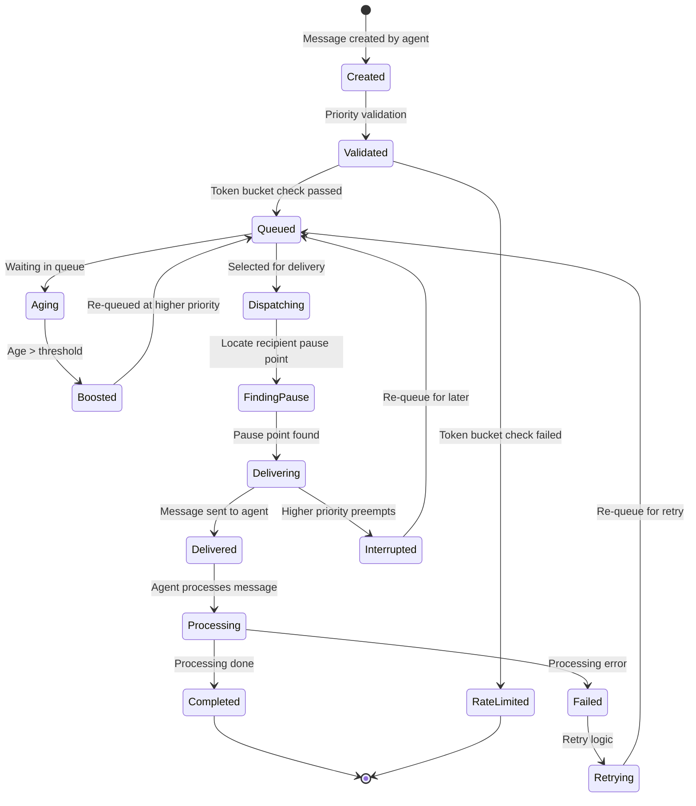
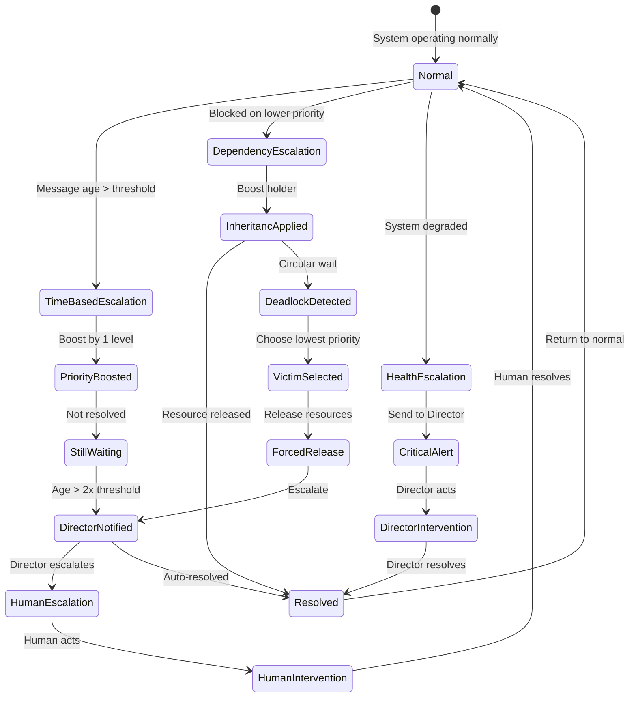

# LIMINAL Message Priority and Interaction Model Specification

## Key Takeaways

- **Priority Levels**: LIMINAL uses a 4+1 priority system (`Info`, `Coordinate`, `Blocking`, `Critical`, plus `DirectorOverride`) to ensure timely message handling.
- **Fairness**: The system uses token buckets to prevent any single agent from flooding the network with high-priority messages and an aging mechanism to prevent low-priority messages from starving.
- **Preemption**: Higher-priority messages can interrupt the processing of lower-priority ones, but only at safe "pause points" in an agent's workflow to ensure stability.
- **Escalation**: The system has automatic triggers to escalate issues like deadlocks, timeouts, or degraded system health to the Director Agent or the Human Director.

---

## Introduction

In a multi-agent coding system like LIMINAL (hosting several AI coding agents on a local desktop), an efficient message priority and routing mechanism is crucial. Agents such as Director, Frontend, Backend, Testing, and Reviewer (with clones for sub-tasks) constantly exchange messages for command-control (task assignments), coordination (e.g. resource leases), discussions (knowledge sharing), and telemetry (status updates). Although the system is not hard real-time, it targets soft real-time responsiveness (ideally under 100 ms message routing latency). This calls for a robust priority scheme to ensure urgent communications get prompt attention without starving routine messages.

To design an optimal solution, we draw inspiration from multiple domains:

- **Modern Message Queue Systems** (RabbitMQ, Kafka, Redis, ZeroMQ, NATS) for how they handle priority messaging and routing.
- **Operating System Schedulers** (Linux kernel scheduling, real-time algorithms) for managing task priorities, preemption, and avoiding priority inversion.
- **Network QoS Mechanisms** (DiffServ, traffic shaping, weighted fair queuing, token buckets) for ensuring high-priority traffic while maintaining fairness.
- **Human Priority Protocols** (emergency communications, hospital triage, air traffic control, military command precedence, incident response) for principles of escalation and priority levels.

## Lessons from Cross-Domain Research

### Message Queue Systems
- **RabbitMQ**: Use 4-5 priority levels max to avoid overhead; separate sub-queues per priority
- **Kafka**: Segregate by topic/partition; allocate more resources to high-priority streams
- **Redis**: Multiple lists with BLPOP from high to low priority
- **ZeroMQ/NATS**: Channel separation with priority-ordered polling

### Operating System Scheduling
- **Preemption Points**: High-priority work interrupts at safe boundaries
- **Priority Inversion**: Apply priority inheritance and ceiling protocols
- **Fairness**: Use weighted servicing or aging to prevent starvation (CFS-inspired)

### Network QoS
- **DiffServ**: Small number of traffic classes with rate limiting
- **WFQ**: Weighted service prevents starvation
- **Token Bucket**: Burst allowance with average rate enforcement

### Human Systems
- **Emergency Communications**: Explicit override channel seizure
- **Hospital Triage**: 3-5 tiers with dynamic reassessment
- **Military Precedence**: Flash Override for absolute priority

## LIMINAL Message Priority Design

### [Priority Levels](./00_glossary.md#priority-levels) (4+1 System)

```rust
#[derive(Debug, Clone, Copy, PartialEq, Eq, PartialOrd, Ord)]
pub enum Priority {
    Info = 0,             // Telemetry, logs, non-urgent discussion
    Coordinate = 1,       // Tasking, leases, routine operations
    Blocking = 2,         // Sender blocked until addressed
    Critical = 3,         // System failures, urgent alerts
    DirectorOverride = 4, // Director-only absolute priority
}

impl Priority {
    pub fn token_cost(&self) -> f64 {
        match self {
            Priority::Info => 1.0,
            Priority::Coordinate => 5.0,
            Priority::Blocking => 20.0,
            Priority::Critical => 100.0,
            Priority::DirectorOverride => 0.0, // Unlimited
        }
    }

    pub fn can_preempt(&self, other: &Priority) -> bool {
        (*self as u8) > (*other as u8 + 1) // Must be 2+ levels higher
    }

    pub fn boost(&self, levels: u8) -> Priority {
        match (*self as u8).saturating_add(levels).min(3) {
            0 => Priority::Info,
            1 => Priority::Coordinate,
            2 => Priority::Blocking,
            3 => Priority::Critical,
            _ => Priority::Critical,
        }
    }
}
```

### Router Implementation with Priority Queues

```rust
pub struct PriorityRouter {
    // Separate queues per priority level
    queues: [VecDeque<QueuedMessage>; 5],

    // Token buckets per agent to prevent inflation
    token_buckets: HashMap<AgentId, TokenBucket>,

    // Aging tracker for starvation prevention
    aging_tracker: AgingTracker,

    // Metrics for monitoring
    metrics: RouterMetrics,
}

impl PriorityRouter {
    pub async fn dispatch_next(&mut self) -> Option<Message> {
        // Apply aging to prevent starvation
        self.aging_tracker.apply_aging(&mut self.queues);

        // Service highest priority non-empty queue
        for (priority_idx, queue) in self.queues.iter_mut().enumerate().rev() {
            if let Some(mut queued_msg) = queue.pop_front() {
                // Check if message has aged enough to boost
                if queued_msg.age() > self.config.aging_threshold {
                    queued_msg.priority = queued_msg.priority.boost(1);

                    // Re-queue at higher priority if boosted
                    if queued_msg.priority as usize > priority_idx {
                        self.queues[queued_msg.priority as usize].push_back(queued_msg);
                        continue;
                    }
                }

                // Record metrics
                self.metrics.record_dispatch(
                    queued_msg.priority,
                    queued_msg.age(),
                    queue.len()
                );

                return Some(queued_msg.into_message());
            }
        }

        None
    }

    pub async fn enqueue(&mut self, msg: Message) -> Result<()> {
        // Validate priority against sender capabilities
        let effective_priority = self.validate_priority(&msg)?;

        // Check token bucket
        if !self.consume_tokens(&msg.sender, effective_priority) {
            return Err(RouteError::RateLimited);
        }

        // Queue message
        let queued = QueuedMessage {
            message: msg,
            priority: effective_priority,
            enqueued_at: Instant::now(),
        };

        self.queues[effective_priority as usize].push_back(queued);

        Ok(())
    }

    fn validate_priority(&self, msg: &Message) -> Result<Priority> {
        // Director can use any priority
        if msg.sender.is_director() {
            return Ok(msg.priority);
        }

        // Clones capped at Coordinate
        if msg.sender.is_clone() {
            return Ok(msg.priority.min(Priority::Coordinate));
        }

        // Regular agents can't use DirectorOverride
        if msg.priority == Priority::DirectorOverride {
            return Err(RouteError::UnauthorizedPriority);
        }

        // Check for priority gaming
        if self.detect_gaming(&msg.sender) {
            // Penalize by downgrading
            return Ok(Priority::Info);
        }

        Ok(msg.priority)
    }
}
```

### State Machine for Message Lifecycle



### Dynamic Priority Escalation

```rust
pub struct EscalationManager {
    escalation_rules: Vec<EscalationRule>,
    escalation_history: HashMap<MessageId, EscalationRecord>,
}

#[derive(Clone)]
pub struct EscalationRule {
    pub trigger: EscalationTrigger,
    pub action: EscalationAction,
}

#[derive(Clone)]
pub enum EscalationTrigger {
    TimeInQueue { threshold: Duration },
    DependencyBlocked { timeout: Duration },
    SystemHealthDegraded { metric: HealthMetric },
    ConsensusTimeout { duration: Duration },
    DeadlockDetected,
}

#[derive(Clone)]
pub enum EscalationAction {
    BoostPriority { levels: u8 },
    NotifyDirector,
    InterruptRecipient,
    EscalateToHuman,
}

impl EscalationManager {
    pub async fn check_escalations(&mut self, messages: &mut [QueuedMessage]) {
        for msg in messages {
            for rule in &self.escalation_rules {
                if self.should_escalate(msg, &rule.trigger).await {
                    self.apply_escalation(msg, &rule.action).await;

                    // Record escalation
                    self.escalation_history.insert(msg.id, EscalationRecord {
                        original_priority: msg.original_priority,
                        new_priority: msg.priority,
                        trigger: rule.trigger.clone(),
                        timestamp: Instant::now(),
                    });
                }
            }
        }
    }

    async fn should_escalate(&self, msg: &QueuedMessage, trigger: &EscalationTrigger) -> bool {
        match trigger {
            EscalationTrigger::TimeInQueue { threshold } => {
                msg.age() > *threshold
            }

            EscalationTrigger::DependencyBlocked { timeout } => {
                self.check_dependency_blocked(msg, *timeout).await
            }

            EscalationTrigger::SystemHealthDegraded { metric } => {
                self.check_health_metric(metric).await
            }

            EscalationTrigger::ConsensusTimeout { duration } => {
                msg.is_consensus_request() && msg.age() > *duration
            }

            EscalationTrigger::DeadlockDetected => {
                self.detect_deadlock_involving(msg).await
            }
        }
    }
}
```

### Preventing Priority Inflation

```rust
pub struct InflationPrevention {
    // Per-agent quotas for high-priority messages
    quotas: HashMap<AgentId, PriorityQuota>,

    // Gaming detection
    gaming_detector: GamingDetector,

    // Audit log for review
    audit_log: AuditLog,
}

#[derive(Default)]
pub struct PriorityQuota {
    critical_tokens: f64,
    blocking_tokens: f64,
    last_refill: Instant,
}

impl PriorityQuota {
    pub fn try_consume(&mut self, priority: Priority) -> bool {
        self.refill();

        match priority {
            Priority::Critical => {
                if self.critical_tokens >= 1.0 {
                    self.critical_tokens -= 1.0;
                    true
                } else {
                    false
                }
            }
            Priority::Blocking => {
                if self.blocking_tokens >= 1.0 {
                    self.blocking_tokens -= 1.0;
                    true
                } else {
                    false
                }
            }
            _ => true, // Lower priorities always allowed
        }
    }

    fn refill(&mut self) {
        let elapsed = self.last_refill.elapsed().as_secs_f64();

        // Refill rates (per second)
        const CRITICAL_REFILL: f64 = 0.1;  // 1 every 10 seconds
        const BLOCKING_REFILL: f64 = 1.0;  // 1 per second

        self.critical_tokens = (self.critical_tokens + elapsed * CRITICAL_REFILL).min(5.0);
        self.blocking_tokens = (self.blocking_tokens + elapsed * BLOCKING_REFILL).min(20.0);

        self.last_refill = Instant::now();
    }
}

pub struct GamingDetector {
    history: HashMap<AgentId, Vec<PriorityUsage>>,
    thresholds: GamingThresholds,
}

impl GamingDetector {
    pub fn check_gaming(&mut self, agent: &AgentId) -> bool {
        let history = self.history.entry(agent.clone()).or_default();

        // Calculate recent high-priority ratio
        let recent = history.iter()
            .filter(|u| u.timestamp.elapsed() < Duration::from_secs(60))
            .collect::<Vec<_>>();

        if recent.is_empty() {
            return false;
        }

        let high_priority_count = recent.iter()
            .filter(|u| u.priority >= Priority::Blocking)
            .count();

        let ratio = high_priority_count as f64 / recent.len() as f64;

        // Gaming detected if >50% high priority
        ratio > self.thresholds.high_priority_ratio
    }
}
```

### Interrupt vs Queue Decision

```mermaid
flowchart TD
    Start([Message Received])

    Start --> CheckPriority{Priority Level?}

    CheckPriority -->|DirectorOverride| Interrupt[Immediate Interrupt]
    CheckPriority -->|Critical| CheckAgent{Agent Status?}
    CheckPriority -->|Blocking| Queue[Queue at Front]
    CheckPriority -->|Coordinate| QueueNormal[Queue Normal]
    CheckPriority -->|Info| QueueLow[Queue at Back]

    CheckAgent -->|Idle| Deliver[Deliver Now]
    CheckAgent -->|AtPausePoint| Deliver
    CheckAgent -->|Processing| CheckTask{Task Interruptible?}

    CheckTask -->|Yes| SaveState[Save State & Interrupt]
    CheckTask -->|No| WaitForPause[Wait for [Pause Point](./00_glossary.md#pause-point)]

    SaveState --> Deliver
    WaitForPause --> QueueFront[Queue at Front]

    Deliver --> Process[Agent Processes]
    Queue --> WaitTurn[Wait for Turn]
    QueueNormal --> WaitTurn
    QueueLow --> WaitTurn
    QueueFront --> WaitTurn

    WaitTurn --> Deliver

    style Interrupt fill:#f00,color:#fff
    style Deliver fill:#0f0
    style Queue fill:#ff0
    style QueueNormal fill:#ff0
    style QueueLow fill:#ff0
```

### Priority Inversion Handling

```rust
pub struct PriorityInversionResolver {
    dependency_graph: DependencyGraph,
    inheritance_policy: InheritancePolicy,
}

impl PriorityInversionResolver {
    pub async fn resolve_inversion(
        &mut self,
        high_priority_agent: &AgentId,
        blocked_on: &ResourceId,
    ) -> Result<Resolution> {
        // Find holder of blocking resource
        let holder = self.find_resource_holder(blocked_on).await?;

        // Apply priority inheritance
        let inherited_priority = self.calculate_inherited_priority(
            high_priority_agent,
            &holder
        );

        // Temporarily boost holder's priority
        self.boost_agent_priority(&holder, inherited_priority).await?;

        // Set restoration trigger
        self.set_restoration_trigger(
            &holder,
            ResourceReleased(blocked_on.clone())
        ).await?;

        Ok(Resolution::PriorityInherited {
            holder,
            original_priority: holder.priority,
            inherited_priority,
        })
    }

    pub async fn detect_and_break_deadlock(
        &mut self,
        agents: Vec<AgentId>,
    ) -> Result<()> {
        // Build wait-for graph
        let wait_graph = self.build_wait_graph(&agents).await?;

        // Detect cycles
        if let Some(cycle) = wait_graph.find_cycle() {
            // Choose victim (lowest priority in cycle)
            let victim = cycle.iter()
                .min_by_key(|a| a.priority)
                .unwrap();

            // Force victim to release resources
            self.force_release(victim).await?;

            // Escalate to Director
            self.escalate_deadlock(cycle, victim).await?;
        }

        Ok(())
    }
}
```

### Agent Priority Privileges

Agent priority privileges are defined in the central [**`liminal.config.yaml`**](../../config/liminal.config.yaml) file.

```yaml
# See liminal.config.yaml for detailed parameter definitions
agent_privileges:
  director:
    max_priority: DirectorOverride
    quota_multiplier: unlimited

  primary_agents:  # Frontend, Backend, etc.
    max_priority: Critical
    quota_multiplier: 1.0

  clone_agents:
    max_priority: Coordinate
    quota_multiplier: 0.5
```

### Escalation Paths State Machine



### Complete Interaction Protocol

```rust
pub struct InteractionProtocol {
    message_types: HashMap<MessageType, InteractionPattern>,
    timeout_policies: HashMap<MessageType, Duration>,
    retry_strategies: HashMap<MessageType, RetryStrategy>,
}

#[derive(Clone)]
pub enum InteractionPattern {
    FireAndForget,              // No response expected
    RequestResponse {            // Synchronous-style
        timeout: Duration,
        priority_boost_on_timeout: bool,
    },
    PublishSubscribe {           // Broadcast pattern
        subscribers: Vec<AgentId>,
        delivery_guarantee: DeliveryGuarantee,
    },
    AsyncDiscussion {            // Clone-based discussion
        min_participants: usize,
        consensus_required: bool,
        max_duration: Duration,
    },
}

impl InteractionProtocol {
    pub async fn send_message(
        &self,
        msg: Message,
        pattern: InteractionPattern,
    ) -> Result<InteractionHandle> {
        match pattern {
            InteractionPattern::FireAndForget => {
                self.router.enqueue(msg).await?;
                Ok(InteractionHandle::None)
            }

            InteractionPattern::RequestResponse { timeout, .. } => {
                let response_future = self.setup_response_handler(&msg);
                self.router.enqueue(msg).await?;

                Ok(InteractionHandle::Awaitable {
                    future: Box::pin(timeout_wrapper(response_future, timeout)),
                })
            }

            InteractionPattern::PublishSubscribe { subscribers, guarantee } => {
                let handles = self.broadcast_to_subscribers(msg, subscribers, guarantee).await?;
                Ok(InteractionHandle::Multiple(handles))
            }

            InteractionPattern::AsyncDiscussion { min_participants, .. } => {
                let discussion = self.spawn_discussion(msg, min_participants).await?;
                Ok(InteractionHandle::Discussion(discussion))
            }
        }
    }
}
```

### Performance Targets and SLAs

Performance SLAs are defined in the central [**`liminal.config.yaml`**](../config/liminal.config.yaml) file.

```yaml
# See liminal.config.yaml for detailed parameter definitions
performance_slas:
  message_routing:
    p99: 1ms

  priority_preemption:
    critical_delivery: <10ms
    blocking_delivery: <50ms

  escalation_detection:
    escalation_latency: <500ms

  deadlock_detection:
    resolution_time: <5s

  queue_depths:
    critical_max: 10
    blocking_max: 50
```

### Monitoring and Observability

```rust
pub struct PriorityMetrics {
    // Per-priority metrics
    messages_sent: CounterVec,
    messages_delivered: CounterVec,
    queue_depth: GaugeVec,
    delivery_latency: HistogramVec,

    // Escalation metrics
    escalations_triggered: Counter,
    priority_boosts: Counter,
    deadlocks_detected: Counter,

    // Gaming/inflation metrics
    priority_violations: Counter,
    rate_limit_hits: Counter,
    gaming_detections: Counter,
}

impl PriorityMetrics {
    pub fn record_routing(&self, msg: &Message, latency: Duration) {
        self.messages_delivered
            .with_label_values(&[&msg.priority.to_string()])
            .inc();

        self.delivery_latency
            .with_label_values(&[&msg.priority.to_string()])
            .observe(latency.as_secs_f64());
    }

    pub fn alert_on_anomaly(&self) -> Vec<Alert> {
        let mut alerts = Vec::new();

        // Check queue depths
        for priority in [Priority::Critical, Priority::Blocking] {
            let depth = self.queue_depth
                .with_label_values(&[&priority.to_string()])
                .get();

            if depth > self.thresholds.get(&priority) {
                alerts.push(Alert::QueueBacklog { priority, depth });
            }
        }

        // Check escalation rate
        let escalation_rate = self.calculate_rate(&self.escalations_triggered);
        if escalation_rate > self.thresholds.escalation_rate {
            alerts.push(Alert::HighEscalationRate(escalation_rate));
        }

        alerts
    }
}
```

## Operational Handoffs and Escalation Triggers

- Handoff points
  - Plan approval: [Director Agent](./00_glossary.md#director-agent) must approve execution plans before routing begins.
  - Lease override: Director confirms overrides when policy would break fairness.
  - Pre‑merge review: Director validates cross‑territory changes before integration.
  - Post‑consensus ratification: Optional Director ratification per policy.

- Escalation triggers (router‑level)
  - Deadlock detected or queue_depth ≥ 2 on same resource.
  - Message age thresholds: Blocking > 60s → escalate; Coordinate that blocks progress > 60s → escalate to Blocking.
  - Consensus timeout > 300s in clone discussion.
  - Priority inflation detected (>50% Blocking/Critical in last 60s) → downgrade + notify.
  - Sustained health breach 60s: message p99 > 1ms, clone spawn p99 > 15ms, critical queue depth > 10.
  - Any Critical error from agents (build/test failure) → immediate Director notification.

## Summary Rules

### Core Principles
1. **Four priority levels plus Director Override** - Balance between granularity and simplicity
2. **Strict priority dispatch with fairness safeguards** - Prevent starvation via aging
3. **Cooperative preemption at agent level** - Interrupt at safe boundaries
4. **Dynamic escalation and priority inheritance** - Adapt to runtime conditions
5. **Token bucket quotas** - Prevent priority inflation
6. **Sub-millisecond routing** - Meet soft real-time targets

### Implementation Checklist
- [x] Separate priority queues with O(1) dispatch
- [x] Token bucket rate limiting per agent
- [x] Aging mechanism for starvation prevention
- [x] Priority inheritance for inversion handling
- [x] Deadlock detection and breaking
- [x] Gaming detection and penalties
- [x] Comprehensive metrics and alerting
- [x] Director override capabilities
- [x] Clone priority restrictions

This complete specification ensures LIMINAL's message priority system delivers reliable, fair, and performant multi-agent coordination while preventing common pitfalls like priority inflation, starvation, and deadlock.
