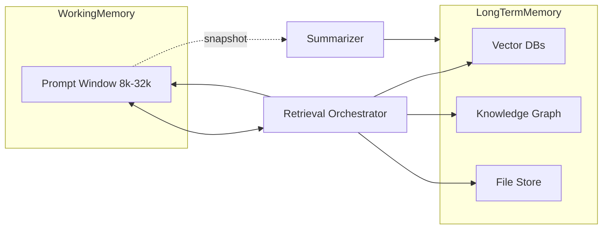
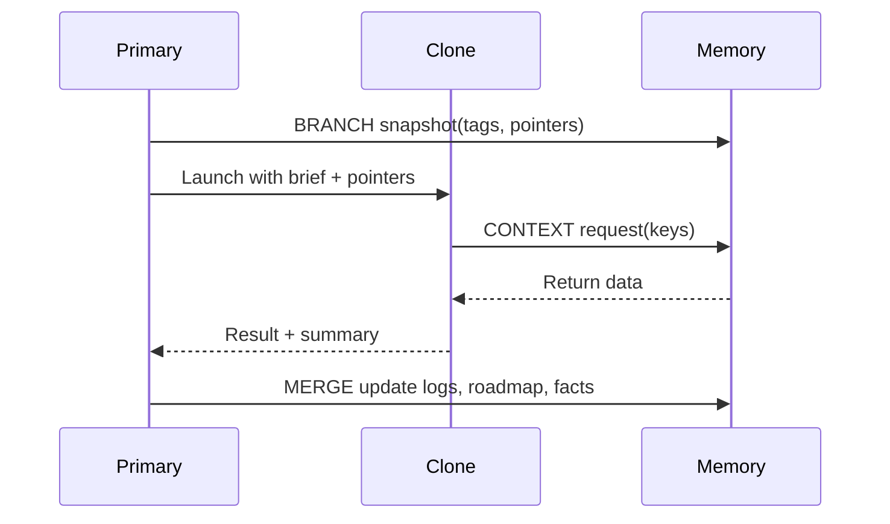

# Context Window Optimization for LLM Agents

Context: Designing optimal context management strategies for LLM-based agents (Claude 3 with 100k+ window, GPT-4 with 32k window) in a multi-agent architecture. Target 32k active context with scalable designs up to 100k tokens. Most tasks fit in 8–16k.

## Context Compression

Semantic chunking
- Split by semantic coherence, not fixed size.
- Build similarity graph of sentences, cluster by topic.
- Ensure each chunk is self-contained and aligned to a goal or code unit.
- Dynamic chunk sizing based on content density and boundaries.

Attention optimization
- For fixed models, simulate sparse attention by segmenting prompts and retrieving only relevant segments.
- For custom models, prefer windowed or sparse attention patterns and segment recurrence.

Context distillation
- Periodically distill long dialogues or logs into concise summaries.
- Extract decisions, constraints, assumptions, open questions.
- Store distilled artifacts in long-term memory for reuse.

Prompt compression
- Prefer generative rewriting over token dropping.
- Compress low-relevance chunks heavily, keep high-relevance chunks detailed.
- Preserve identifiers, invariants, and constraints verbatim.
- Normalize formatting, remove boilerplate.

Token optimization
- Compact formatting and structured lists.
- Deduplicate with alias references.
- Use tables for dense facts.
- Reference large assets via keys and fetch on demand.

## Memory Architecture

Working vs long-term memory
- Working: immediate prompt state, small and frequently refreshed.
- Long-term: external store for persistent summaries, facts, pointers.

Episodic vs semantic memory
- Episodic: chronological records of events and decisions with timestamps.
- Semantic: normalized facts, APIs, schemas, and stable project knowledge.

Consolidation
- Checkpoint summaries after milestones or N interactions.
- Extract key facts to semantic store.
- Prune or merge low-value memories.
- Version and tag snapshots.

Relevance decay
- Apply time-based decay on retrieval scores.
- Reinforce items on access.
- Periodically review and refresh important aging items.

## Retrieval Systems

Vector databases
- Use ANN indexes (FAISS, HNSW) for <2s latency on desktop RAM.
- Separate indices per modality: code, docs, logs, chat.

Hybrid retrieval
- Combine keyword search with vector similarity.
- Merge and re-rank by weighted score.
- Enforce diversity across sources.

Graph-based retrieval
- Maintain knowledge and dependency graphs.
- Traverse neighbors of top results for relational context.
- Blend graph hits with semantic candidates.

Embedding for code
- Index by logical units: functions, classes, modules.
- Use code-aware embeddings.
- Attach metadata: file path, symbol, language, framework.

Two-stage retrieval
- Stage 1: fast recall, top K.
- Stage 2: cross-encoder or LLM re-rank within token budget.

## Code-Specific Context

Dependency graph analysis
- Include callee definitions and immediate callers.
- Include required globals, constants, configs.
- Use radius-limited expansion to avoid explosion.

Symbol table
- Map identifiers to definitions and docstrings.
- Quick lookup for signatures and contracts.

Type propagation
- Include types and interfaces used by current scope.
- Include base class definitions when relevant.

Import/export relations
- Pull imported constants and usage exemplars.
- Include minimal usage patterns for libraries.

Call graph boundaries
- Default radius 1 both directions.
- Expand adaptively on errors or new questions.

Persistent vs ephemeral
- Persist summaries, decisions, and learned rules.
- Treat third-party code bodies as retrievable, not stored.

## Multi-Agent Context

Minimal clone context
- Provide focused brief plus exact artifacts required.
- Use pointers for optional large assets.

Snapshotting
- Create branch snapshots for clones with tags and pointers.
- Keep clone context bounded and isolated.

Include vs reference
- Include must-have snippets.
- Reference large documents and let clone fetch on demand.

Merge back
- Summarize clone outcomes and integrate into long-term memory.
- Update roadmap and logs.
- Archive clone artifacts under branch tags.

Persistent vs ephemeral
- Persist outcomes and justifications.
- Keep step-by-step clone chatter ephemeral or low-detail.

Cross-agent sharing
- Use shared external memory with versioning.
- Append-only logs for concurrent writes.

## Algorithms

### Snapshot and Compression (pseudocode)

```
function snapshot_and_compress_context(work_ctx, ltm, limit):
    if work_ctx.tokens() < limit * 0.8:
        return

    old, recent = split_by_tokens(work_ctx, keep_tail=true, tail_budget=limit * 0.5)

    summary = LLM.summarize(
        old,
        instructions="Extract goals, decisions, constraints, entities, refs. Keep identifiers, APIs, versions, file paths verbatim. Use bullet list. <= 800 tokens."
    )

    ltm.add_entry(summary, tags=["compressed_history"], meta={"orig_tokens": old.tokens()})

    for chunk in semantic_chunks(old):
        ltm.index(chunk, index="chat_history")

    work_ctx.replace_with(recent)
    work_ctx.prepend("Earlier discussion summarized in memory tag: compressed_history")
```

### Retrieval (pseudocode)

```
function retrieve(query, ltm, scope, token_budget):
    kw = extract_keywords(query)
    sem_q = embed(query, model=scope.embedder)

    cand = []
    if kw:
        cand += ltm.keyword_search(kw, scopes=[scope], k=50)

    cand += ltm.vector_search(sem_q, scopes=[scope], k=50)

    top = topk(cand, k=10, key="sim")
    for item in top:
        if item.graph_neighbors:
            cand += ltm.graph_expand(item, hops=1)

    ranked = rerank(query, cand, method="cross_encoder")

    sel = []
    used = 0
    for item in ranked:
        t = tokens(item.text)
        if used + t <= token_budget:
            sel.append(item)
            used += t
        if used >= token_budget * 0.9:
            break
    return sel
```

## Python Reference Snippets

Note: Replace stubs with real embeddings, FAISS/HNSW, and LLM summarization.

```python
import numpy as np
from typing import List, Dict, Any, Tuple

class VectorEntry:
    def __init__(self, vec: np.ndarray, text: str, meta: Dict[str, Any]):
        self.vec = vec
        self.text = text
        self.meta = meta

class VectorMemory:
    def __init__(self, dim: int = 384):
        self.dim = dim
        self.entries: List[VectorEntry] = []

    def add_entry(self, text: str, vector: np.ndarray, meta: Dict[str, Any] | None = None):
        self.entries.append(VectorEntry(vector, text, meta or {}))

    def keyword_search(self, keywords: List[str], scopes: List[str] | None = None, k: int = 50) -> List[VectorEntry]:
        kws = [kw.lower() for kw in keywords]
        out = []
        for e in self.entries:
            if scopes and e.meta.get("scope") not in scopes:
                continue
            if all(kw in e.text.lower() for kw in kws):
                score = -len(e.text)
                out.append((score, e))
        out.sort(key=lambda x: x[0])
        return [e for _, e in out[:k]]

    def vector_search(self, q: np.ndarray, scopes: List[str] | None = None, k: int = 50) -> List[VectorEntry]:
        sims: List[Tuple[float, VectorEntry]] = []
        qn = np.linalg.norm(q) + 1e-9
        for e in self.entries:
            if scopes and e.meta.get("scope") not in scopes:
                continue
            sim = float(np.dot(q, e.vec) / (qn * (np.linalg.norm(e.vec) + 1e-9)))
            sims.append((sim, e))
        sims.sort(key=lambda x: x[0], reverse=True)
        return [e for _, e in sims[:k]]

def embed_stub(text: str, dim: int = 384) -> np.ndarray:
    rng = np.random.default_rng(abs(hash(text)) % (2**32))
    v = rng.normal(size=dim)
    v /= np.linalg.norm(v) + 1e-9
    return v

def rerank_stub(query: str, cands: List[VectorEntry]) -> List[VectorEntry]:
    qset = set(query.lower().split())
    scored = []
    for e in cands:
        overlap = len(qset.intersection(set(e.text.lower().split())))
        scored.append((overlap, -len(e.text), e))
    scored.sort(key=lambda x: (x[0], x[1]), reverse=True)
    return [e for _, _, e in scored]

def retrieve(memory: VectorMemory, query: str, scopes: List[str], token_budget: int) -> List[VectorEntry]:
    kw = [w for w in query.split() if len(w) > 3]
    sem_q = embed_stub(query, dim=memory.dim)
    cands = []
    if kw:
        cands += memory.keyword_search(kw, scopes=scopes, k=50)
    cands += memory.vector_search(sem_q, scopes=scopes, k=50)
    seen = set()
    uniq = []
    for e in cands:
        key = (e.text, e.meta.get("scope"))
        if key not in seen:
            uniq.append(e)
            seen.add(key)
    ranked = rerank_stub(query, uniq)
    sel, used = [], 0
    for e in ranked:
        t = max(16, len(e.text) // 4)
        if used + t <= token_budget:
            sel.append(e)
            used += t
        if used >= token_budget * 0.9:
            break
    return sel
```

## Mermaid Diagrams

System architecture



Primary and clone



## Operational Policies

Budgets
- Default active prompt budget: 32k tokens.
- Retrieval budget: 6–10k tokens per step.
- Compression target: summaries <= 800 tokens per checkpoint.

Latency
- Retrieval end-to-end < 2s.
- Vector search < 200 ms.
- Re-rank < 500 ms.
- Disk IO bounded by local SSD.

Storage
- Keep indices in RAM when possible.
- Persist episodic logs and semantic facts to disk.
- Apply decay during retrieval scoring, not destructive deletion.

Observability
- Log snapshot and merge events with tags.
- Record retrieval candidates and final selections.
- Track token spend per step.

Security
- Do not embed secrets.
- Store secrets as pointers with secure fetch on demand.
